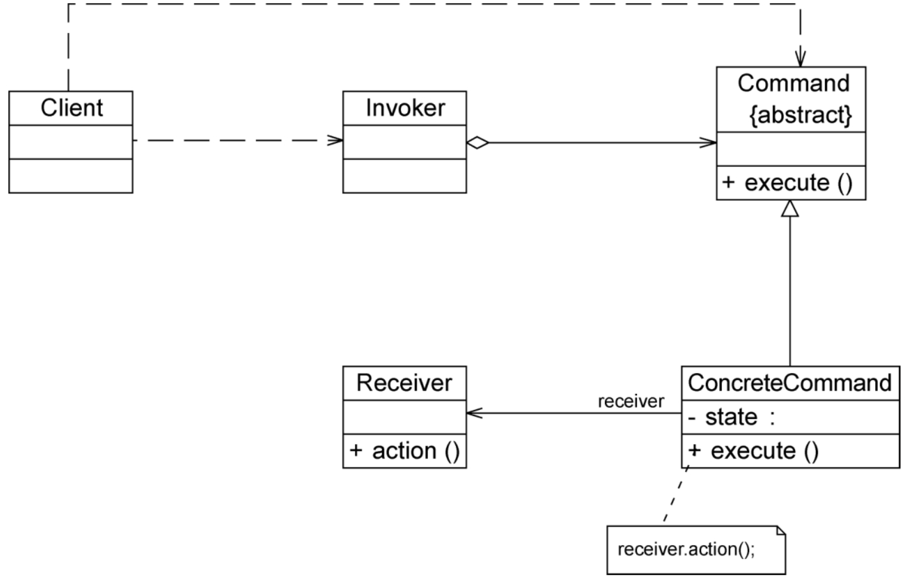
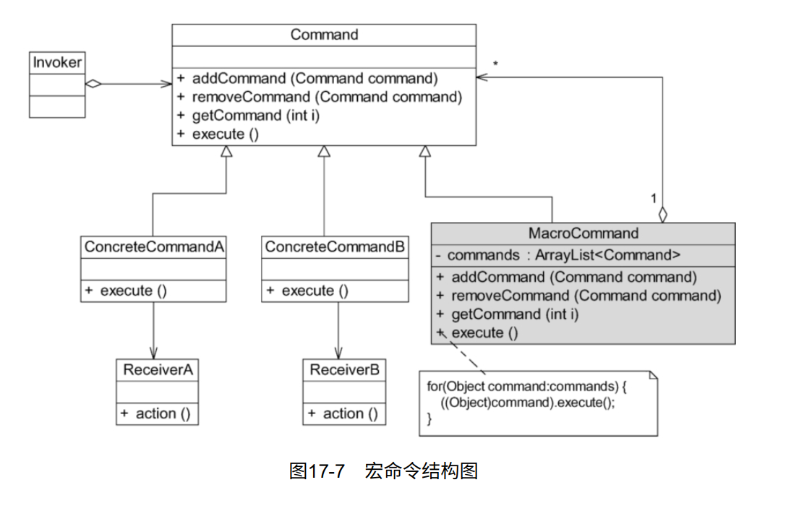

# 命令模式

在软件开发中也存在很多与开关和电器类似的请求发送者和接收者对象。例如一个按钮，它可能是一个“关闭窗口”请求的发送者，而按钮点击事件处理类则是该请求的接收者。为了降低系统的耦合度，将请求的发送者和接收者解耦，可以使用一种被称之为命令模式的设计模式来设计系统。在命令模式中，发送者与接收者之间引入了新的命令对象（类似图17-1中的电线），将发送者的请求封装在命令对象中，再通过命令对象来调用接收者的方法

## 定义

将一个请求封装为一个对象，从而可用不同的请求对客户进行参数化；对请求排队或者记录请求日志，以及支持可撤销的操作。命令模式是一种对象行为型模式，其别名为动作（Action）模式或事务（Transaction）模式。

## UML

## 主要优点

1.  **降低系统的耦合度**。由于请求者与接收者之间不存在直接引用，因此请求者与接收者之间实现完全解耦，相同的请求者可以对应不同的接收者。同样，相同的接收者也可以供不同的请求者使用，两者之间具有良好的独立性。
2. 新的命令可以很容易地加入系统中。由于增加新的具体命令类不会影响到其他类，因此增加新的具体命令类很容易，无须修改原有系统源代码甚至客户类代码，满足开闭原则的要求。
3. **可以比较容易地设计一个命令队列或宏命令（组合命令）。**
4. 为请求的**撤销（Undo）和恢复（Redo）操作**提供了一种设计和实现方案。

## 主要缺点

**使用命令模式可能会导致某些系统有过多的具体命令类。**因为针对每一个对请求接收者的调用操作都需要设计一个具体命令类，因此在某些系统中可能需要提供大量的具体命令类，这将影响命令模式的使用。

## 适用场景

1. **系统需要将请求调用者和请求接收者解耦，使得调用者和接收者不直接交互**。请求调用者无须知道接收者的存在，也无须知道接收者是谁，接收者也无须关心何时被调用。
2. **系统需要在不同的时间指定请求、将请求排队和执行请求。**一个命令对象和请求的初始调用者可以有不同的生命期。换言之，最初的请求发出者可能已经不在了，而命令对象本身仍然是活动的，可以通过该命令对象去调用请求接收者，而无须关心请求调用者的存在性，可以通过**请求日志文件**等机制来具体实现。
3. 系统需要支持命令的**撤销（Undo）操作和恢复（Redo）操作**。
4. 系统需要将一组操作组合在一起形成**宏**命令。

> 后续内容没有代码部分，请详细参考《设计模式的艺术》第17章

## 命令队列的实现

有时需要将多个请求排队。当一个请求发送者发送一个请求时，不止一个请求接收者产生响应，这些请求接收者将逐个执行业务方法，完成对请求的处理。此时，可以通过命令队列来实现。

命令队列的实现方法有多种形式，其中最常用、灵活性最好的一种方式是增加一个CommandQueue类。CommandQueue类负责存储多个命令对象，而不同的命令对象可以对应不同的请求接收者。

命令队列与批处理有点类似。批处理，顾名思义，可以对一组对象（命令）进行批量处理，当一个发送者发送请求后，将有一系列接收者对请求做出响应。命令队列可以用于设计批处理应用程序，如果请求接收者的接收次序没有严格的先后次序，还可以使用多线程技术来并发调用命令对象的execute（）方法，从而提高程序的执行效率。

## 撤销&重做功能的实现

在命令模式中，可以通过调用一个命令对象的execute（）方法来实现对请求的处理。如果需要撤销（Undo）请求，可通过在命令类中增加一个逆向操作来实现。

除了通过采用逆向操作来实现撤销（Undo）外，还可以通过保存对象的历史状态来实现撤销，后者将在备忘录模式（Memento Pattern）中进行详细学习。

通过在抽象命令类中加入一个undo的抽象方法来实现撤销和重做功能。

## 请求日志

请求日志就是将请求的历史记录保存下来，通常以日志文件（Log File）的形式永久存储在计算机中。很多系统都提供了日志文件，例如Windows日志文件、Oracle日志文件等。日志文件可以记录用户对系统的一些操作（例如对数据的更改）。请求日志文件可以实现很多功能，常用功能如下：

（1）“天有不测风云”，一旦系统发生故障，日志文件可以为系统提供一种恢复机制。在请求日志文件中可以记录用户对系统的每一步操作，从而让系统能够顺利恢复到某一个特定的状态。

（2）请求日志也可以用于实现批处理。在一个请求日志文件中可以存储一系列命令对象，例如一个命令队列。

（3）可以将命令队列中的所有命令对象都存储在一个日志文件中。每执行一个命令则从日志文件中删除一个对应的命令对象，防止因为断电或者系统重启等原因造成请求丢失。而且可以避免重新发送全部请求时造成某些命令的重复执行，只需读取请求日志文件，再继续执行文件中剩余的命令即可。

在实现请求日志时，可以将命令对象通过序列化写到日志文件中，此时命令类必须实现java.io.Serializable接口。

## 宏命令

宏命令（Macro Command）又称为组合命令，它是组合模式和命令模式联用的产物。宏命令是一个具体命令类，它拥有一个集合属性，在该集合中包含了对其他命令对象的引用。通常宏命令不直接与请求接收者交互，而是通过它的成员来调用接收者的方法。当调用宏命令的execute（）方法时，将递归调用它所包含的每个成员命令的execute（）方法。一个宏命令的成员可以是简单命令，还可以继续是宏命令。执行一个宏命令将触发多个具体命令的执行，从而实现对命令的批处理。其结构如图17-7所示。

