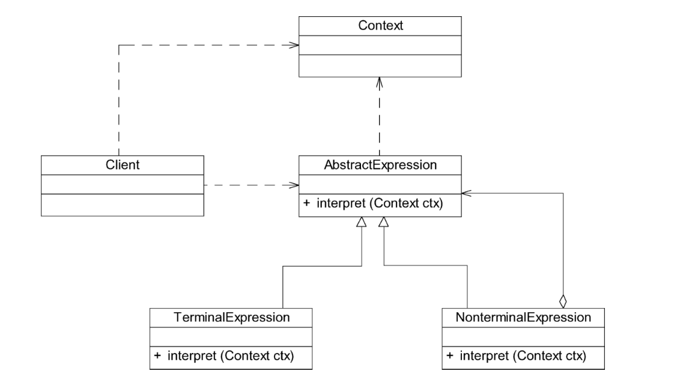

# 解释器模式

虽然目前计算机编程语言有好几百种，但有时候人们还是希望能用一些简单的语言来实现一些特定的操作。只要向计算机输入一个句子或文件，它就能够按照预先定义的文法规则来对句子或文件进行解释，从而实现相应的功能。例如提供一个简单的加法／减法解释器，只要输入一个加法／减法表达式，它就能够计算出表达式结果。如图18-1所示，当输入字符串表达式为“1+2+3-4+1”时，将输出计算结果为3。

像C++、Java和C＃等语言无法直接解释类似“1+2+3-4+1”这样的字符串（如果直接作为数值表达式时可以解释），用户必须自己定义一套文法规则来实现对这些语句的解释，即设计一个自定义语言。在实际开发中，这些简单的自定义语言可以基于现有的编程语言来设计。如果所基于的编程语言是面向对象语言，此时可以使用解释器模式来实现自定义语言。

**为了实现对语句的解释，可以使用解释器模式。在解释器模式中每一条文法规则都将对应一个类，扩展、改变文法以及增加新的文法规则都很方便。**

在某些情况下，为了更好地描述某些特定类型的问题，可以创建一种新的语言。这种语言拥有自己的表达式和结构，即文法规则，这些问题的实例将对应为该语言中的句子。此时，可以使用解释器模式来设计这种新的语言。对解释器模式的学习能够加深对面向对象思想的理解，并且掌握编程语言中文法规则的解释过程。

## 定义

定义一个语言的文法，并且建立一个解释器来解释该语言中的句子，这里的“语言”是指使用规定格式和语法的代码。解释器模式是一种类行为型模式。

## UML

## 主要优点

1. 易于改变和扩展文法。由于在解释器模式中使用类来表示语言的文法规则，因此可以通过继承等机制来改变或扩展文法。
2. 每一条文法规则都可以表示为一个类，因此可以方便地实现一个简单的语言。
3. 实现文法较为容易。在抽象语法树中每一个表达式节点类的实现方式都是相似的，这些类的代码编写都不会特别复杂，还可以通过一些工具自动生成节点类代码。
4. 增加新的解释表达式较为方便。如果用户需要增加新的解释表达式只需要对应增加一个新的终结符表达式或非终结符表达式类，原有表达式类代码无须修改，符合开闭原则。

## 主要缺点

1. **对于复杂文法难以维护**。在解释器模式中，每一条规则至少需要定义一个类，因此如果一种语言包含太多文法规则，类的个数将会急剧增加，导致系统难以管理和维护，此时可以考虑使用语法分析程序等方式来取代解释器模式。
2. **执行效率较低**。由于在解释器模式中使用了大量的循环和递归调用，因此在解释较为复杂的句子时其速度很慢，而且代码的调试过程也比较麻烦。

## 适用场景

1. 可以将一个需要解释执行的语言中的句子表示为一个抽象语法树。
2. 一些重复出现的问题可以用一种简单的语言来进行表达。
3. 一个语言的文法较为简单。
4. **执行效率不是关键问题。**（注：高效的解释器通常不是通过直接解释抽象语法树来实现的，而是需要将它们转换成其他形式，使用解释器模式的执行效率并不高。）

## Context类的作用

在解释器模式中，环境类Context用于存储解释器之外的一些全局信息。它通常作为参数被传递到所有表达式的解释方法interpret（）中，可以在Context对象中存储和访问表达式解释器的状态，向表达式解释器提供一些全局的、公共的数据。此外，还可以在Context中增加一些所有表达式解释器都共有的功能，减轻解释器的职责。

通常，我们会在Context中对需要执行的语句进行一些必要的分析。