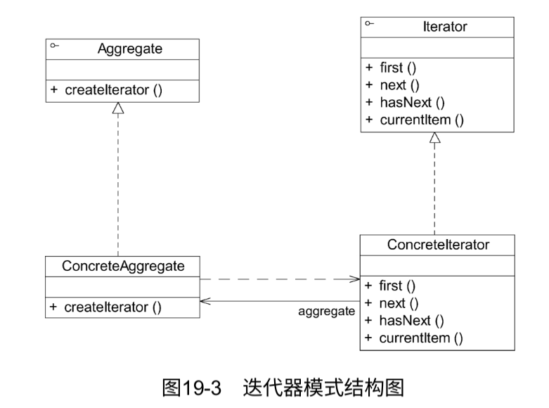

# 迭代器模式

在软件开发时，经常需要使用聚合对象来存储一系列数据。聚合对象拥有两个职责：一是存储数据；二是遍历数据。从依赖性来看，前者是聚合对象的基本职责；而后者既是可变化的，又是可分离的。因此，可以将遍历数据的行为从聚合对象中分离出来，封装在一个被称之为“迭代器”的对象中。由迭代器来提供遍历聚合对象内部数据的行为，这将简化聚合对象的设计，更符合单一职责原则的要求。

通过引入迭代器，客户端无须了解聚合对象的内部结构即可实现对聚合对象中成员的遍历，还可以根据需要很方便地增加新的遍历方式。

## 定义

提供一种方法来访问聚合对象，而不用暴露这个对象的内部表示，其别名为游标（Cursor）。迭代器模式是一种对象行为型模式。

## UML



## 主要优点

1. 支持以不同的方式遍历一个聚合对象，在同一个聚合对象上可以定义多种遍历方式。**在迭代器模式中只需要用一个不同的迭代器来替换原有迭代器即可改变遍历算法**，也可以自己定义迭代器的子类以支持新的遍历方式。
2. 迭代器简化了聚合类。由于引入了迭代器，在原有的聚合对象中不需要再自行提供数据遍历等方法，这样可以简化聚合类的设计。
3. 在迭代器模式中，由于引入了抽象层，**增加新的聚合类和迭代器类都很方便，无须修改原有代码，满足开闭原则的要求。**

## 主要缺点

1. 由于迭代器模式将存储数据和遍历数据的职责分离，增加新的聚合类需要对应增加新的迭代器类，类的个数成对增加，这在一定程度上增加了系统的复杂性。
2. 抽象迭代器的设计难度较大，需要充分考虑到系统将来的扩展。例如JDK内置迭代器Iterator就无法实现逆向遍历，如果需要实现逆向遍历，只能通过其子类ListIterator等来实现，而ListIterator迭代器无法用于操作Set类型的聚合对象。在自定义迭代器时，创建一个考虑全面的抽象迭代器并不是件很容易的事情。

## 适用场景

1. 访问一个聚合对象的内容而无须暴露它的内部表示。将聚合对象的访问与内部数据的存储分离，使得访问聚合对象时无须了解其内部实现细节。
2. 需要为一个聚合对象提供多种遍历方式。
3. 为遍历不同的聚合结构提供一个统一的接口，在该接口的实现类中为不同的聚合结构提供不同的遍历方式，而客户端可以一致性地操作该接口。


## 使用内部类实现迭代器

迭代器模式结构图中可以看到，具体迭代器类和具体聚合类之间存在双重关系，其中一个关系为关联关系。在具体迭代器中需要维持一个对具体聚合对象的引用，该关联关系的目的是访问存储在聚合对象中的数据，以便迭代器能够对这些数据进行遍历操作。

除了使用关联关系外，为了能够让迭代器可以访问到聚合对象中的数据，还可以将迭代器类设计为聚合类的内部类。JDK中的迭代器类就是通过这种方法来实现的。其中AbstractList类的代码片段如下：

```java
package java.util;

import java.util.function.Consumer;

public abstract class AbstractList<E> extends AbstractCollection<E> implements List<E> {
    protected transient int modCount = 0;
    //...
        private class Itr implements Iterator<E> {
        int cursor = 0;
        //...
        }
    //...
}
```

但无论使用哪种实现机制，客户端代码都是一样的。也就是说，客户端无须关心具体迭代器对象的创建细节，只需通过调用工厂方法createIterator（）即可得到一个可用的迭代器对象，这也是使用工厂方法模式的好处。通过工厂来封装对象的创建过程，简化了客户端的调用。


## JDK内置迭代器

为了让开发人员能够更加方便地操作聚合对象，在Java、C＃等编程语言中都提供了内置迭代器。在Java集合框架中，常用的List和Set等聚合类的子类都间接实现了java.util.Collection接口。在Collection接口中声明了如下方法（部分）：

```java
package java.util;

public interface Collection<E> extends Iterable<E> {
    boolean add(E var1);
    boolean remove(Object var1);
    boolean containsAll(Collection<?> var1);
    boolean addAll(Collection<? extends E> var1);
    boolean removeAll(Collection<?> var1);
    Iterator<E> iterator();
    //...
}
```

除了包含一些增加元素和删除元素的方法外，还提供了一个iterator（）方法，用于返回一个Iterator迭代器对象，以便遍历聚合中的元素。具体的Java聚合类可以通过实现该iterator（）方法返回一个具体的Iterator对象。

JDK中定义了抽象迭代器接口Iterator，代码如下：

```java
public interface Iterator<E> {
    boolean hasNext();
    E next();
    default void remove() {
        throw new UnsupportedOperationException("remove");
    }
    default void forEachRemaining(Consumer<? super E> action) {
        Objects.requireNonNull(action);
        while(this.hasNext()) {
            action.accept(this.next());
        }
    }
}
```

其中，hasNext（）方法用于判断聚合对象中是否还存在下一个元素。为了不抛出异常，在每次调用next（）之前需先调用hasNext（），如果有可供访问的元素，则返回true。next（）方法用于将游标移至下一个元素，通过它可以逐个访问聚合中的元素，它返回游标所越过的那个元素的引用。remove（）方法用于删除上次调用next（）时所返回的元素。

Java迭代器工作原理如图19-5所示。在第一个next（）方法被调用时，迭代器游标由“元素1”与“元素2”之间移至“元素2”与“元素3”之间，跨越了“元素2”，因此next（）方法将返回对“元素2”的引用。在第二个next（）方法被调用时，迭代器游标由“元素2”与“元素3”之间移至“元素3”和“元素4”之间，next（）方法将返回对“元素3”的引用。如果此时调用remove（）方法，即可将“元素3”删除。


在JDK中，Collection接口和Iterator接口充当了迭代器模式的抽象层，分别对应于抽象聚合类和抽象迭代器，而Collection接口的子类充当了具体聚合类。下面以List为例加以说明，图19-6列出了JDK中部分与List有关的类及它们之间的关系。


在JDK中，实际情况比图19-6要复杂很多。在图19-6中，List接口除了继承Collection接口的iterator（）方法外，还增加了新的工厂方法listIterator（），专门用于创建ListIterator类型的迭代器。在List的子类LinkedList中实现了该方法，可用于创建具体的ListIterator子类ListItr的对象。代码如下：

```java
public ListIterator<E> listIterator(int index){
    return new ListItr(index);
}
```

listIterator（）方法用于返回具体迭代器ListItr类型的对象。在JDK源码中，AbstractList中的iterator（）方法调用了listIterator（）方法，代码如下：

```java
publci Iterator<E> iterator(){
    return listIterator();
}
```

客户端通过调用LinkedList类的iterator（）方法，即可得到一个专门用于遍历LinkedList的迭代器对象。

大家可能会问：既然有了iterator（）方法，为什么还要提供一个listIterator（）方法呢？这两个方法的功能不会存在重复吗？

现在给大家简单解释一下这样设计的原因：由于在Iterator接口中定义的方法太少，只有3个。通过这3个方法只能实现正向遍历，但有时需要对一个聚合对象进行逆向遍历等操作，因此在JDK的ListIterator接口中声明了用于逆向遍历的hasPrevious（）和previous（）等方法。如果客户端需要调用这两个方法来实现逆向遍历，就不能再使用iterator（）方法来创建迭代器了，因为此时创建的迭代器对象是不具有这两个方法的。于是只能通过如下代码来创建ListIterator类型的迭代器对象：

```java
ListIterator i = c.listIterator();
```

正因为这样，在JDK的List接口中不得不增加对listIterator（）方法的声明，该方法可以返回一个ListIterator类型的迭代器。ListIterator迭代器具有更加强大的功能。