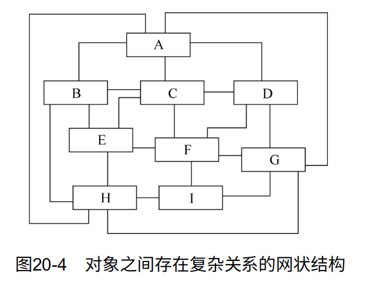
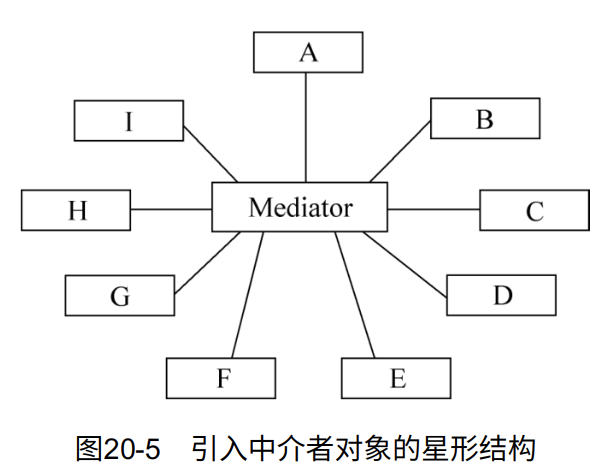
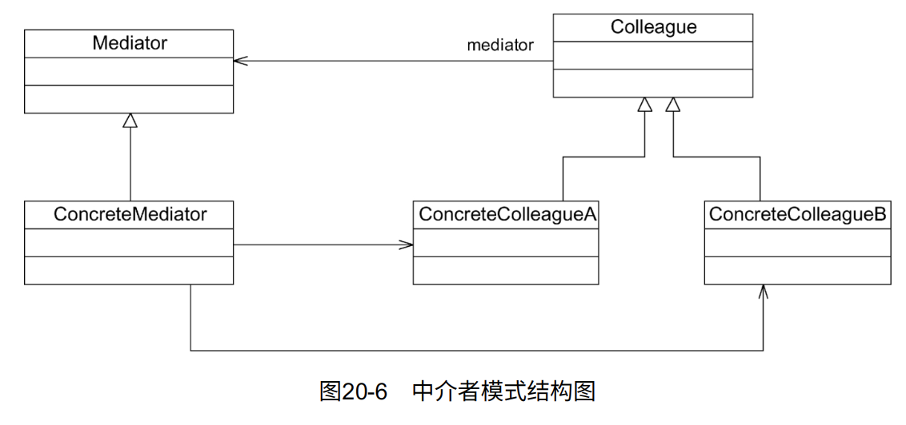

# 中介者模式

如果在一个系统中对象之间的联系呈现为网状结构，如图20-4所示。对象之间存在大量的多对多联系，将导致系统非常复杂，这些对象既会影响别的对象，也会被别的对象所影响，这些对象称为同事对象，它们之间通过彼此的相互作用实现系统的行为。在网状结构中，几乎每个对象都需要与其他对象发生相互作用，而这种相互作用表现为一个对象与另外一个对象的直接耦合，这将导致一个过度耦合的系统。

中介者模式可以使对象之间的关系数量急剧减少。通过引入中介者对象，可以将系统的网状结构变成以中介者为中心的星形结构，如图20-5所示。在这个星形结构中，同事对象不再直接与另一个对象联系，它通过中介者对象与另一个对象发生相互作用。中介者对象的存在保证了对象结构上的稳定，也就是说，系统的结构不会因为新对象的引入带来大量的修改工作。

如果在一个系统中对象之间存在多对多的相互关系，可以将对象之间的一些交互行为从各个对象中分离出来，并集中封装在一个中介者对象中，由该中介者进行统一协调，这样对象之间多对多的复杂关系就转化为相对简单的一对多关系。通过引入中介者来简化对象之间的复杂交互，中介者模式是迪米特法则的一个典型应用。

## 定义

中介者模式（Mediator
Pattern）：用一个中介对象（中介者）来封装一系列的对象交互。中介者使各对象不需要显式地相互引用，从而使其耦合松散，而且可以独立地改变它们之间的交互。中介者模式又称为调停者模式，它是一种对象行为型模式。

中介者模式的核心在于中介者类的引入。在中介者模式中，中介者类承担了以下两方面的职责：

1. 中转作用（结构性）。通过中介者提供的中转作用，各个同事对象就不再需要显式地引用其他同事。当需要和其他同事进行通信时，可通过中介者来实现间接调用。该中转作用属于中介者在结构上的支持。

2.
协调作用（行为性）。中介者可以更进一步地对同事之间的关系进行封装，同事可以一致地和中介者进行交互，而不需要指明中介者需要具体怎么做。中介者根据封装在自身内部的协调逻辑，对同事的请求进行进一步处理，将同事成员之间的关系行为进行分离和封装。该协调作用属于中介者在行为上的支持。

## UML

## 主要优点

1. 中介者模式简化了对象之间的交互，它用中介者和同事的一对多交互代替了原来同事之间的多对多交互。一对多关系更容易理解、维护和扩展，将原本难以理解的网状结构转换成相对简单的星形结构。
2. 中介者模式可将各同事对象解耦。中介者有利于各同事之间的松耦合，可以独立地改变和复用每一个同事和中介者，增加新的中介者和新的同事类都比较方便，更好地符合开闭原则。
3. 可以减少大量同事子类生成。中介者将原本分布于多个对象间的行为集中在一起，改变这些行为只需要生成新的中介者子类即可，这使得各个同事类可以被重用，无须对同事类进行扩展。

## 主要缺点

中介者模式的主要缺点是：在具体中介者类中包含了大量同事之间的交互细节，可能会导致具体中介者类非常复杂，使得系统难以维护。

## 适用场景

1. 系统中对象之间存在复杂的引用关系，系统结构混乱且难以理解。
2. 一个对象由于引用了其他很多对象并且直接和这些对象通信，导致难以复用该对象。
3. 想通过一个中间类来封装多个类中的行为，而又不想生成太多的子类。可以通过引入中介者类来实现，在中介者中定义对象交互的公共行为，如果需要改变行为则可以增加新的具体中介者类。

## 中介者与同事类的扩展

> 需要与具体示例配合使用，请参考《设计模式的艺术》一书第20章
