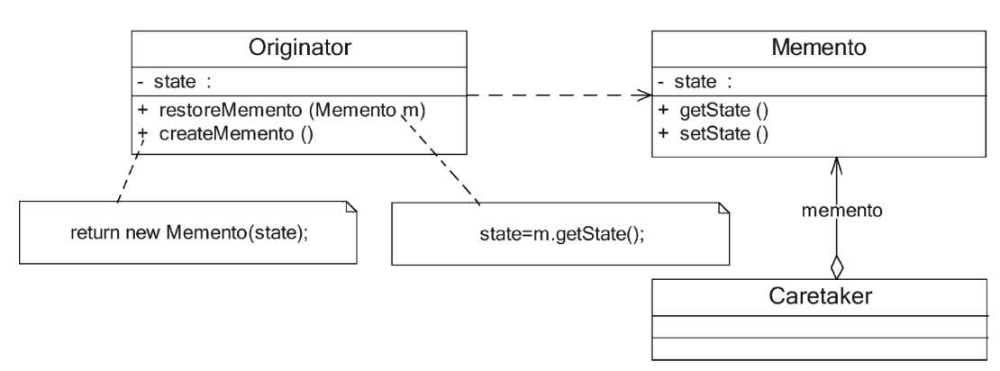

# 备忘录模式

**备忘录模式在很多软件的使用过程中普遍存在，但是在应用软件开发中，它的使用频率并不太高**，因为现在很多基于窗体和浏览器的应用软件并没有提供撤销操作。如果需要为软件提供撤销功能，备忘录模式无疑是一种很好的解决方案。在一些字处理软件、图像编辑软件、数据库管理系统等软件中备忘录模式都得到了很好的应用。

备忘录模式提供了一种状态恢复的实现机制，使得用户可以方便地回到一个特定的历史步骤。当新的状态无效或者存在问题时，可以使用暂时存储起来的备忘录将状态复原。当前很多软件都提供了撤销（Undo）操作，其中就使用了备忘录模式。

## 定义

在不破坏封装的前提下，捕获一个对象的内部状态，并在该对象之外保存这个状态，这样可以在以后将对象恢复到原先保存的状态。它是一种对象行为型模式，其别名为Token。

## UML

1. Originator（原发器）：它是一个普通类，可以创建一个备忘录，并存储其当前内部状态，也可以使用备忘录来恢复其内部状态。一般将需要保存内部状态的类设计为原发器。
2. Memento（备忘录）：存储原发器的内部状态，根据原发器来决定保存哪些内部状态。备忘录的设计一般可以参考原发器的设计，根据实际需要确定备忘录类中的属性。需要注意的是，除了原发器本身与负责人类之外，备忘录对象不能直接供其他类使用。原发器的设计在不同的编程语言中实现机制会有所不同。
3. Caretaker（负责人）：负责人又称为管理者，他负责保存备忘录，但是不能对备忘录的内容进行操作或检查。在负责人类中可以存储一个或多个备忘录对象，他只负责存储对象，而不能修改对象，也无须知道对象的实现细节。

## 主要优点

1. **它提供了一种状态恢复的实现机制，使得用户可以方便地回到一个特定的历史步骤**。当新的状态无效或者存在问题时，可以使用暂时存储起来的备忘录将状态复原。
2. **备忘录实现了对信息的封装。一个备忘录对象是一种原发器对象状态的表示，不会被其他代码所改动**。**备忘录保存了原发器的状态，采用列表、堆栈等集合来存储备忘录对象可以实现多次撤销操作。**

## 主要缺点

**资源消耗过大**。如果需要保存的原发器类的成员变量太多，就不可避免地需要占用大量的存储空间，每保存一次对象的状态都需要消耗一定的系统资源。

## 适用场景

1. 保存一个对象在某一个时刻的全部状态或部分状态，这样以后需要时就能够恢复到先前的状态，实现撤销操作。
2. 防止外界对象破坏一个对象历史状态的封装性，避免将对象历史状态的实现细节暴露给外界对象。

## 实现多次撤销

**在负责人类中定义一个集合来存储多个备忘录。**每个备忘录负责保存一个历史状态，在撤销时可以对备忘录集合进行逆向遍历，回到一个指定的历史状态，而且还可以对备忘录集合进行正向遍历，实现重做（Redo）或恢复操作，即取消撤销，让对象状态得到恢复。

但是使用一个集合来存储多个备忘录会遇见一个问题：

只能实现最简单的Undo和Redo操作，并未考虑对象状态在操作过程中出现分支的情况。如果在撤销到某个历史状态之后，用户再修改对象状态，此后执行Undo操作时可能会发生对象状态错误，大家可以思考其产生原因。（注：可将对象状态的改变绘制成一张树状图进行分析。）

在实际开发中，可以使用链表或者堆栈来处理有分支的对象状态改变。大家可通过链表或者堆栈对上述实例进行改进。

## 再谈备忘录的封装

**备忘录是一个很特殊的对象，只有原发器对它拥有控制的权力，负责人只负责管理备忘录，而其他类无法直接访问到备忘录，因此需要对备忘录进行封装。**

为了实现对备忘录对象的封装，需要对备忘录的调用进行控制。对于原发器而言，它可以调用备忘录的所有信息，可以访问返回到先前状态所需的所有数据。对于负责人而言，只负责备忘录的保存并将备忘录传递给其他对象。对于其他对象而言，只需要从负责人处取出备忘录对象并将原发器对象的状态恢复，而无须关心备忘录的保存细节。理想的情况是只允许生成该备忘录的那个原发器访问备忘录的内部状态。

**在实际开发中，原发器与备忘录之间的关系是非常特殊的，它们要分享信息而不让其他类知道，实现方法因编程语言的不同而有所差异**。在C++中可以使用friend关键字，让原发器类和备忘录类成为友元类，相互之间可以访问对方的一些私有属性。在Java语言中可以将原发器类和备忘录类放在一个包中，让它们之间满足默认的包内可见性，也可以将备忘录类作为原发器类的内部类，使得只有原发器才可以访问备忘录中的数据，其他对象都无法直接使用备忘录中的数据。