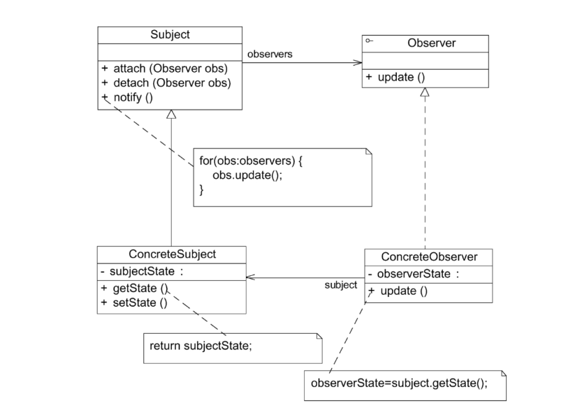

# 观察者模式

在软件系统中，有些对象之间也存在类似交通信号灯和汽车之间的关系。一个对象的状态或行为的变化将导致其他对象的状态或行为也发生改变，它们之间将产生联动，正所谓“触一而牵百发”。为了更好地描述对象之间存在的这种一对多（包括一对一）的联动，观察者模式应运而生。它定义了对象之间一对多的依赖关系，让一个对象的改变能够影响其他对象。

## 定义

定义对象之间的一种一对多依赖关系，使得每当一个对象状态发生改变时，其相关依赖对象皆得到通知并被自动更新。观察者模式的别名包括发布-订阅（Publish/Subscribe）模式、模型-视图（Model/View）模式、源-监听器（Source/Listener）模式或从属者（Dependents）模式。观察者模式是一种对象行为型模式。

## UML

1. Subject（目标）：目标又称为主题，它是指被观察的对象。在目标中定义了一个观察者集合，一个观察目标可以接受任意数量的观察者来观察，它提供一系列方法来增加和删除观察者对象，同时定义了通知方法notify（）。目标类可以是接口，也可以是抽象类或具体类。
2. ConcreteSubject（具体目标）：具体目标是目标类的子类，通常它包含有经常发生改变的数据，当它的状态发生改变时，向它的各个观察者发出通知；同时它还实现了在目标类中定义的抽象业务逻辑方法（如果有的话）。如果无须扩展目标类，则具体目标类可以省略。
3. Observer（观察者）：观察者将对观察目标的改变做出反应，观察者一般定义为接口，该接口声明了更新数据的方法update（）。
4. ConcreteObserver（具体观察者）：在具体观察者中维护一个指向具体目标对象的引用，它存储具体观察者的有关状态，这些状态需要和具体目标的状态保持一致；它实现了在抽象观察者Observer中定义的update（）方法。通常在实现时，可以调用具体目标类的attach（）方法将自己添加到目标类的集合中或通过detach（）方法将自己从目标类的集合中删除。

## 主要优点

1. 观察者模式可以实现表示层和数据逻辑层的分离。它定义了稳定的消息更新传递机制，并抽象了更新接口，使得可以有各种各样不同的表示层充当具体观察者角色。
2. 观察者模式在观察目标和观察者之间建立一个抽象的耦合。观察目标只需要维持一个抽象观察者的集合，无须了解其具体观察者。由于观察目标和观察者没有紧密地耦合在一起，因此它们可以属于不同的抽象化层次。
3. 观察者模式支持广播通信。观察目标会向所有已注册的观察者对象发送通知，简化了一对多系统设计的难度。
4. 观察者模式满足开闭原则的要求，增加新的具体观察者无须修改原有系统代码。在具体观察者与观察目标之间不存在关联关系的情况下，增加新的观察目标也很方便。

## 主要缺点

1. 如果一个观察目标对象有很多直接和间接观察者，将所有的观察者都通知到会花费很多时间。
2. 如果在观察者和观察目标之间存在循环依赖，观察目标会触发它们之间进行循环调用，可能导致系统崩溃。
3. 观察者模式没有相应的机制让观察者知道所观察的目标对象是怎么发生变化的，而仅仅只是知道观察目标发生了变化。

## 适用场景

1. 一个抽象模型有两个方面，其中一个方面依赖于另一个方面，将这两个依赖方面封装在独立的对象中以使它们可以各自独立地改变和复用。
2. 一个对象的改变将导致一个或多个其他对象也发生改变，而并不知道具体有多少对象将发生改变，也不知道这些对象是谁。
3. 需要在系统中创建一个触发链，A对象的行为将影响B对象，B对象的行为将影响C对象……可以使用观察者模式创建一种链式触发机制。

## JDK对观察者模式的支持

在java.util.Observer中只声明一个方法，它充当抽象观察者，但是该方法在JDK9时已经废弃。

取代者是java.util.concurrent.Flow，它是基于响应式流（Reactive Streams）规范的。Flow API提供了一种标准化的方式来处理异步数据流和背压。以下是对Flow API的详细介绍以及如何使用它来实现观察者模式。

java.util.concurrent.Flow 概述
Flow API 包含以下核心接口：

- Publisher<T>：发布者，生成数据流。
- Subscriber<T>：订阅者，消费数据流。
- Subscription：表示订阅关系，用于控制数据流。
- Processor<T, R>：处理器，可以作为中介处理数据。

本次示例也是根据该Flow API来实现的。

另外，除去Flow之外，也可通过RxJava来实现，RxJava基于ReactiveX的理念，通过使用可观察的序列来组合异步和基于事件的程序。以下是RxJava的核心概念和组件：

Observable<T>：可观察对象，生成数据流。
Observer<T>：观察者，消费数据流。
Disposable：表示订阅关系，可以用于取消订阅。
Subject<T>：既是Observable又是Observer，可以用来桥接或多播数据流。
RxJava提供了大量的操作符，用于创建、转换、组合和过滤数据流。这使得它非常灵活和强大，适用于各种异步编程场景。

本实例也提供了RxJava的相关示例。

## 观察者和Java事件处理

JDK 1.0及更早版本的事件模型基于职责链模式，但是这种模型不适用于复杂的系统。因此，在JDK 1.1及以后的各个版本中，事件处理模型采用基于观察者模式的委派事件模型（Delegation Event Model，DEM），即一个Java组件所引发的事件并不由引发事件的对象自己来负责处理，而是委派给独立的事件处理对象负责。

在DEM模型中，目标角色（例如界面组件）负责发布事件，而观察者角色（事件处理者）可以向目标订阅它所感兴趣的事件。当一个具体目标产生一个事件时，它将通知所有订阅者。事件的发布者称为**事件源（Event Source）**，而订阅者称为**事件监听器（Event Listener）**。在这个过程中还可以通过**事件对象（Event Object）**来传递与事件相关的信息。在事件监听者的实现类中实现事件处理，因此事件监听对象又可以称为事件处理对象。事件源对象、事件监听对象（事件处理对象）和事件对象构成了Java事件处理模型的三要素。事件源对象充当观察目标，而事件监听对象充当观察者。以按钮单击事件为例，其事件处理流程如下：

1. 如果用户在GUI中单击一个按钮，将触发一个事件（例如ActionEvent类型的动作事件）。JVM将产生一个相应的ActionEvent类型的事件对象，在该事件对象中包含了有关事件和事件源的信息，此时按钮是事件源对象。

2. 将ActionEvent事件对象传递给事件监听对象（事件处理对象），JDK提供了专门用于处理ActionEvent事件的接口ActionListener。开发人员需提供一个ActionListener的实现类（例如MyActionHandler），实现在ActionListener接口中声明的抽象事件处理方法actionPerformed（），对所发生事件做出相应的处理。
3. 开发人员将ActionListener接口的实现类（例如MyActionHandler）对象注册到按钮中，可以通过按钮类的addActionListener（）方法来实现注册。
4. JVM在触发事件时将调用按钮的fire×××（）方法，在该方法内部将调用注册到按钮中的事件处理对象的actionPerformed（）方法，实现对事件的处理。
