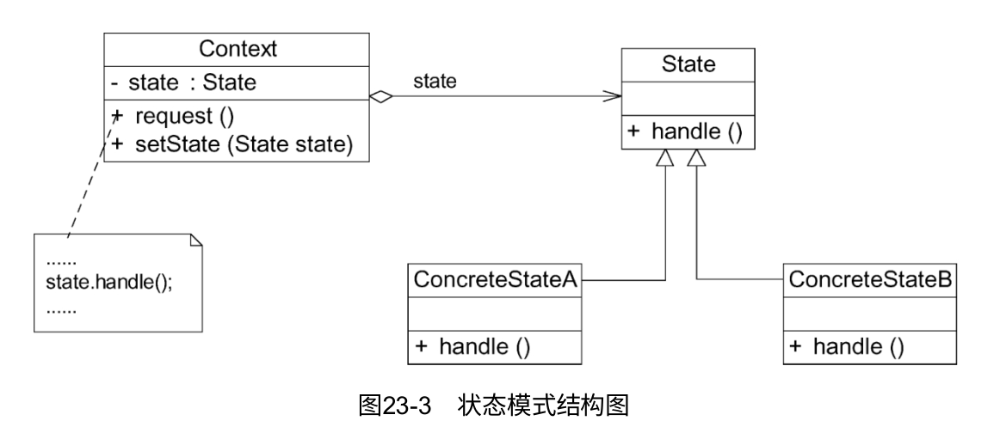

# 状态模式

状态模式用于解决系统中复杂对象的状态转换以及不同状态下行为的封装问题。当系统中某个对象存在多个状态，这些状态之间可以进行转换，而且对象在不同状态下行为不相同时可以使用状态模式。状态模式将一个对象的状态从该对象中分离出来，封装到专门的状态类中，使得对象状态可以灵活变化。对于客户端而言，无须关心对象状态的转换以及对象所处的当前状态，无论对于何种状态的对象，客户端都可以一致性地处理。

## 定义

**允许一个对象在其内部状态改变时改变它的行为，对象看起来似乎修改了它的类**。其别名为状态对象（Objects for States），状态模式是一种对象行为型模式。

## UML

1. Context（环境类）：环境类又称为上下文类，它是拥有多种状态的对象。由于环境类的状态存在多样性且在不同状态下对象的行为有所不同，因此将状态独立出去形成单独的状态类。在环境类中维护一个抽象状态类State的实例，这个实例定义当前状态，在具体实现时，它是一个State子类的对象。
2. State（抽象状态类）：它用于定义一个接口以封装与环境类的一个特定状态相关的行为。在抽象状态类中声明各种不同状态对应的方法，而在其子类中实现这些方法。由于不同状态下对象的行为可能不同，因此在不同子类中方法的实现可能存在不同，相同的方法可以写在抽象状态类中。
3. ConcreteState（具体状态类）：它是抽象状态类的子类，每个子类实现一个与环境类的一个状态相关的行为。每个具体状态类对应环境类的一个具体状态，不同的具体状态类其行为有所不同。

## 主要优点

1. 封装了状态的转换规则。**在状态模式中可以将状态的转换代码封装在环境类或者具体状态类中**，对状态转换代码进行集中管理，而不是分散在一个个业务方法中。
2. 将所有与某个状态有关的行为放到一个类中，只需要注入一个不同的状态对象即可使环境对象拥有不同的行为。
3. **允许状态转换逻辑与状态对象合成一体，而不是提供一个巨大的条件语句块。状态模式可以避免使用庞大的条件语句来将业务方法和状态转换代码交织在一起。**
4. 可以让多个环境对象共享一个状态对象，从而减少系统中对象的个数。

## 主要缺点

1. **状态模式的使用必然会增加系统中类和对象的个数，导致系统运行开销增大。**
2. 状态模式的程序结构与实现都较为复杂，如果使用不当将导致程序结构和代码的混乱，增加系统设计的难度。
3. **状态模式对开闭原则的支持并不太好**。增加新的状态类需要修改那些负责状态转换的源代码，否则无法转换到新增状态；而且修改某个状态类的行为也需修改对应类的源代码。

## 适用场景

1. **对象的行为依赖于它的状态（例如某些属性值），状态的改变将导致行为的变化**。
2. **在代码中包含大量与对象状态有关的条件语句**。这些条件语句的出现，会导致代码的可维护性和灵活性变差，不能方便地增加和删除状态，并且导致客户类与类库之间的耦合增强。

## 共享状态

在有些情况下，多个环境对象可能需要共享同一个状态。如果希望在系统中实现多个环境对象共享一个或多个状态对象，那么需要将这些状态对象定义为环境类的静态成员对象。

## 使用环境类实现状态转换

在状态模式中实现状态转换时，在具体状态类中可通过调用环境类Context的setState（）方法进行状态的转换操作，也可以统一由环境类Context来实现状态的转换。此时，**增加新的具体状态类可能需要修改其他具体状态类或者环境类的源代码，否则系统无法转换到新增状态**（这是它的缺点之一）。但是对于客户端来说，无须关心状态类，可以为环境类设置默认的状态类，而将状态的转换工作交给具体状态类或环境类来完成，具体的转换细节对于客户端而言是透明的。