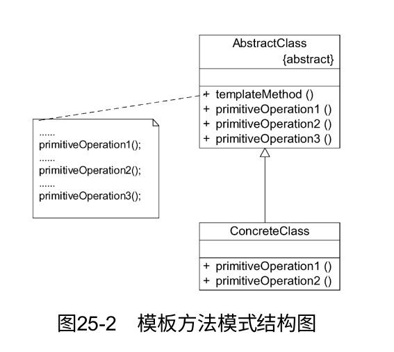

# 模板方法模式

模板方法模式是结构最简单的行为型设计模式，在其结构中只存在父类与子类之间的继承关系。通过使用模板方法模式，可以将一些复杂流程的实现步骤封装在一系列基本方法中。在抽象父类中提供一个称之为模板方法的方法来定义这些基本方法的执行次序，而通过其子类来覆盖某些步骤，从而使得相同的算法框架可以有不同的执行结果。模板方法模式提供了一个模板方法来定义算法框架，而某些具体步骤的实现可以在其子类中完成。

## 定义

定义一个操作中算法的框架，而将一些步骤延迟到子类中。模板方法模式使得子类可以不改变一个算法的结构即可重定义该算法的某些特定步骤。模板方法模式是一种类行为型模式。

## UML



1. AbstractClass（抽象类）：在抽象类中定义了一系列基本操作（Primitive Operations），这些基本操作可以是具体的，也可以是抽象的。每个基本操作对应算法的一个步骤，在其子类中可以重定义或实现这些步骤。同时，在抽象类中实现了一个模板方法（Template Method），用于定义一个算法的框架。模板方法不仅可以调用在抽象类中实现的基本方法，也可以调用在抽象类的子类中实现的基本方法，还可以调用其他对象中的方法。
2. ConcreteClass（具体子类）：它是抽象类的子类，用于实现在父类中声明的抽象基本操作以完成子类特定算法的步骤，也可以覆盖在父类中已经实现的具体基本操作。在使用模板方法模式时，开发抽象类的软件设计师和开发具体子类的软件设计师之间可以进行协作。一个设计师负责给出一个算法的轮廓和框架，另一些设计师则负责给出这个算法的各个逻辑步骤。实现这些具体逻辑步骤的方法即为基本方法，而将这些基本方法汇总起来的方法即为模板方法，模板方法模式的名字也因此而来。下面将详细介绍模板方法和基本方法。

## 主要优点

1. 模板方法模式在父类中形式化地定义一个算法，而由它的子类来实现细节的处理。在子类实现详细的处理算法时并不会改变算法中步骤的执行次序。
2. 模板方法模式是一种代码复用技术，它在类库设计中尤为重要。它提取了类库中的公共行为，将公共行为放在父类中，而通过其子类来实现不同的行为。它鼓励恰当使用继承来实现代码复用。
3. 模板方法模式可实现一种反向控制结构。通过子类覆盖父类的钩子方法来决定某一特定步骤是否需要执行。
4. 在模板方法模式中可以通过子类来覆盖父类的基本方法，不同的子类可以提供基本方法的不同实现，更换和增加新的子类很方便，符合单一职责原则和开闭原则。

## 主要缺点

需要为每一个基本方法的不同实现提供一个子类。如果父类中可变的基本方法太多，将会导致类的个数增加，系统更加庞大，设计也更加抽象。此时，可结合桥接模式来进行设计。

## 适用场景

1. 对一些复杂的算法进行分割，将其算法中固定不变的部分设计为模板方法和父类具体方法，而一些可以改变的细节由其子类来实现。即一次性地实现一个算法的不变部分，并将可变的行为留给子类来实现。
2. 各子类中公共的行为应被提取出来并集中到一个公共父类中以避免代码重复。
3. 需要通过子类来决定父类算法中某个步骤是否执行，实现子类对父类的反向控制。


## 模板方法中的钩子函数

在对模板方法模式进行学习时，大家已经知道该模式不仅在父类中提供了一个定义算法框架的模板方法，还提供了一系列抽象方法、具体方法和钩子方法，其中钩子方法的引入使得子类可以控制父类的行为。最简单的钩子方法就是空方法，代码如下：

```java
public void display(){}
```

当然也可以在钩子方法中提供一个默认的实现，如果子类不覆盖钩子方法，则执行父类的默认实现代码。另一种钩子方法可以用于对其他方法进行约束，这种钩子方法通常返回一个boolean类型的值，即返回true或false，用来判断是否执行某一个基本方法。下面通过一个实例来说明这种钩子方法的使用。