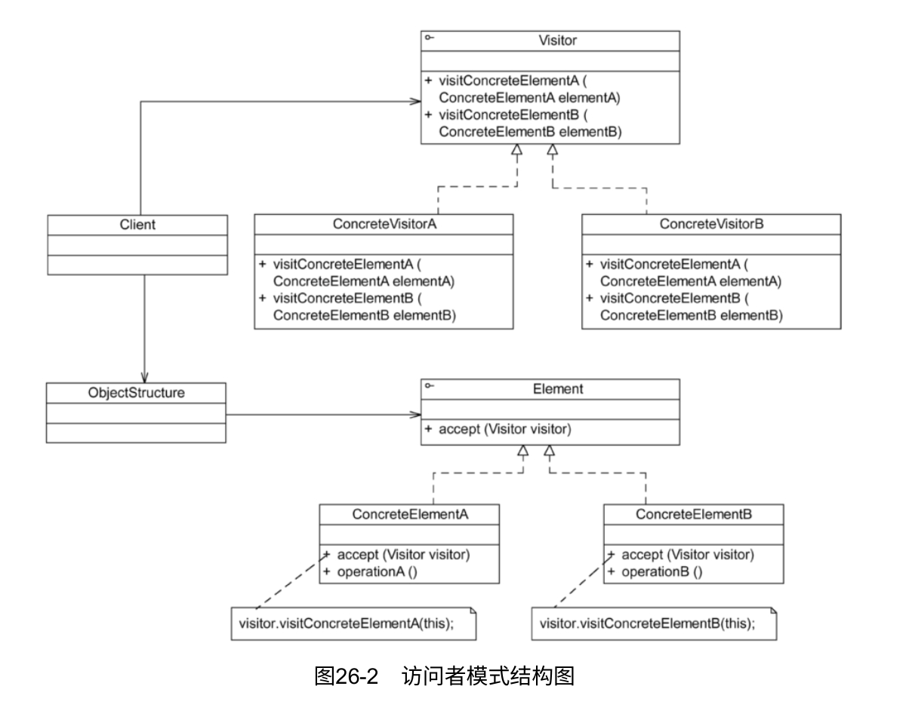
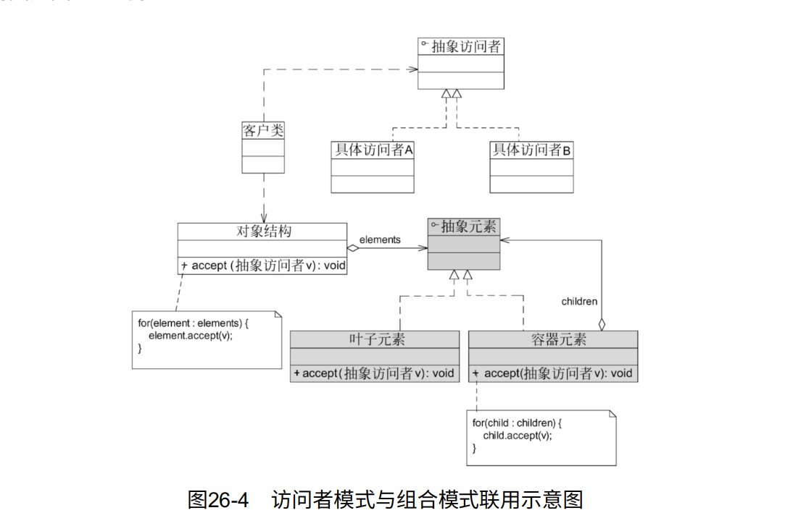

# 访问者模式

由于访问者模式的使用条件较为苛刻，本身结构也较为复杂，因此在实际应用中使用频率不是特别高。

访问者模式是一种较为复杂的行为型设计模式，它包含访问者和被访问元素两个主要组成部分。这些被访问的元素通常具有不同的类型，且不同的访问者可以对它们进行不同的访问操作。例如处方单中的各种药品信息就是被访问的元素，而划价人员和药房工作人员就是访问者。访问者模式使得用户可以在不修改现有系统的情况下扩展系统的功能，为这些不同类型的元素增加新的操作。

在使用访问者模式时，被访问的元素通常不是单独存在的，它们存储在一个集合中，这个集合称为“对象结构”。访问者通过遍历对象结构实现对其中存储的元素的逐个操作。

## 定义

提供一个作用于某对象结构中的各元素的操作表示，它使得可以在不改变各元素的类的前提下定义作用于这些元素的新操作。访问者模式是一种对象行为型模式。

## UML

1.
Visitor（抽象访问者）：抽象访问者为对象结构中每个具体元素类ConcreteElement声明一个访问操作，从这个操作的名称或参数类型可以清楚知道需要访问的具体元素的类型。具体访问者需要实现这些操作方法，提供对这些元素的访问操作。
2. ConcreteVisitor（具体访问者）：具体访问者实现了每个由抽象访问者声明的操作，每个操作用于访问对象结构中一种类型的元素。
3. Element（抽象元素）：抽象元素一般是抽象类或者接口，它定义一个accept（）方法，该方法通常以一个抽象访问者作为参数。（稍后将介绍为什么要这样设计。）
4. ConcreteElement（具体元素）：具体元素实现了accept（）方法，在accept（）方法中调用访问者的访问方法以便完成对一个元素的操作。
5. ObjectStructure（对象结构）：对象结构是一个元素的集合，它用于存放元素对象，并且提供了遍历其内部元素的方法。它可以结合组合模式来实现，也可以是一个简单的集合对象，例如一个List对象或一个Set对象。

## 主要优点

1. 增加新的访问操作很方便。使用访问者模式，增加新的访问操作就意味着增加一个新的具体访问者类，实现简单，无须修改源代码，符合开闭原则。
2. 将有关元素对象的访问行为集中到一个访问者对象中，而不是分散在一个个的元素类中。类的职责更加清晰，有利于对象结构中元素对象的复用，相同的对象结构可以供多个不同的访问者访问。
3. 让用户能够在不修改现有元素类层次结构的情况下，定义作用于该层次结构的操作。

## 主要缺点

1. 增加新的元素类很困难。在访问者模式中，每增加一个新的元素类都意味着要在抽象访问者角色中增加一个新的抽象操作，并在每一个具体访问者类中增加相应的具体操作，这违背了开闭原则的要求。
2. 破坏封装。访问者模式要求访问者对象访问并调用每一个元素对象的操作，这意味着元素对象有时候必须暴露一些自己的内部操作和内部状态，否则无法供访问者访问。

## 适用场景

1. 一个对象结构包含多种类型的对象，希望对这些对象实施一些依赖其具体类型的操作。在访问者中针对每一种具体的类型都提供了一个访问操作，不同类型的对象可以有不同的访问操作。
2.
需要对一个对象结构中的对象进行很多不同的并且不相关的操作，而且需要避免让这些操作“污染”这些对象的类，也不希望在增加新操作时修改这些类。访问者模式将相关的访问操作集中起来定义在访问者类中，对象结构可以被多个不同的访问者类所使用，将对象本身与对象的访问操作分离。
3. 对象结构中元素对象对应的类很少改变，但经常需要在此对象结构上定义新的操作。

## 访问模式与组合模式结合使用

在访问者模式中，包含一个用于存储元素对象集合的对象结构，通常可以使用迭代器来遍历对象结构。具体元素之间如果存在整体与部分关系，有些元素作为容器对象，有些元素作为成员对象，则可以使用组合模式来组织元素。引入组合模式后的访问者模式结构图如图26-4所示。

需要注意的是，在图26-4所示结构中，由于叶子元素的遍历操作已经在容器元素中完成，因此要防止单独将已增加到容器元素中的叶子元素再次加入对象结构中。对象结构中只保存容器元素和孤立的叶子元素。
