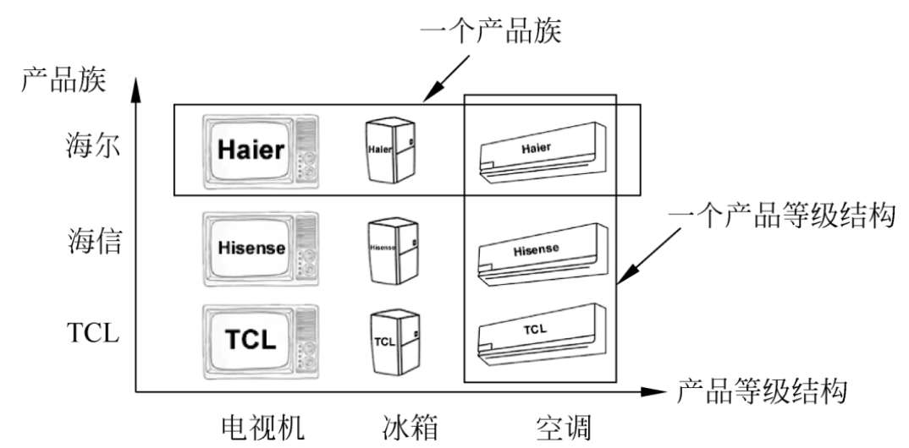
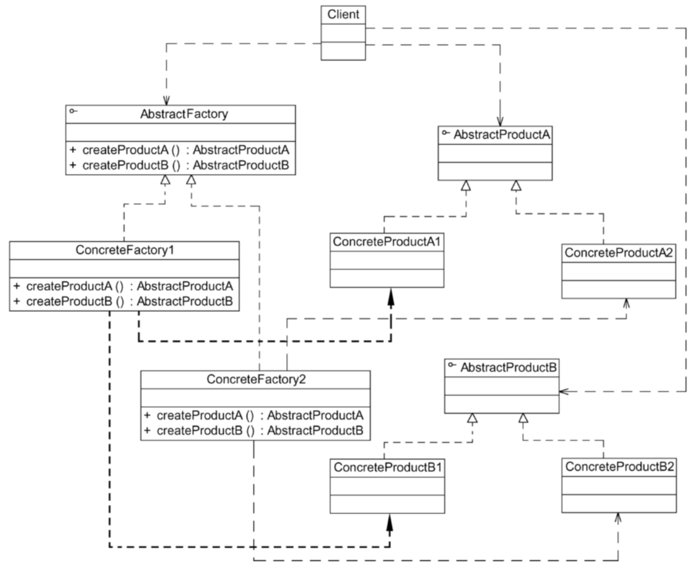

# 抽象工厂模式

> 在工厂方法模式中，具体工厂负责生产具体的产品，每个具体工厂对应一种具体产品，工厂方法具有唯一性。一般情况下，一个具体工厂中只有一个或者一组重载的工厂方法。但是，有时希望一个工厂可以提供多个产品对象，而不是单一的产品对象。例如一个电器工厂，它可以生产电视机、电冰箱、空调等多种电器，而不是只生产某一种电器。为了更好地理解抽象工厂模式，这里先引入如下两个概念：
>
> 1. 产品等级结构。产品等级结构即产品的继承结构，例如一个抽象类是电视机，其子类有海尔电视机、海信电视机、TCL电视机，则抽象电视机与具体品牌的电视机之间构成了一个产品等级结构，抽象电视机是父类，而具体品牌的电视机是其子类。
> 2. 产品族。在抽象工厂模式中，产品族是指由同一个工厂生产的，位于不同产品等级结构中的一组产品。例如海尔电器工厂生产的海尔电视机、海尔电冰箱，海尔电视机位于电视机产品等级结构中，海尔电冰箱位于电冰箱产品等级结构中，海尔电视机、海尔电冰箱构成了一个产品族。
>
> 

## 定义

抽象工厂模式（Abstract Factory Pattern）：提供一个创建一系列相关或相互依赖对象的接口，而无须指定它们具体的类。抽象工厂模式又称为Kit模式，它是一种对象创建型模式。

## UML

## 主要优点

1. 抽象工厂模式隔离了具体类的生成，使得客户并不需要知道什么被创建。由于这种隔离，更换一个具体工厂就变得相对容易，所有的具体工厂都实现了在抽象工厂中声明的那些公共接口，因此只需改变具体工厂的实例，就可以在某种程度上改变整个软件系统的行为。
2. 当一个产品族中的多个对象被设计成一起工作时，它能够保证客户端始终只使用同一个产品族中的对象。
3. 增加新的产品族很方便，无须修改已有系统，符合开闭原则。

## 主要缺点

增加新的产品等级结构麻烦，需要对原有系统进行较大的修改，甚至需要修改抽象层代码，这显然会带来较大的不便，**违背了开闭原则**。

## 适用场景

1. 一个系统不应当依赖于产品类实例如何被创建、组合和表达的细节，这对于所有类型的工厂模式都是很重要的，用户无须关心对象的创建过程，将对象的创建和使用解耦。
2. 系统中有多于一个的产品族，而每次只使用其中某一个产品族。可以通过配置文件等方式来使得用户可以动态改变产品族，也可以很方便地增加新的产品族。
3. 属于同一个产品族的产品将在一起使用，这一约束必须在系统的设计中体现出来。同一个产品族中的产品可以是没有任何关系的对象，但是它们都具有一些共同的约束。例如同一操作系统下的按钮和文本框，按钮与文本框之间没有直接关系，但它们都是属于某一操作系统的，此时具有一个共同的约束条件：操作系统的类型。
4. 产品等级结构稳定，设计完成之后，不会向系统中增加新的产品等级结构或者删除已有的产品等级结构。

## 开闭原则的倾斜性

在抽象工厂模式中，增加新的产品族很方便，但是增加新的产品等级结构很麻烦，抽象工厂模式的这种性质称为**开闭原则的倾斜性**。开闭原则要求系统对扩展开放，对修改封闭，通过扩展达到增强其功能的目的，对于涉及多个产品族与多个产品等级结构的系统，其功能增强包括两方面：

1. 增加产品族。对于增加新的产品族，抽象工厂模式很好地支持了开闭原则，只需要增加具体产品并对应增加一个新的具体工厂，对已有代码无须做任何修改
2. 增加新的产品等级结构。对于增加新的产品等级结构，需要修改所有的工厂角色，包括抽象工厂类，在所有的工厂类中都需要增加生产新产品的方法，违背了开闭原则。

正因为抽象工厂模式存在开闭原则的倾斜性，它以一种倾斜的方式来满足开闭原则，为增加新产品族提供方便，但不能为增加新产品结构提供这样的方便。因此，**要求设计人员在设计之初就能够全面考虑，不会在设计完成之后向系统中增加新的产品等级结构，也不会删除已有的产品等级结构，否则将导致系统出现较大的修改，为后续维护工作带来诸多麻烦。**