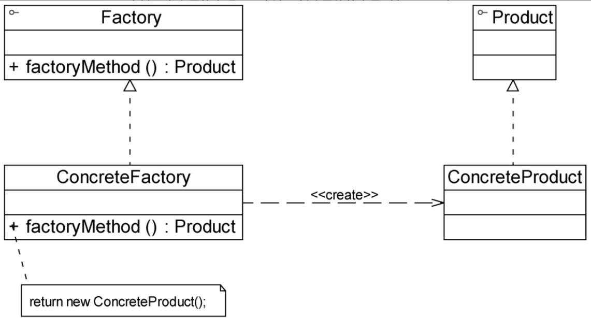
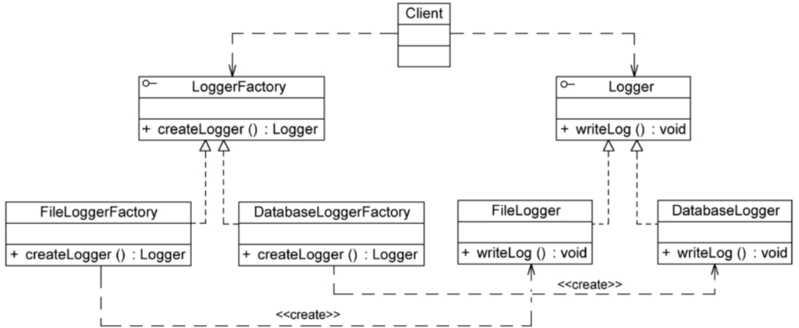

# 工厂方法模式

> 简单工厂模式最大的缺点是当有新产品要加入系统中时，必须修改工厂类，需要在其中加入必要的业务逻辑，这违背了开闭原则。此外，在简单工厂模式中，所有的产品都由同一个工厂创建，工厂类职责较重，业务逻辑较为复杂，具体产品与工厂类之间的耦合度高，严重影响了系统的灵活性和扩展性，而工厂方法模式则可以很好地解决这一问题。

## 定义

定义一个用于创建对象的接口，让子类决定将哪一个类实例化。工厂方法模式让一个类的实例化延迟到其子类。工厂方法模式又简称为工厂模式（Factory Pattern），又可称作虚拟构造器模式（Virtual Constructor Pattern）或多态工厂模式（Polymorphic Factory Pattern）。工厂方法模式是一种类创建型模式。

## UML

## 主要优点

1. **在工厂方法模式中，工厂方法用来创建客户所需要的产品，同时还向客户隐藏了哪种具体产品类将被实例化这一细节。**用户只需要关心所需产品对应的工厂，无须关心创建细节，甚至无须知道具体产品类的类名。
2. **基于工厂角色和产品角色的多态性设计是工厂方法模式的关键。**它能够让工厂可以自主确定创建何种产品对象，而如何创建这个对象的细节则完全封装在具体工厂内部。工厂方法模式之所以又被称为多态工厂模式，正是因为所有的具体工厂类都具有同一抽象父类。
3. 使用工厂方法模式的另一个优点是在系统中加入新产品时，无须修改抽象工厂和抽象产品提供的接口，无须修改客户端，也无须修改其他的具体工厂和具体产品，而只要添加一个具体工厂和具体产品就可以了。这样，系统的可扩展性也就变得非常好，**完全符合开闭原则**。

## 主要缺点

1. 在添加新产品时，需要编写新的具体产品类，而且还要提供与之对应的具体工厂类，系统中类的个数将成对增加，在一定程度上增加了系统的复杂度，有更多的类需要编译和运行，会给系统带来一些额外的开销。
2. 由于考虑到系统的可扩展性，需要引入抽象层，在客户端代码中均使用抽象层进行定义，增加了系统的抽象性和理解难度，且在实现时可能需要用到配置文件解析、反射等技术，增加了系统的实现难度。

## 适用场景

1. 客户端不知道其所需要的对象的类。在工厂方法模式中，客户端不需要知道具体产品类的类名，只需要知道所对应的工厂即可，具体的产品对象由具体工厂类创建，可将具体工厂类的类名存储在配置文件或数据库中。
2. 抽象工厂类通过其子类来指定创建哪个对象。在工厂方法模式中，抽象工厂类只需要提供一个创建产品的接口，而由其子类来确定具体要创建的对象，利用面向对象的多态性和里氏代换原则，在程序运行时，子类对象将覆盖父类对象，从而使得系统更容易扩展。

## 与简单工厂对比

与简单工厂模式相比，工厂方法模式最重要的区别是引入了抽象工厂角色。抽象工厂可以是接口，也可以是抽象类或者具体类。

在抽象工厂中声明了工厂方法但并未实现工厂方法，具体产品对象的创建由其子类负责。客户端针对抽象工厂编程，可在运行时再指定具体工厂类。具体工厂类实现了工厂方法，不同的具体工厂可以创建不同的具体产品。

在实际使用时，具体工厂类在实现工厂方法时除了创建具体产品对象之外，还可以负责产品对象的初始化工作以及一些资源和环境配置工作，例如连接数据库、创建文件等。

在客户端代码中，只需关心工厂类即可。不同的具体工厂可以创建不同的产品。

可以通过配置文件来存储具体工厂类ConcreteFactory的类名，更换新的具体工厂时无须修改源代码，系统扩展更为方便。

### 代码示例UML图

