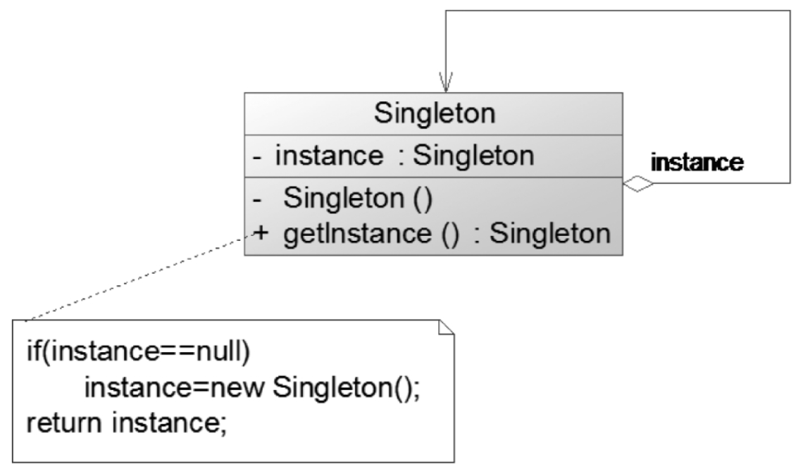

# 单例模式

> 为了节约系统资源，有时需要确保系统中某个类只有唯一一个实例，当这个唯一实例创建成功之后，无法再创建一个同类型的其他对象，所有的操作都只能基于这个唯一实例。为了确保对象的唯一性，可以通过单例模式来实现，这就是单例模式的动机所在。

## 定义

确保某一个类只有一个实例，而且自行实例化并向整个系统提供这个实例，这个类称为单例类，它提供全局访问的方法。单例模式是一种对象创建型模式。

## UML

## 主要优点

1. 单例模式提供了对唯一实例的受控访问。因为单例类封装了它的唯一实例，所以它可以严格控制客户怎样以及何时访问它。

2. 由于在系统内存中只存在一个对象，因此可以节约系统资源。对于一些需要频繁创建和销毁的对象，单例模式无疑可以提高系统的性能。

3. 允许可变数目的实例。基于单例模式，开发人员可以进行扩展，使用与控制单例对象相似的方法来获得指定个数的实例对象，既节省系统资源，又解决了由于单例对象共享过多有损性能的问题。（注：自行提供指定数目实例对象的类可称之为多例类。）

   

## 主要缺点

1. 由于单例模式中没有抽象层，因此单例类的扩展有很大的困难。
2. 单例类的职责过重，在一定程度上违背了单一职责原则。因为单例类既提供了业务方法，又提供了创建对象的方法（工厂方法），将对象的创建和对象本身的功能耦合在一起。
3. 现在很多面向对象语言（如Java、C＃）的运行环境都提供了自动垃圾回收技术，因此，如果实例化的共享对象长时间不被利用，系统会认为它是垃圾，会自动销毁并回收资源，下次利用时又将重新实例化，这将导致共享的单例对象状态的丢失。

## 适用场景

1. **系统只需要一个实例对象。**例如，系统要求提供一个唯一的序列号生成器或资源管理器，或者需要考虑资源消耗太大而只允许创建一个对象。
2. **客户调用类的单个实例只允许使用一个公共访问点。**除了该公共访问点，不能通过其他途径访问该实例。

## 饿汉式和懒汉式比较

饿汉式单例类在类被加载时就将自己实例化，它的优点在于无须考虑多线程访问问题，可以确保实例的唯一性；从调用速度和反应时间角度来讲，由于单例对象一开始就得以创建，因此要优于懒汉式单例。但是无论系统在运行时是否需要使用该单例对象，由于在类加载时该对象就需要创建，因此从资源利用效率角度来讲，饿汉式单例不及懒汉式单例，而且在系统加载时由于需要创建饿汉式单例对象，加载时间可能会比较长。

懒汉式单例类在第一次使用时创建，无须一直占用系统资源，实现了延迟加载。但是必须处理好多个线程同时访问的问题，特别是当单例类作为资源控制器，在实例化时必然涉及资源初始化，而资源初始化很有可能耗费大量时间，这意味着出现多线程同时首次引用此类的概率变得较大，需要通过双重检查锁定等机制进行控制，这将导致系统性能受到一定影响。
## 一种更好的实现方式
饿汉式单例类不能实现延迟加载，不管将来用不用，它始终占据内存；懒汉式单例类线程安全控制烦琐，而且性能受影响。可见，无论是饿汉式单例还是懒汉式单例都存在这样那样的问题。有没有一种方法，能够将两种单例的缺点都克服，而将两者的优点合二为一呢？答案是肯定的。下面来学习这种更好的被称为Initialization on Demand Holder（IoDH）的技术。
