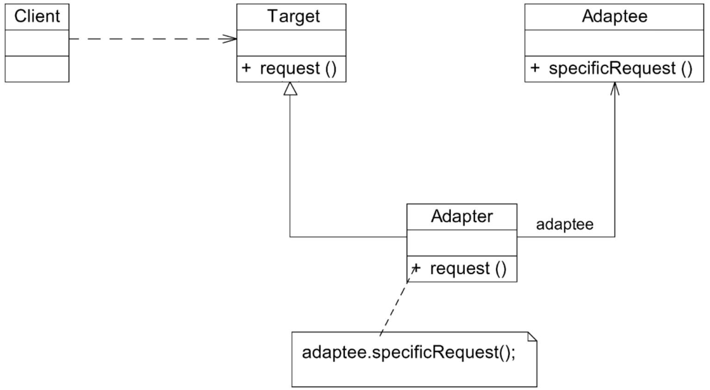
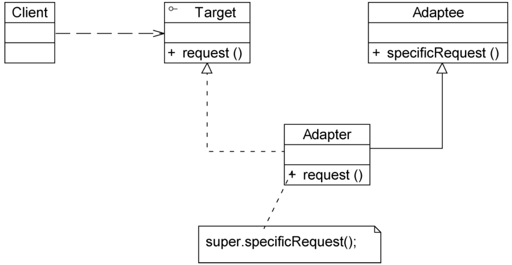
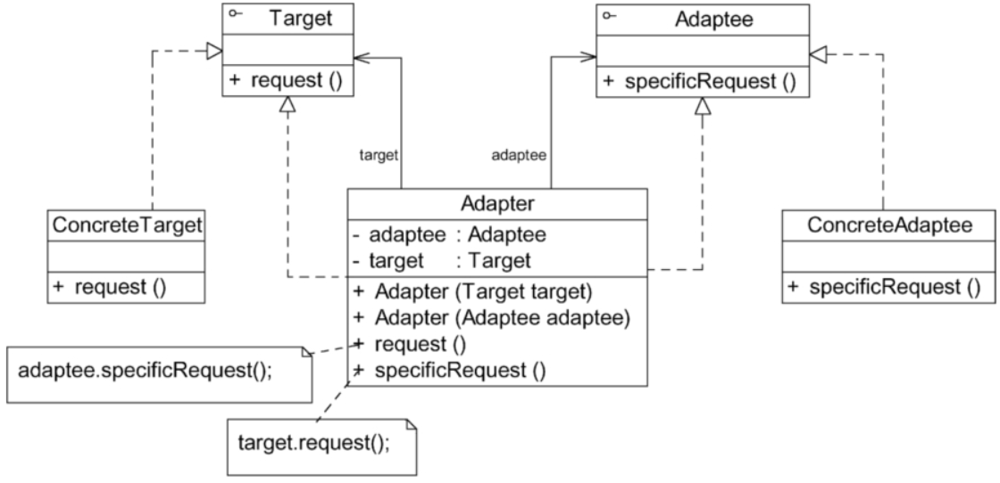
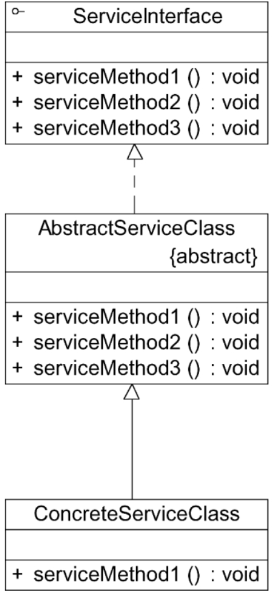

# 适配器模式

## 定义

将一个接口转换成客户希望的另一个接口，使接口不兼容的那些类可以一起工作，其别名为包装器（Wrapper）。适配器模式既可以作为类结构型模式，也可以作为对象结构型模式。

## UML

## 主要优点

无论是对象适配器模式还是类适配器模式都具有如下优点：

1. 将目标类和适配者类解耦。通过引入一个适配器类来重用现有的适配者类，无须修改原有结构。
2. 增加了类的透明性和复用性。将具体的业务实现过程封装在适配者类中，对于客户端类而言是透明的，而且提高了适配者类的复用性，同一个适配者类可以在多个不同的系统中复用。
3. 灵活性和扩展性都非常好。通过使用配置文件，可以很方便地更换适配器，也可以在不修改原有代码的基础上增加新的适配器类，完全符合开闭原则。

具体来说，类适配器模式还有这样的优点：由于适配器类是适配者类的子类，因此可以在适配器类中置换一些适配者的方法，使得适配器的灵活性更强。

‘对象适配器模式还有如下优点：

1. 一个对象适配器可以把多个不同的适配者适配到同一个目标。

2. 可以适配一个适配者的子类。由于适配器和适配者之间是关联关系，根据里氏代换原则，适配者的子类也可通过该适配器进行适配。

## 主要缺点

1. 对于Java、C＃等不支持多重类继承的语言，一次最多只能适配一个适配者类，不能同时适配多个适配者。
2. 适配者类不能为最终类，例如在Java中不能为final类，C＃中不能为sealed类。
3. 在Java、C＃等语言中，类适配器模式中的目标抽象类只能为接口，不能为类，其使用有一定的局限性。

对象适配器模式的缺点是：与类适配器模式相比，要在适配器中置换适配者类的某些方法比较麻烦。如果一定要置换掉适配者类的一个或多个方法，可以先做一个适配者类的子类，在子类中将适配者类的方法置换掉，然后再把适配者类的子类当作真正的适配者进行适配，实现过程较为复杂。

## 适用场景

1. 系统需要使用一些现有的类，而这些类的接口（例如方法名）不符合系统的需要，甚至没有这些类的源代码。
2. 想创建一个可以重复使用的类，用于与一些彼此之间没有太大关联的类，包括一些可能在将来引进的类一起工作。

## 类适配器模式

由于Java、C＃等语言不支持多重类继承，因此类适配器模式的使用受到很多限制。例如，如果目标抽象类Target不是接口，而是一个类，就无法使用类适配器模式。此外，如果适配者Adaptee为最终（Final）类，也无法使用类适配器模式。在Java等面向对象编程语言中，大部分情况下使用的是对象适配器模式，类适配器模式较少使用。

## 双向适配器模式

在对象适配器模式的使用过程中，如果在适配器中同时包含对目标类和适配者类的引用，适配者可以通过它调用目标类中的方法，目标类也可以通过它调用适配者类中的方法，那么该适配器就是一个双向适配器。

## 缺省适配器模式

缺省适配器模式（Default Adapter
Pattern）：当不需要实现一个接口所提供的所有方法时，可先设计一个抽象类实现该接口，并为接口中每个方法提供一个默认实现（空方法），那么该抽象类的子类可以选择性地覆盖父类的某些方法来实现需求。它适用于不想使用一个接口中的所有方法的情况，又称为单接口适配器模式。

