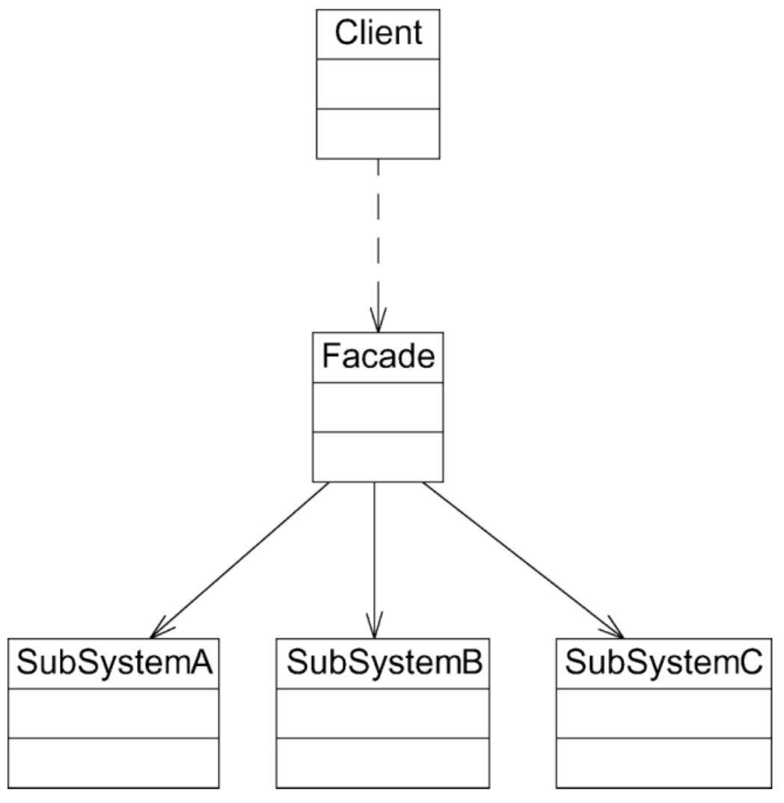
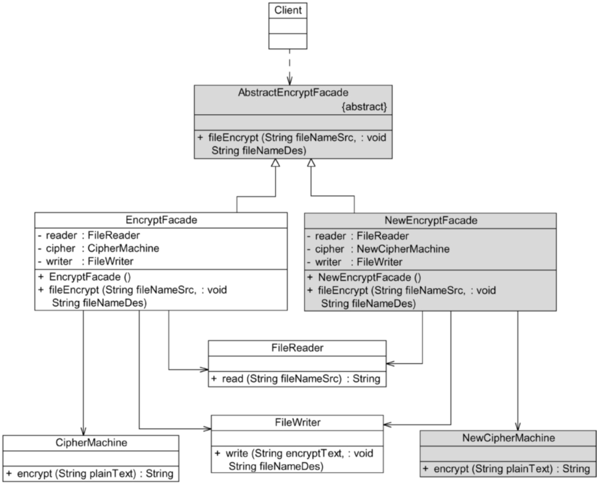
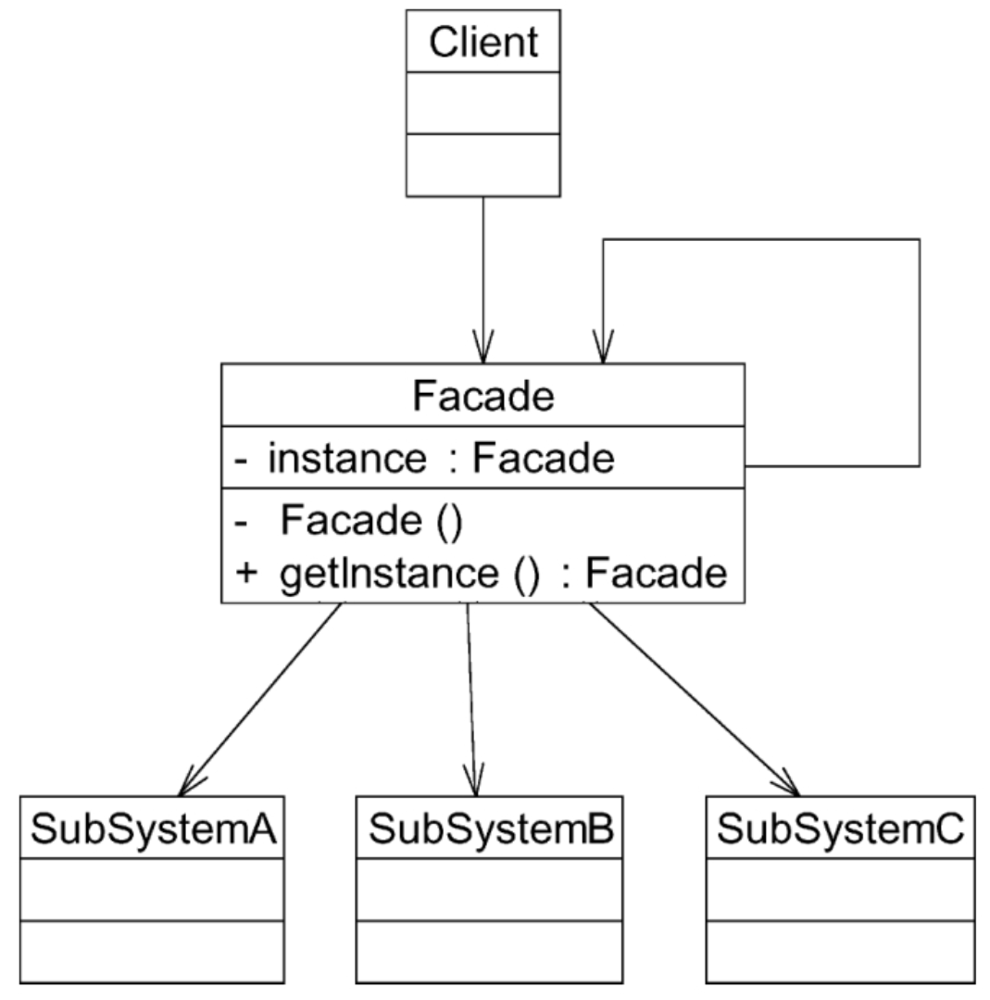

# 外观模式

## 定义

外部与一个子系统的通信通过一个统一的外观角色进行，为子系统中的一组接口提供一个一致的入口。外观模式定义了一个高层接口，这个接口使得子系统更加容易使用。外观模式又称为门面模式，它是一种对象结构型模式。

## UML

## 主要优点

1. 对客户端屏蔽了子系统组件，减少了客户端所需处理的对象数目并使得子系统使用起来更加容易。通过引入外观模式，客户端代码将变得很简单，与之关联的对象也很少。
2. **实现了子系统与客户端之间的松耦合关系**，这使得子系统的变化不会影响到调用它的客户端，只需要调整外观类即可。
3. 一个子系统的修改对其他子系统没有任何影响，而且子系统内部变化也不会影响到外观对象。
4. 只是提供了一个访问子系统的统一入口，并不影响客户端直接使用子系统类。

## 主要缺点

1. 不能很好地限制客户端直接使用子系统类，如果对客户端访问子系统类做太多的限制则减少了可变性和灵活性。
2. 如果设计不当，增加新的子系统可能需要修改外观类的源代码，这违背了开闭原则。

## 适用场景

1. 当要为访问一系列复杂的子系统提供一个简单入口时可以使用外观模式。
2. 客户端程序与多个子系统之间存在很大的依赖性。引入外观类可以将子系统与客户端解耦，从而提高子系统的独立性和可移植性。
3. 在层次化结构中，可以使用外观模式定义系统中每一层的入口，层与层之间不直接产生联系，而通过外观类建立联系，降低层之间的耦合度。

## 抽象外观类的引入

在标准的外观模式结构图中，如果需要增加、删除或更换与外观类交互的子系统类，必须修改外观类或客户端的源代码，这将违背开闭原则。因此，可以通过引入抽象外观类来对系统进行改进，在一定程度上解决该问题。

在引入抽象外观类之后，客户端可以针对抽象外观类进行编程，对于新的业务需求，不需要修改原有外观类，而对应增加一个新的具体外观类。由新的具体外观类来关联新的子系统对象，同时通过修改配置文件来达到不修改任何源代码并更换外观类的目的。

## 外观角色设计补充说明

1. 在很多情况下为了节约系统资源，系统中只需要一个外观类的实例。换言之，外观类可以是一个单例类。因此可以通过单例模式来设计外观类，从而确保系统中只有唯一一个访问子系统的入口，并降低对系统资源的消耗。

   

2. 在一个系统中可以设计多个外观类，每个外观类都负责和一些特定的子系统交互，向客户端提供相应的业务功能。
3. 试图通过外观类为子系统增加新行为的做法是错误的。外观模式的用意是为子系统提供一个集中化和简化的沟通渠道，而不是向子系统加入新行为。新行为的增加应该通过修改原有子系统类或增加新的子系统类来实现，不能通过外观类来实现。

