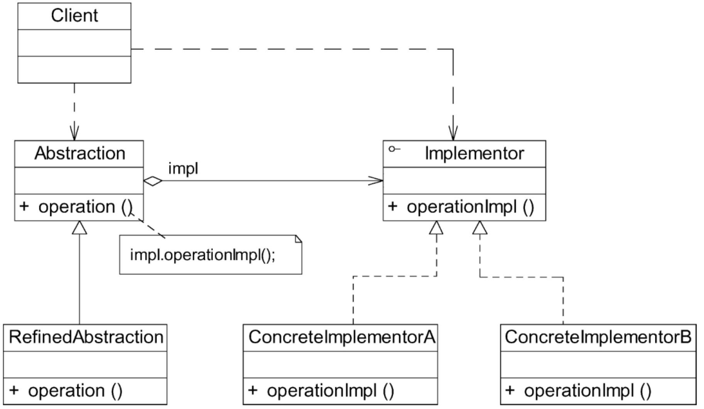
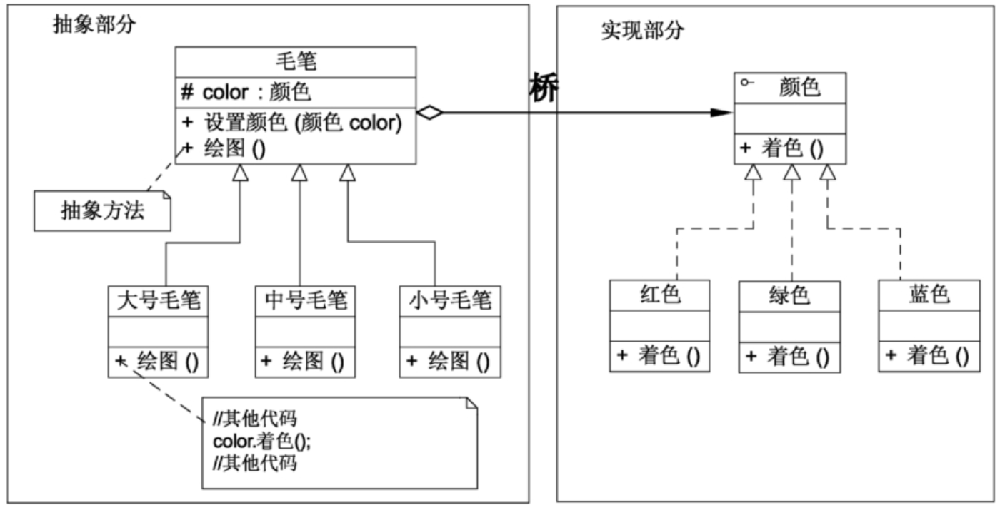
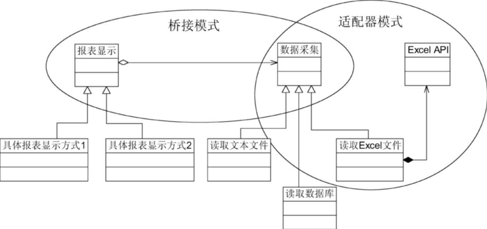

# 桥接模式

> 如果软件系统中某个类存在两个独立变化的维度，通过该模式可以将这两个维度分离出来，使两者可以独立扩展，让系统更加符合单一职责原则。与多层继承方案不同，它将两个独立变化的维度设计为两个独立的继承等级结构，并且在抽象层建立一个抽象关联，该关联关系类似一条连接两个独立继承结构的桥，故名桥接模式。

## 定义

将抽象部分与其实现部分分离，使它们都可以独立地变化。它是一种对象结构型模式，又称为柄体（Handle and Body）模式或接口（Interface）模式。

## UML

## 主要优点

1. 分离抽象接口及其实现部分。桥接模式使用“对象间的关联关系”**解耦了抽象和实现之间固有的绑定关系，使得抽象和实现可以沿着各自的维度来变化**（即抽象和实现不再在同一个继承层次结构中，而是“子类化”它们，使它们各自都具有自己的子类，以便任意组合子类，从而获得多维度组合对象）。
2. 在很多情况下，**桥接模式可以取代多层继承方案**。多层继承方案违背了单一职责原则，复用性较差，且类的个数非常多。桥接模式是比多层继承方案更好的解决方法，它极大地减少了子类的个数。
3. 桥接模式提高了系统的可扩展性。在两个变化维度中任意扩展一个维度，都不需要修改原有系统，符合开闭原则。

## 主要缺点

1. 桥接模式的使用会增加系统的理解与设计难度。由于关联关系建立在抽象层，要求开发者一开始就针对抽象层进行设计与编程。
2. 桥接模式要求正确识别出系统中两个独立变化的维度，因此其使用范围具有一定的局限性，如何正确识别两个独立维度也需要一定的经验积累。

## 适用场景

1. 如果一个系统需要在抽象类和具体类之间增加更多的灵活性，避免在两个层次之间建立静态的继承关系，通过桥接模式可以使它们在抽象层建立一个关联关系。
2. 抽象部分和实现部分可以以继承的方式独立扩展而互不影响，在程序运行时可以动态地将一个抽象类子类的对象和一个实现类子类的对象进行组合，即系统需要对抽象类角色和实现类角色进行动态耦合。
3. 一个类存在两个（或多个）独立变化的维度，且这两个（或多个）维度都需要独立进行扩展。
4. 对于那些不希望使用继承或因为多层继承导致系统类的个数急剧增加的系统，桥接模式尤为适用。

## 例子

在使用桥接模式时，首先应该识别出一个类所具有的两个独立变化的维度，将它们设计为两个独立的继承等级结构，为两个维度都提供抽象层，并建立抽象耦合。通常情况下，将具有两个独立变化维度的类的一些普通业务方法和与之关系最密切的维度设计为抽象类层次结构（抽象部分），而将另一个维度设计为实现类层次结构（实现部分）。例如，对于毛笔而言，由于型号是其固有的维度，因此可以设计一个抽象的毛笔类，在该类中声明并部分实现毛笔的业务方法，而将各种型号的毛笔作为其子类。颜色是毛笔的另一个维度，由于它与毛笔之间存在一种“设置”的关系，因此可以提供一个抽象的颜色接口，而将具体的颜色作为实现该接口的子类。在此，型号可认为是毛笔的抽象部分，而颜色是毛笔的实现部分，其结构示意图如图。

## 适配器模式与桥接模式的联用

在软件开发中，适配器模式通常可以与桥接模式联合使用。适配器模式可以解决两个已有接口间不兼容问题，在这种情况下被适配的类往往是一个黑盒子，有时候用户不想也不能改变这个被适配的类，也不能控制其扩展。适配器模式通常用于现有系统与第三方产品功能的集成，采用增加适配器的方式将第三方类集成到系统中。桥接模式则不同，用户可以通过接口继承或类继承的方式来对系统进行扩展。

桥接模式和适配器模式用于设计的不同阶段。桥接模式用于系统的初步设计，对于存在两个独立变化维度的类可以将其分为抽象类和实现类两个角色，使它们可以分别进行变化；而在初步设计完成之后，当发现系统与已有类无法协同工作时，可以采用适配器模式。但有时候在设计初期也需要考虑适配器模式，特别是那些涉及大量第三方应用接口的情况。

下面通过一个实例来说明适配器模式和桥接模式的联合使用。在某系统的报表处理模块中，需要将报表显示和数据采集分开，系统可以有多种报表显示方式，也可以有多种数据采集方式。例如可以从文本文件中读取数据，也可以从数据库中读取数据，还可以从Excel文件中获取数据。如果需要从Excel文件中获取数据，则需要调用与Excel相关的API，而这个API是现有系统所不具备的，该API由厂商提供。使用适配器模式和桥接模式设计该模块。

在设计过程中，由于存在报表显示和数据采集两个独立变化的维度，因此可以使用桥接模式进行初步设计。为了使用Excel相关的API来进行数据采集，则需要使用适配器模式。

