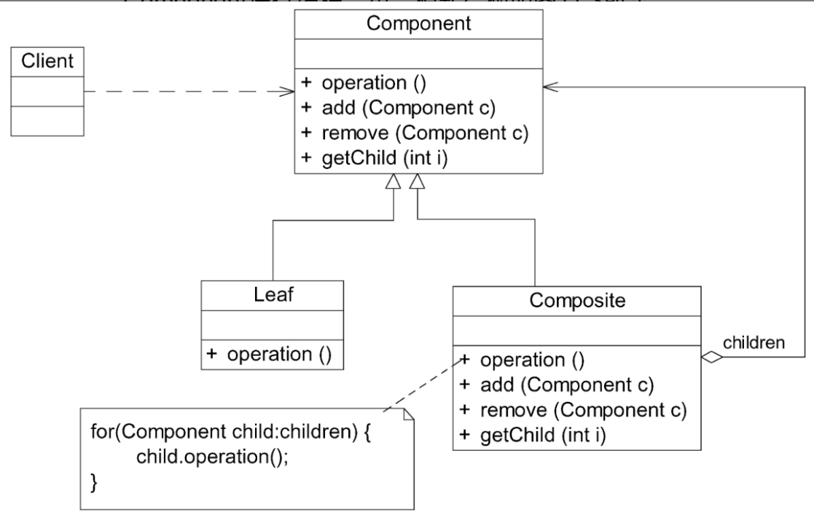
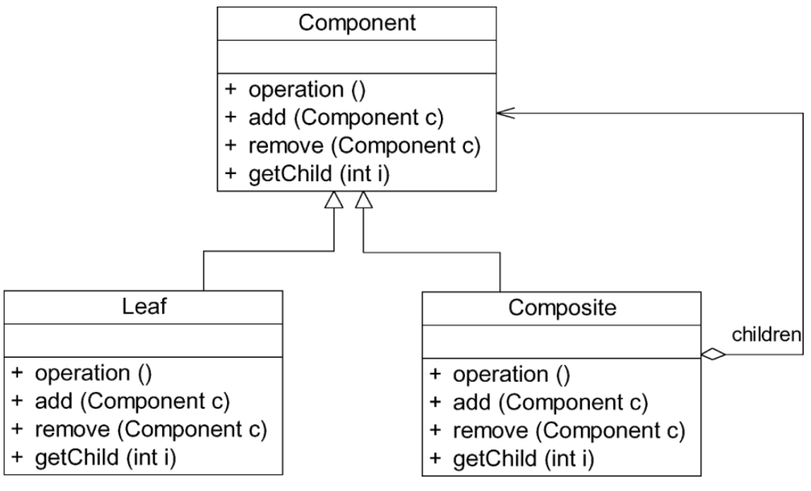
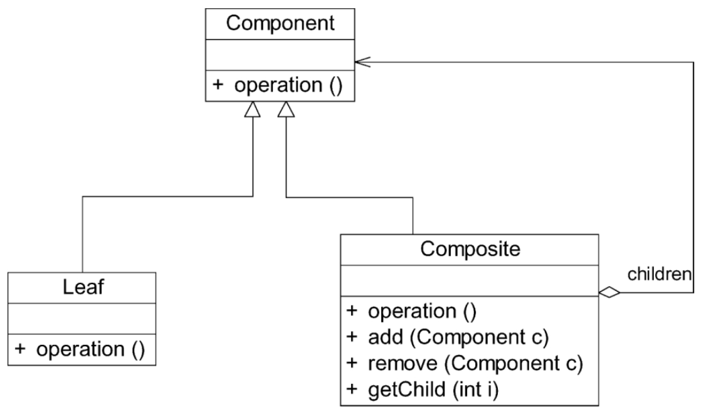

# 组合模式

树形结构在软件中随处可见，例如操作系统中的目录结构、应用软件中的菜单、办公系统中的公司组织结构等。如何运用面向对象的方式来处理这种树形结构是组合模式需要解决的问题。组合模式通过一种巧妙的设计方案使得用户可以一致性地处理整个树形结构或者树形结构的一部分，也可以一致性地处理树形结构中的叶子节点（不包含子节点的节点）和容器节点（包含子节点的节点）。

## 定义

组合模式（Composite Pattern）：组合多个对象形成树形结构以表示具有“部分—整体”关系的层次结构。组合模式对单个对象（即叶子对象）和组合对象（即容器对象）的使用具有一致性，又可以称为“部分—整体”（Part-Whole）模式，它是一种对象结构型模式。

## UML

## 主要优点

1. 组合模式可以清楚地定义分层次的复杂对象，表示对象的全部或部分层次。它让客户端忽略了层次的差异，方便对整个层次结构进行控制。
2. 客户端可以一致地使用一个组合结构或其中单个对象，不必关心处理的是单个对象还是整个组合结构，简化了客户端代码。
3. 在组合模式中增加新的容器构件和叶子构件都很方便，无须对现有类库进行任何修改，符合开闭原则。
4. 组合模式为树形结构的面向对象实现提供了一种灵活的解决方案。通过叶子对象和容器对象的递归组合，可以形成复杂的树形结构，但对树形结构的控制却非常简单。

## 主要缺点

在增加新构件时很难对容器中的构件类型进行限制。有时希望一个容器中只能有某些特定类型的对象，例如在某个文件夹中只能包含文本文件。使用组合模式时，不能依赖类型系统来施加这些约束，因为它们都来自相同的抽象层。在这种情况下，必须通过在运行时进行类型检查来实现，这个实现过程较为复杂。

## 适用场景

1. 在**具有整体和部分的层次结构**中，希望通过一种方式忽略整体与部分的差异，客户端可以一致性地对待它们。
2. 在一个使用面向对象语言开发的系统中需要处理一个树形结构。
3. 在一个系统中能够分离出叶子对象和容器对象，而且它们的类型不固定，将来需要增加一些新的类型。

## 透明组合模式和安全组合模式

通过引入组合模式，Sunny公司设计的杀毒软件具有良好的可扩展性，在增加新的文件类型时，无须修改现有类库代码，只需增加一个新的文件类作为AbstractFile类的子类即可。但是，由于在AbstractFile中声明了大量用于管理和访问成员构件的方法，例如add（）、remove（）等方法，就不得不在新增的文件类中实现这些方法，提供对应的错误提示和异常处理。为了简化代码，有以下两种解决方案。

### 透明组合模式

透明组合模式中，抽象构件Component中声明了所有用于管理成员对象的方法，包括add（）、remove（）以及getChild（）等方法，这样做的好处是确保所有的构件类都有相同的接口。在客户端看来，叶子对象与容器对象所提供的方法是一致的，客户端可以相同地对待所有的对象。透明组合模式也是组合模式的标准形式，其完整结构如图

### 安全组合模式

安全组合模式中，在抽象构件Component中没有声明任何用于管理成员对象的方法，而是在Composite类中声明并实现这些方法。这种做法是安全的，因为根本不向叶子对象提供这些管理成员对象的方法，对于叶子对象，客户端不可能调用到这些方法。

安全组合模式的缺点是不够透明。因为叶子构件和容器构件具有不同的方法，且容器构件中那些用于管理成员对象的方法没有在抽象构件类中定义，因此客户端不能完全针对抽象编程，必须有区别地对待叶子构件和容器构件。在实际应用中，安全组合模式的使用频率也非常高，在Java AWT中使用的组合模式就是安全组合模式。