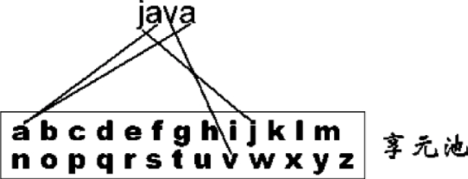
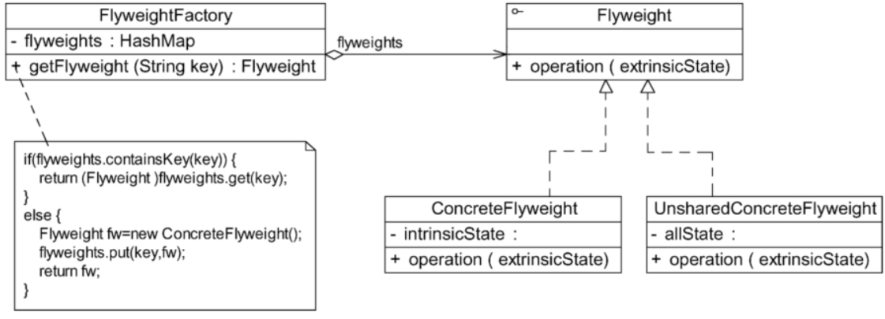
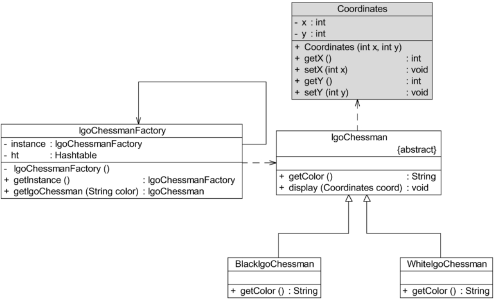

# 享元模式

当一个软件系统在运行时产生的对象数量太多，将导致运行代价过高，带来系统性能下降等问题。例如，在一个文本字符串中存在很多重复的字符，如果每个字符都用一个单独的对象来表示，将会占用较多的内存空间。那么，如何去避免系统中出现大量相同或相似的对象，同时又不影响客户端程序通过面向对象的方式对这些对象进行操作？享元模式正为解决这一类问题而诞生。享元模式通过共享技术实现相同或相似对象的重用。在逻辑上每个出现的字符都有一个对象与之对应，然而在物理上它们却共享同一个享元对象。这个对象可以出现在一个字符串的不同地方，相同的字符对象都指向同一个实例。在享元模式中，存储这些共享实例对象的地方称为享元池（Flyweight Pool）。可以针对每个不同的字符创建一个享元对象，将其放在享元池中，需要时再从享元池取出，如图

享元模式以共享的方式高效地支持大量细粒度对象的重用。享元对象能做到共享的关键是区分了内部状态（Intrinsic State）和外部状态（Extrinsic State）。下面对享元的内部状态和外部状态进行简单介绍。

（1）内部状态是存储在享元对象内部并且不会随环境改变而改变的状态，内部状态可以共享。例如字符的内容，不会随外部环境的变化而变化，无论在任何环境下，字符“a”始终是“a”，都不会变成“b”。

（2）外部状态是随环境改变而改变的、不可以共享的状态。享元对象的外部状态通常由客户端保存，并在享元对象被创建之后，需要使用的时候，再传入享元对象内部。一个外部状态与另一个外部状态之间是相互独立的。如字符的颜色，可以在不同的地方有不同的颜色，例如有的“a”是红色的，有的“a”是绿色的；字符的大小也是如此，有的“a”是五号字，有的“a”是四号字。而且字符的颜色和大小是两个独立的外部状态，它们可以独立变化，相互之间没有影响，客户端可以在使用时将外部状态注入享元对象中。正因为区分了内部状态和外部状态，可以将具有相同内部状态的对象存储在享元池中，享元池中的对象是可以实现共享的，需要的时候就将对象从享元池中取出，实现对象的复用。通过向取出的对象注入不同的外部状态，可以得到一系列相似的对象，而这些对象在内存中实际上只存储一份。

## 定义

享元模式（Flyweight Pattern）：运用共享技术有效地支持大量细粒度对象的复用。系统只使用少量的对象，而这些对象都很相似，状态变化很小，可以实现对象的多次复用。由于享元模式要求能够共享的对象必须是细粒度对象，因此它又称为轻量级模式，是一种对象结构型模式。

## UML

1. Flyweight（抽象享元类）：通常是一个接口或抽象类，在抽象享元类中声明了具体享元类公共的方法，这些方法可以向外界提供享元对象的内部数据（内部状态），同时也可以通过这些方法来设置外部数据（外部状态）。
2. ConcreteFlyweight（具体享元类）：它实现了抽象享元类，其实例称为享元对象。在具体享元类中为内部状态提供了存储空间。通常，可以结合单例模式来设计具体享元类，为每个具体享元类提供唯一的享元对象。
3. UnsharedConcreteFlyweight（非共享具体享元类）：并不是所有的抽象享元类的子类都需要被共享，不能被共享的子类可设计为非共享具体享元类。当需要一个非共享具体享元类的对象时可以直接通过实例化创建。
4. FlyweightFactory（享元工厂类）：享元工厂类用于创建并管理享元对象，它针对抽象享元类编程，将各种类型的具体享元对象存储在一个享元池中。享元池一般设计为一个存储“键值对”的集合（也可以是其他类型的集合），可以结合工厂模式进行设计。当用户请求一个具体享元对象时，享元工厂提供一个存储在享元池中已创建的实例，或者创建一个新的实例（如果不存在的话）并返回新创建的实例，同时将其存储在享元池中。

## 主要优点

1. 可以极大减少内存中对象的数量，使得相同或相似对象在内存中只保存一份，从而可以节约系统资源，提高系统性能。
2. 享元模式的外部状态相对独立，而且不会影响其内部状态，从而使得享元对象可以在不同的环境中被共享。

## 主要缺点

1. 享元模式需要分离出内部状态和外部状态，从而使得系统变得复杂，这使得程序的逻辑复杂化。
2. 为了使对象可以共享，享元模式需要将享元对象的部分状态外部化，而读取外部状态将使得运行时间变长。

## 适用场景

1. 一个系统有大量相同或者相似的对象，造成内存的大量耗费。
2. 对象的大部分状态都可以外部化，可以将这些外部状态传入对象中。

3. 在使用享元模式时需要维护一个存储享元对象的享元池，而这需要耗费一定的系统资源。因此，在需要多次重复使用同一享元对象时才值得使用享元模式。

## 带外部状态的解决方案

Sunny软件公司开发人员通过对围棋棋子进行进一步分析，发现虽然黑色棋子和白色棋子可以共享，但是它们将显示在棋盘的不同位置。如何让相同的黑子或者白子能够多次重复显示在一个棋盘的不同地方呢？解决方法就是将棋子的位置定义为棋子的一个外部状态，在需要时再进行设置。因此，在图14-4中增加一个新的类Coordinates（坐标类），用于存储每一个棋子的位置，修改之后的结构图如图

除了增加一个坐标类Coordinates以外，抽象享元类IgoChessman中的display（）方法也将对应增加一个Coordinates类型的参数，用于在显示棋子时指定其坐标。

## 单纯享元模式和复合享元模式

见《[设计模式的艺术](https://weread.qq.com/web/reader/c4032270727da196c40104ak37632cd021737693cfc7149)》 第14.5节