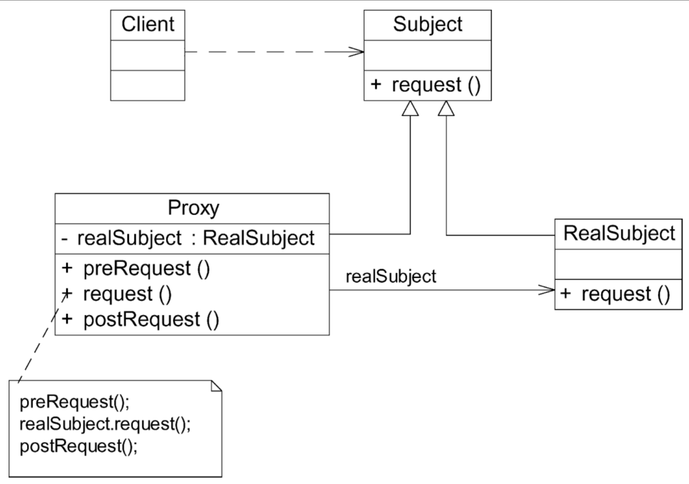

# 代理模式

在软件开发中，有一种设计模式可以提供与代购网站类似的功能。由于某些原因，客户端不想或不能直接访问某个对象，此时可以通过一个被称为“代理”的第三者来实现间接访问，该方案对应的设计模式被称为代理模式。

## 定义

给某一个对象提供一个代理，并由代理对象控制对原对象的引用。代理模式是一种对象结构型模式。

## UML

## 主要优点

1. 代理模式能够协调调用者和被调用者，在一定程度上降低了系统的耦合度，满足迪米特法则。
2. 客户端可以针对抽象主题角色进行编程，增加和更换代理类无须修改源代码，符合开闭原则，系统具有较好的灵活性和可扩展性。
3. 远程代理为位于两个不同地址空间对象的访问提供了一种实现机制，可以将一些消耗资源较多的对象和操作移至性能更好的计算机上，提高系统的整体运行效率。
4. 虚拟代理通过一个消耗资源较少的对象来代表一个消耗资源较多的对象，可以在一定程度上节省系统的运行开销。
5. 保护代理可以控制对一个对象的访问权限，为不同用户提供不同级别的使用权限。

## 主要缺点

1. 由于在客户端和真实主题之间增加了代理对象，因此有些类型的代理模式可能会造成请求的处理速度变慢，例如保护代理。
2. 实现代理模式需要额外的工作，有些代理模式的实现非常复杂，例如远程代理。

## 适用场景

1. 当客户端对象需要访问远程主机中的对象时，可以使用远程代理。
2. 当需要用一个消耗资源较少的对象来代表一个消耗资源较多的对象，从而降低系统开销、缩短运行时间时，可以使用虚拟代理。例如一个对象需要很长时间才能完成加载时。
3. 当需要控制对一个对象的访问，为不同用户提供不同级别的访问权限时，可以使用保护代理。
4. 当需要为某一个被频繁访问的操作结果提供一个临时存储空间，以供多个客户端共享访问这些结果时，可以使用缓冲代理。通过缓冲代理，系统无须在客户端每次访问时都重新执行操作，只需直接从临时缓冲区获取操作结果即可。
5. 当需要为一个对象的访问（引用）提供一些额外的操作时，可以使用智能引用代理。

## 常见的5种代理模式

1. 远程代理（Remote Proxy）：为一个位于不同的地址空间的对象提供一个本地的代理对象，这个不同的地址空间可以在同一台主机中，也可以在另一台主机中。远程代理又称为大使（Ambassador）。

   远程代理是一种常用的代理模式，它使得客户端程序可以访问在远程主机（或另一个虚拟机）上的对象。远程主机可能具有更好的计算性能与处理速度，可以快速响应并处理客户端请求。**远程代理可以将网络的细节隐藏起来，使得客户端不必考虑网络的存在**。客户端完全可以认为被代理的远程业务对象是局域的而不是远程的，而远程代理对象承担了大部分的网络通信工作，并负责对远程业务方法的调用。

2. 虚拟代理（Virtual Proxy）：如果需要创建一个资源消耗较大的对象，先创建一个消耗相对较小的对象来表示，真实对象只在需要时才会被真正创建。

   虚拟代理也是一种常用的代理模式。对于一些占用系统资源较多或者加载时间较长的对象，可以给这些对象提供一个虚拟代理。在真实对象创建成功之前虚拟代理扮演真实对象的替身，而当真实对象创建之后，虚拟代理将用户的请求转发给真实对象。

   在以下两种情况下可以考虑使用虚拟代理：

   - 由于对象本身的复杂性或者网络等原因导致一个对象需要较长的加载时间，此时可以用一个加载时间相对较短的代理对象来代表真实对象。通常在实现时可以结合多线程技术，一个线程用于显示代理对象，其他线程用于加载真实对象。
   - 当一个对象的加载十分耗费系统资源的时候，也非常适合使用虚拟代理。虚拟代理可以让那些占用大量内存或处理起来非常复杂的对象推迟到使用它们的时候才创建，而在此之前用一个相对来说占用资源较少的代理对象来代表真实对象，再通过代理对象来引用真实对象。

3. 保护代理（Protect Proxy）：控制对一个对象的访问，可以给不同的用户提供不同级别的使用权限。

4. 缓冲代理（Cache Proxy）：为某一个目标操作的结果提供临时的存储空间，以便多个客户端可以共享这些结果。

5. 智能引用代理（Smart Reference Proxy）：当一个对象被引用时，提供一些额外的操作，例如将对象被调用的次数记录下来等。

##  JDK动态代理和CGLib动态代理

JDK中提供的动态代理只能代理一个或多个接口，如果需要动态代理具体类或抽象类，可以使用CGLib（Code Generation Library）等工具。CGLib是一个功能较为强大、性能和质量也较好的代码生成包，在许多AOP框架中得到了广泛应用。大家可以自行查阅相关资料来学习JDK动态代理和CGLib。