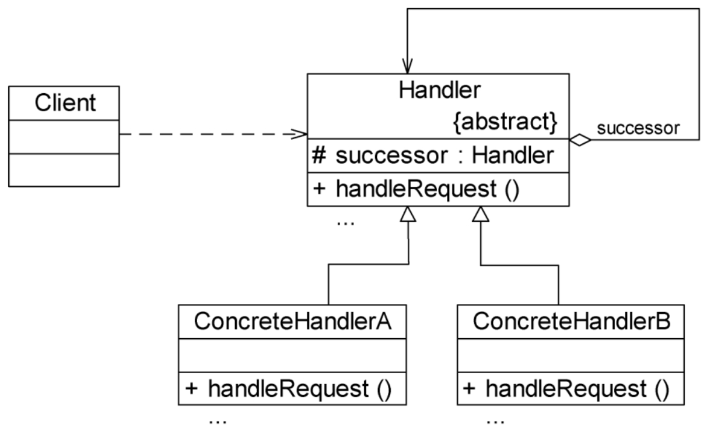

# 职责链模式

很多情况下，在一个软件系统中可以处理某个请求的对象不止一个。例如SCM系统中的采购单审批，主任、副董事长、董事长和董事会都可以处理采购单，他们可以构成一条处理采购单的链式结构。采购单沿着这条链进行传递，这条链就称为职责链。职责链可以是一条直线、一个环或者一个树形结构，最常见的职责链是直线型，即沿着一条单向的链来传递请求。链上的每一个对象都是请求处理者，职责链模式可以将请求的处理者组织成一条链，并让请求沿着链传递，由链上的处理者对请求进行相应的处理，客户端无须关心请求的处理细节以及请求的传递，只需将请求发送到链上即可，实现请求发送者和请求处理者解耦。

## 定义

避免将请求发送者与接收者耦合在一起，让多个对象都有机会接收请求，将这些对象连接成一条链，并且沿着这条链传递请求，直到有对象处理它为止。职责链模式是一种对象行为型模式。

## UML

## 主要优点

1. 职责链模式使得一个对象无须知道是其他哪一个对象处理其请求。对象仅需知道该请求会被处理即可，接收者和发送者都没有对方的明确信息，且链中的对象不需要知道链的结构。由客户端负责链的创建，降低了系统的耦合度。
2. 请求处理对象仅需维持一个指向其后继者的引用，而不需要维持它对所有的候选处理者的引用，可简化对象的相互连接。
3. 在给对象分派职责时，职责链可以提供更多的灵活性，可以通过在运行时对链进行动态的增加或修改来增加或改变处理一个请求的职责。
4. **在系统中增加一个新的具体请求处理者时无须修改原有系统的代码，只需要在客户端重新建链即可，从这一点来看是符合开闭原则的。**

## 主要缺点

1. 由于一个请求没有明确的接收者，那么就不能保证它一定会被处理，该请求可能一直到链的末端都得不到处理。一个请求也可能因职责链没有被正确配置而得不到处理。
2. 对于比较长的职责链，请求的处理可能涉及多个处理对象，系统性能将受到一定影响，而且在进行代码调试时不太方便。
3. **如果建链不当，可能会造成循环调用，将导致系统陷入死循环。**

## 适用场景

1. 有多个对象可以处理同一个请求，具体哪个对象处理该请求待运行时刻再确定。客户端只需将请求提交到链上，而无须关心请求的处理对象是谁以及它是如何处理的。
2. 在不明确指定接收者的情况下，向多个对象中的一个提交一个请求。
3. 可动态指定一组对象处理请求。客户端可以动态创建职责链来处理请求，还可以改变链中处理者之间的先后次序。

## 纯与不纯的职责链模式

### 纯的职责链

一个纯的职责链模式要求一个具体处理者对象只能在两个行为中选择一个：**要么承担全部责任，要么将责任推给下家**。不允许出现某一个具体处理者对象在承担了一部分或全部责任后又将责任向下传递的情况。而且在纯的职责链模式中，要求一个请求必须被某一个处理者对象所接收，不能出现某个请求未被任何一个处理者对象处理的情况。在前面的采购单审批实例中应用的是纯的职责链模式。

### 不纯的职责链

**在一个不纯的职责链模式中，允许某个请求被一个具体处理者部分处理后再向下传递，或者一个具体处理者处理完某请求后其后继处理者可以继续处理该请求，而且一个请求可以最终不被任何处理者对象所接收。**