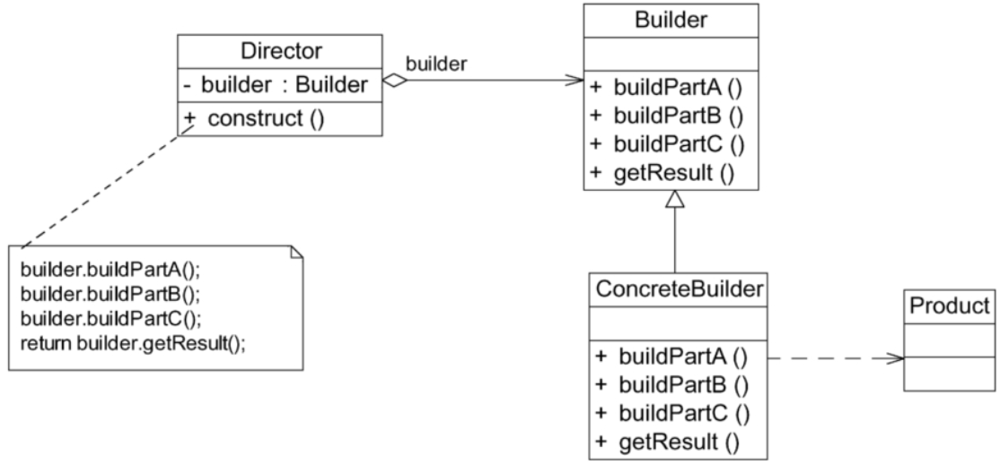

# 建造者模式

> 没有人买车会只买一个轮胎或者方向盘，大家买的都是一辆包含轮胎、方向盘和发动机等多个部件的完整汽车。如何将这些部件组装成一辆完整的汽车并返回给用户，这是建造者模式需要解决的问题。建造者模式又称为生成器模式，它是一种较为复杂、使用频率也相对较低的创建型模式。建造者模式向客户端返回的不是一个简单的产品，而是一个由多个部件组成的复杂产品。

## 定义

将一个复杂对象的构建与它的表示分离，使得同样的构建过程可以创建不同的表示。建造者模式是一种对象创建型模式。

## UML

## 主要优点

1. 在建造者模式中，客户端不必知道产品内部组成的细节，将产品本身与产品的创建过程解耦，使得相同的创建过程可以创建不同的产品对象。
2. 每个具体建造者都相对独立，而与其他具体建造者无关。因此，可以很方便地替换具体建造者或增加新的具体建造者，用户使用不同的具体建造者即可得到不同的产品对象。由于指挥者类针对抽象建造者编程，增加新的具体建造者无须修改原有类库的代码，系统扩展方便，符合开闭原则。
3. 可以更加精细地控制产品的创建过程。将复杂产品的创建步骤分解在不同的方法中，使得创建过程更加清晰，也更方便使用程序来控制创建过程。

## 主要缺点

1. 建造者模式所创建的产品一般具有较多的共同点，其组成部分相似。如果产品之间的差异性很大，例如很多组成部分都不相同，就不适合使用建造者模式，因此其使用范围受到一定的限制。
2. 如果产品的内部结构复杂且多变，可能会需要定义很多具体建造者类来实现这种变化，这就导致系统变得很庞大，增加系统的理解难度和运行成本。

## 适用场景

1. 需要生成的产品对象有复杂的内部结构，这些产品对象通常包含多个成员变量。
2. 需要生成的产品对象的属性相互依赖，需要指定其生成顺序。
3. 对象的创建过程独立于创建该对象的类。在建造者模式中通过引入指挥者类，将创建过程封装在指挥者类中，而不在建造者类和客户类中。
4. 隔离复杂对象的创建和使用，并使得相同的创建过程可以创建不同的产品。

## 省略Director

在有些情况下，为了简化系统结构，可以将Director和抽象建造者Builder进行合并，在Builder中提供逐步构建复杂产品对象的construct（）方法。由于Builder类通常为抽象类，因此可以将construct（）方法定义为静态（static）方法。

## 钩子方法的引入

建造者模式除了逐步构建一个复杂产品对象外，还可以通过Director类来更加精细地控制产品的创建过程，例如增加一类称之为钩子方法（Hook Method）的特殊方法来控制是否调用某个buildPartX（）方法。

例如，我们可以在`Builder`中定义一个`+ isPartANeeded() Bollean`方法，默认返回需要（true），如果具体建造者不需要partA,则覆盖该方法，改为不需要，再在Director中判断是否需要建造partA。