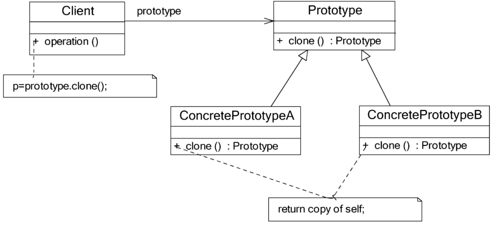
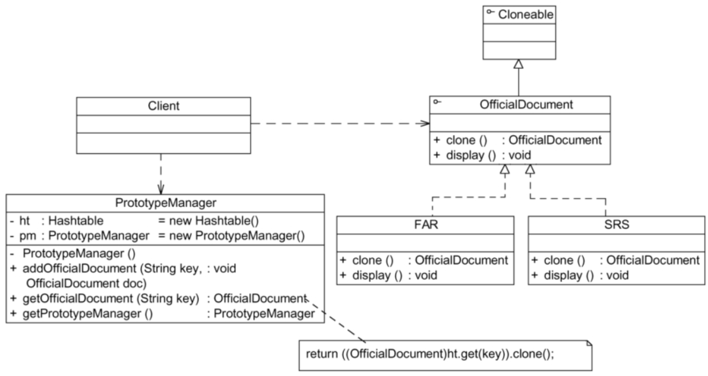

# 原型模式

> 《西游记》里孙悟空拔毛变出小猴子的故事几乎人人皆知。孙悟空可以用猴毛根据自己的形象，复制（又称克隆）出很多跟自己长得一模一样的“身外身”来。在设计模式中也存在一个类似的模式，可以通过一个原型对象克隆出多个一模一样的对象，该模式被称为原型模式。
>
> 原型模式的工作原理很简单：将一个原型对象传给要发动创建的对象，这个要发动创建的对象通过请求原型对象克隆自己来实现创建过程。

## 定义

使用原型实例指定创建对象的种类，并且通过克隆这些原型创建新的对象。原型模式是一种对象创建型模式。

## UML

## 主要优点

1. 当创建新的对象实例较为复杂时，使用原型模式可以简化对象的创建过程，通过复制一个已有实例可以提高新实例的创建效率。
2. 扩展性较好。由于在原型模式中提供了抽象原型类，在客户端可以针对抽象原型类进行编程，而将具体原型类写在配置文件中，增加或减少具体原型类对原有系统都没有任何影响。
3. 原型模式提供了简化的创建结构。工厂方法模式常常需要有一个与产品类等级结构相同的工厂等级结构，而原型模式就不需要这样。原型模式中产品的复制是通过封装在原型类中的克隆方法实现的，无须专门的工厂类来创建产品。
4. 可以使用深克隆的方式保存对象的状态。使用原型模式将对象复制一份并将其状态保存起来，以便在需要的时候使用，例如恢复到某一历史状态，可辅助实现撤销操作。

## 主要缺点

1. 需要为每一个类配备一个克隆方法，而且该克隆方法位于一个类的内部。当对已有的类进行改造时，需要修改源代码，违背了开闭原则。
2. 在实现深克隆时需要编写较为复杂的代码，而且当对象之间存在多重的嵌套引用时，为了实现深克隆，每一层对象对应的类都必须支持深克隆，实现起来可能会比较麻烦。

## 适用场景

1. 创建新对象成本较大（例如初始化需要占用较长的时间，占用太多的CPU资源或网络资源）。新的对象可以通过原型模式对已有对象进行复制来获得，如果是相似对象，则可以对其成员变量稍作修改。
2. 如果系统要保存对象的状态，而对象的状态变化很小，或者对象本身占用内存较少时，**可以使用原型模式配合备忘录模式来实现。**
3. 需要避免使用分层次的工厂类来创建分层次的对象，并且类的实例对象只有一个或很少的几个组合状态。通过复制原型对象得到新实例可能比使用构造函数创建一个新实例更加方便。

## 原型管理器的引入和实现

原型管理器（Prototype Manager）是将多个原型对象存储在一个集合中供客户端使用，它是一个专门负责克隆对象的工厂，其中定义了一个集合用于存储原型对象，如果需要某个原型对象的一个克隆，可以通过复制集合中对应的原型对象来获得。在原型管理器中针对抽象原型类进行编程，以便扩展。其结构如图

