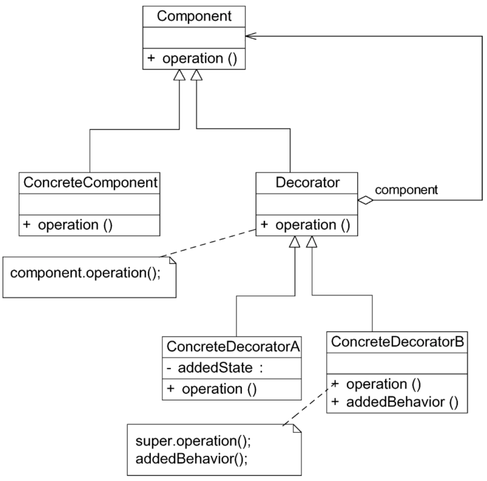
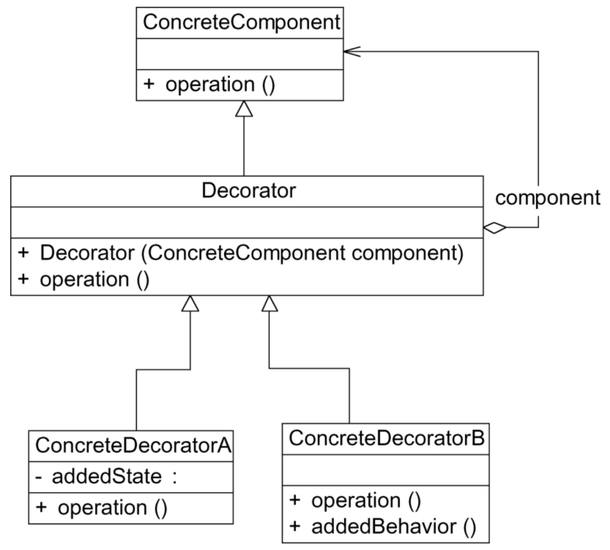

# 装饰模式

尽管目前房价依旧很高，但还是阻止不了大家对新房的渴望和买房的热情。如果大家买的是毛坯房，无疑还有一项艰巨的任务要面对，那就是装修。对新房进行装修并没有改变房屋用于居住的本质，但它可以让房子变得更漂亮、更温馨、更实用、更能满足居家的需求。在软件设计中，也有一种类似新房装修的技术可以对已有对象（新房）的功能进行扩展（装修），以获得更加符合用户需求的对象，使得对象具有更加强大的功能。这种技术对应于一种被称之为装饰模式的设计模式。

## 定义

装饰模式（Decorator Pattern）：动态地给一个对象增加一些额外的职责，就增加对象功能来说，装饰模式比生成子类实现更为灵活。装饰模式是一种对象结构型模式。

## UML

## 主要优点

1. 对于扩展一个对象的功能，装饰模式比继承更加灵活性，不会导致类的个数急剧增加。
2. 可以通过一种动态的方式来扩展一个对象的功能。通过配置文件可以在运行时选择不同的具体装饰类，从而实现不同的行为。
3. 可以对一个对象进行多次装饰。通过使用不同的具体装饰类以及这些装饰类的排列组合，可以创造出很多不同行为的组合，得到功能更为强大的对象。
4. 具体构件类与具体装饰类可以独立变化，用户可以根据需要增加新的具体构件类和具体装饰类，原有类库代码无须改变，符合开闭原则。

## 主要缺点

1. 使用装饰模式进行系统设计时将产生很多小对象。这些对象的区别在于它们之间相互连接的方式有所不同，而不是它们的类或者属性值有所不同。大量小对象的产生势必会占用更多的系统资源，在一定程度上影响程序的性能。
2. 装饰模式提供了一种比继承更加灵活机动的解决方案，但同时也意味着比继承更加易于出错，排错也很困难。对于多次装饰的对象，调试时寻找错误可能需要逐级排查，较为烦琐。

## 适用场景

1. **在不影响其他对象的情况下，以动态、透明的方式给单个对象添加职责。**
2. **当不能采用继承的方式对系统进行扩展或者采用继承不利于系统扩展和维护时可以使用装饰模式。**不能采用继承的情况主要有两类：第1类是系统中存在大量独立的扩展，为支持每一种扩展或者扩展之间的组合将产生大量的子类，使得子类数目呈爆炸性增长；第2类是因为类已定义为不能被继承（如Java语言中的final类）。

## 透明模式和半透明模式

见《[设计模式的艺术](https://github.com/JiuYou2020/ReadingBook)》一书 第12章

## 注意事项

1. 尽量保持装饰类的接口与被装饰类的接口相同。这样，对于客户端而言，无论是装饰之前的对象还是装饰之后的对象都可以一致对待。也就是说，在可能的情况下，应该尽量使用透明装饰模式。
2. 尽量保持具体构件类ConcreteComponent是一个“轻”类。也就是说，不要把太多的行为放在具体构件类中，可以通过装饰类对其进行扩展。
3. 如果只有一个具体构件类，那么抽象装饰类可以作为该具体构件类的直接子类。

