# 一文到底手搓简易RPC

> 请注意！！！是简易版，什么负载均衡，服务注册，服务发现都没有实现，和`Open Feign`等RPC框架没有任何可比性。请勿吐槽，当然，如果有改进建议，可以提出。

> 如果图片消失，请参考源码地址：[myrpc](https://github.com/JiuYou2020/java-learning/tree/master/myrpc)

> 测试代码待编写！！！

## 一. 对RPC框架的简单介绍

在分布式系统中，应用或者服务会被部署到不同的服务器和网络环境中，特别是在有微服务的情况下，应用被拆分为很多个服务，每个服务都有可能依赖其他服务。如图
1.1 所示，客户端调用下单服务时，还会调用商品查询服务、扣减库存服务、订单更新服务，如果这三个服务分别对应三个数据库，那么一次客户端请求就会引发
6 次调用，要是这些服务或者数据库都部署在不同的服务器或者网络节点，这 6 次调用就会引发 6
次网络请求。因此，分布式部署方式在提高系统性能和可用性的前提下，对网络调用效率也发起了挑战。

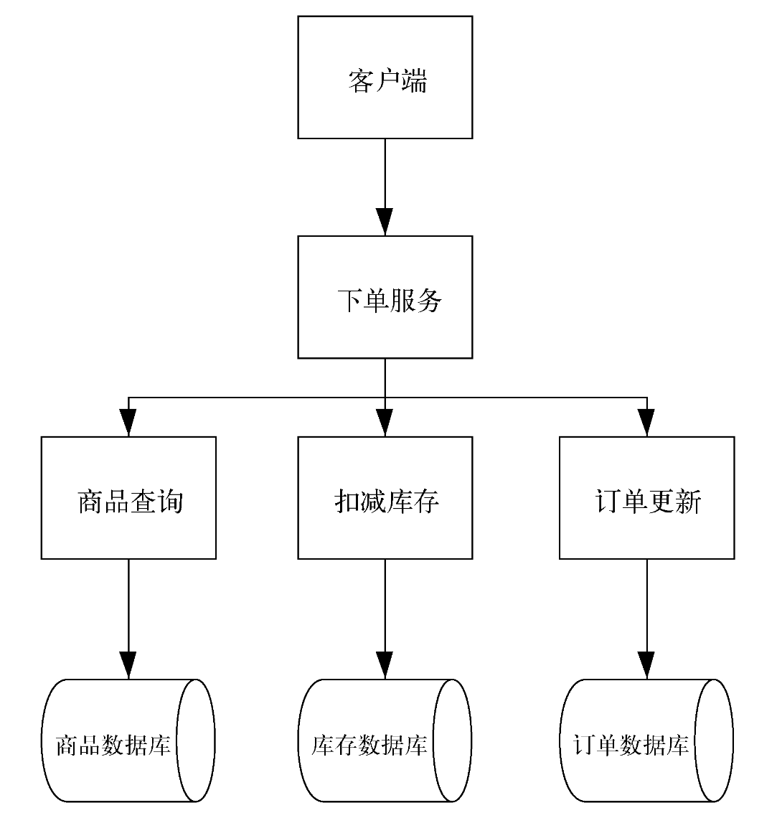

为了面对这种挑战，需要选择合适的网络模型，对传输的数据包进行有效的序列化，调整网络参数优化网络传输性能。为了做到以上几点我们需要引入
**RPC**，下面就来介绍RPC 是如何解决服务之间网络传输问题的。

### RPC调用过程

**RPC 是 Remote Procedure
Call（远程过程调用）的缩写，该技术可以让一台服务器上的服务通过网络调用另一台服务器上的服务，简单来说就是让不同网络节点上的服务相互调用。**
因此 RPC 框架会封装网络调用的细节，让调用远程服务看起来像调用本地服务一样简单。由于微服务架构的兴起，RPC
的概念得到广泛应用，在消息队列、分布式缓存、分布式数据库等多个领域都有用到。可以将 RPC 理解为连接两个城市的高速公路，让车辆能够在城市之间自由通行。由于
RPC 屏蔽了远程调用和本地调用的区别，因此程序开发者无须过多关注网络通信，可以把更多精力放到业务逻辑的开发上。

下面看一下 RPC 调用的流程。图 1.2 描述了服务调用的过程，这里涉及左侧的服务调用方和右侧的服务提供方。既然是服务的调用过程，就存在请求过程和响应过程，这两部分用虚线圈出来了。从图左侧的服务调用方开始，利用“
**动态代理**”方式向服务提供方发起调用，这里会制定服务、接口、方法以及输入的参数；将这些信息打包好之后进行“**序列化**”操作，由于
RPC 是基于 TCP 进行传输的，因此在网络传输中使用的数据必须是二进制形式，序列化操作就是将请求数据转换为二进制，以便网络传输；打好二进制包后，需要对信息进行说明，比如协议标识、数据大小、请求类型等，这个过程叫作“
**协议编码**”，说白了就是对数据包进行描述，并告诉数据接收方数据包有多大、要发送到什么地方去。至此，数据发送的准备工作就完成了，数据包会通过“
**网络传输**
”到达服务提供方。服务提供方接收到数据包以后，先进行“协议解码”，并对解码后的数据“反序列化”，然后通过“反射执行”获取由动态代理封装好的请求。此时随着箭头到了图的最右边，顺着向下的箭头，服务提供方开始“处理请求”，处理完后就要发送响应信息给服务调用方了，之后的发送过程和服务调用方发送请求的过程调用方了，之后的发送过程和服务调用方发送请求的过程是一致的，只是方向相反，依次为“序列化→协议编码→网络传输→协议解码→反序列化→接收响应”。以上便是整个RPC
调用的请求、响应流程。

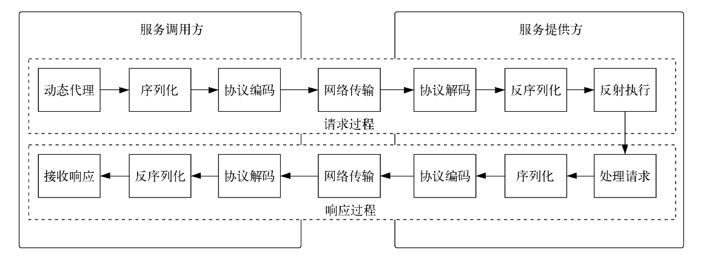

分析上述的 RPC 调用流程后，发现无论是服务调用方发送请求，还是服务提供方发送响应，有几个步骤都是必不可少的，分别为*
*动态代理、序列化、协议编码和网络传输**。下面对这四个方面展开讨论。

### RPC动态代理

服务调用方访问服务提供方的过程是一个 RPC
调用。作为服务调用方的客户端通过一个接口访问作为服务提供方的服务端，这个接口决定了访问方法和传入参数，可以告诉客户端如何调用服务端，实际的程序运行也就是接口实现是在客户端进行的。RPC
会通过动态代理机制，为客户端请求生成一个代理类，在项目中调用接口时绑定对应的代理类，之后当调用接口时，会被代理类拦截，在代理类里加入远程调用逻辑即可调用远程服务端。原理说起来有些枯燥，我们通过一个例子来帮助大家理解，相关代码如下：（简单的[例子](https://github.com/JiuYou2020/java-learning/blob/master/myrpc/rpc-introduction/src/main/java/cn/jiuyou2020/Service.java)
，就算笔者自己实现的RPC也绝无可能这么简单）

```java
// 服务接口
interface Service {
    String sayHello(String name);
}

// 服务实现类
class ServiceImpl implements Service {
    @Override
    public String sayHello(String name) {
        return "Hello, " + name;
    }
}

// 动态代理处理器
class RpcInvocationHandler implements InvocationHandler {
    private final Object target;

    public RpcInvocationHandler(Object target) {
        this.target = target;
    }

    @Override
    public Object invoke(Object proxy, Method method, Object[] args) throws Throwable {
        // 在这里加入远程调用逻辑
        System.out.println("Calling remote service...");

        // 模拟远程调用，实际调用本地的服务实现
        Object result = method.invoke(target, args);

        System.out.println("Remote service called successfully.");
        return result;
    }
}

// 客户端代码
class RpcClient {
    public static void main(String[] args) {
        // 创建服务实现
        Service service = new ServiceImpl();

        // 创建动态代理
        Service proxy = (Service) Proxy.newProxyInstance(service.getClass().getClassLoader(), service.getClass().getInterfaces(), new RpcInvocationHandler(service));

        // 通过代理调用服务
        String response = proxy.sayHello("Alice");
        System.out.println("Response: " + response);
    }
}
```

回顾上述调用过程不难发现，在客户端和服务端之间加入了一层动态代理，这个代理用来代理服务端接口。客户端只需要知道调用服务端接口的方法名字和输入参数就可以了，并不需要知道具体的实现过程。在实际的
RPC 调用过程中，在客户端生成需要调用的服务端接口实例，将它丢给代理类，当代理类将这些信息传到服务端以后再执行。因此，**RPC
动态代理是对客户端的调用和服务端的执行进行了解耦**，目的是让客户端像调用本地方法一样调用远程服务。

### RPC序列化

序列化是将对象转化为字节流的过程，RPC
客户端在请求服务端时会发送请求的对象，这个对象如果通过网络传输，就需要进行序列化，也就是将对象转换成字节流数据。反过来，在服务端接收到字节流数据后，将其转换成可读的对象，就是反序列化。如果把序列化比作快递打包的过程，那么收到快递后拆包的过程就是反序列化。序列化和反序列化的核心思想是设计一种序列化、反序列化规则，将对象的类型、属性、属性值、方法名、方法的传入参数等信息按照规定格式写入到字节流中，然后再通过这套规则读取对象的相关信息，完成反序列化操作。下面罗列几种常见的序列化方式供大家参考。

| 序列化方式              | 格式   | 效率                                                  | 可读性                       | 语言支持                                  | 易用性                                                 | 使用场景                              |
|--------------------|------|-----------------------------------------------------|---------------------------|---------------------------------------|-----------------------------------------------------|-----------------------------------|
| **JSON**           | 文本格式 | JSON 在空间和速度方面的效率不如二进制格式。虽然它在可读格式中速度相对较快，但仍比二进制替代品慢。 | 高度可读，易于调试和检查数据。           | 几乎所有编程语言都支持 JSON。                     | 使用简单，进行基本操作时不需要额外的工具或库。                             | 适用于需要人类可读性的网页应用和配置文件。             |
| **Protobuf**（协议缓冲） | 二进制  | 在空间和速度方面都非常高效，使用变长编码优化存储。                           | 不可读，但有工具可以检查 Protobuf 数据。 | 支持多种语言，包括 C++、Java、Python 等。          | 需要在 .proto 文件中定义数据结构，然后编译成代码。这增加了一步，但确保了数据一致性。      | 适用于高性能应用，如微服务架构中的服务间通信。           |
| **Thrift**         | 二进制  | 性能与 Protobuf 相当，序列化稍微低效，但反序列化效率高。                   | 不可读，主要用于机器处理。             | 支持多种语言，包括 C++、Java、Python、PHP、Ruby 等。 | 与 Protobuf 类似，使用 IDL（接口定义语言）文件定义数据和服务接口，需要额外一步生成代码。 | 非常适合多语言环境中的跨语言服务，特别是涉及多种语言的分布式系统。 |
| **Hessian**        | 二进制  | 高效的二进制序列化，Hessian 2.0 比 Hessian 1.0 有所改进。           | 不可读。                      | 支持多种语言，包括 Java、Python、C++、.Net 等。     | 比 Protobuf 和 Thrift 更简单使用，因为不需要 IDL，而是使用自描述格式。      | 适用于需要高效数据交换且设置最少的 RPC 框架和场景。      |

**总结**

- **JSON**：适合需要人类可读性和简单性的场景，如网页应用和配置文件。
- **Protobuf**：适合高吞吐量、低延迟的应用，如高性能服务通信。
- **Thrift**：适合跨语言兼容性和高效序列化/反序列化的场景，如多语言环境中的分布式系统。
- **Hessian**：适合需要高效二进制序列化且无需 IDL 的场景，如 RPC 框架和高效数据交换。

### 协议编码

有了序列化功能，就可以将客户端的请求对象转化成字节流在网络上传输了，这个字节流转换为二进制信息以后会写入本地的 Socket
中，然后通过网卡发送到服务端。从编程角度来看，每次请求只会发送一个请求包，但是从网络传输的角度来看，网络传输过程中会将二进制包拆分成很多个数据包，这一点也可以从
TCP
传输数据的原理看出。拆分后的多个二进制包会同时发往服务端，服务端接收到这些数据包以后，将它们合并到一起，再进行反序列化以及后面的操作。实际上，协议编码要做的事情就是对同一次网络请求的数据包进行拆分，并且为拆分得到的每个数据包定义边界、长度等信息。如果把序列化比作快递打包过程，那么协议编码更像快递公司发快递时，往每个快递包裹上贴目的地址和收件人信息，这样快递员拿到包裹以后就知道该把包裹送往哪里、交给谁。当然这只是个例子，RPC
协议包含的内容要更为广泛。

接下来一起看看 RPC 协议的消息设计格式。RPC 协议的消息由两部分组成：消息头和消息体。消息头部分主要存放消息本身的描述信息，如图
1.3 所示。

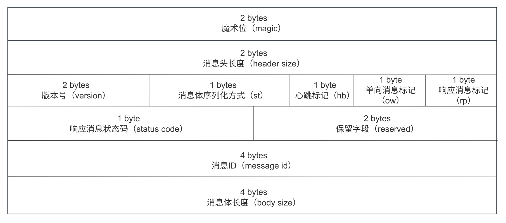

- 魔术位（magic）：协议魔术，为解码设计。
- 消息头长度（header size）：用来描述消息头长度，为扩展设计。
- 协议版本（version）：协议版本，用于版本兼容。
- 消息体序列化类型（st）：描述消息体的序列化类型，例如 JSON、Protobuf。
- 心跳标记（hb）：每次传输都会建立一个长连接，隔一段时间向接收方发送一次心跳请求，保证对方始终在线。
- 单向消息标记（ow）：标记是否为单向消息。
- 响应消息标记（rp）：用来标记是请求消息还是响应消息。
- 响应消息状态码（status code）：标记响应消息状态码。
- 保留字段（reserved）：用于填充消息，保证消息的字节是对齐的。但是在我的设计中貌似没有起到任何作用。
- 消息 Id（message id）：用来唯一确定一个消息的标识。
- 消息头长度（body size）：描述消息体的长度。

从上面的介绍也可以看出，消息头主要负责描述消息本身，其内容甚至比上面提到的更加详细。消息体的内容相对而言就显得非常简单了，就是在 [RPC序列化](#
RPC序列化) 中提到的序列化所得的字节流信息，包括 JSON、Hessian、Protobuf、Thrift 等。

### 网络传输

动态代理使客户端可以像调用本地方法一样调用服务端接口；序列化将传输的信息打包成字节码，使之适合在网络上传输；协议编码对序列化信息进行标注，使其能够顺利地传输到目的地。做完前面这些准备工作后就可以进行网络传输了。RPC
的网络传输本质上是服务调用方和服务提供方的一次网络信息交换过程。以 Linux
操作系统为例，操作系统的核心是内核，独立于普通的应用程序，可以访问受保护的内存空间，还拥有访问底层硬件设备（比说网卡）的所有权限。为了保证内核的安全，用户的应用程序并不能直接访问内核。对此，操作系统将内存空间划分为两部分，一部分是内核空间，一部分是用户空间。如果用户空间想访问内核空间就需要以缓冲区作为跳板。网络传输也是如此，
**如果一个应用程序（用户空间）想访问网卡发送的信息，就需要通过应用缓冲区将数据传递给内核空间的内核缓冲区，再通过内核空间访问硬件设备，也就是网卡，最终完成信息的发送
**。下面来看看 RPC 应用程序进行网络传输的流程，希望能给大家一些启发。

如图 1.4 所示，整个请求过程分为左右两边，左边是服务调用方，右边是服务提供方，左边是应用程序写入 IO 数据的操作，右边是应用程序读出
IO 数据的操作。**从左往右看这张图，图的最左边是服务调用方中的应用程序发起网络请求，也就是应用程序的写 IO
操作。然后应用程序把要写入的数据复制到应用缓冲区，操作系统再将应用缓冲区中的数据复制到内核缓冲区，接下来通过网卡发送到服务提供方。服务提供方接收到数据后，先将数据复制到内核缓冲区内，再复制到应用缓冲区，最后供应用程序使用，这便完成了应用程序读出
IO 数据的操作。**

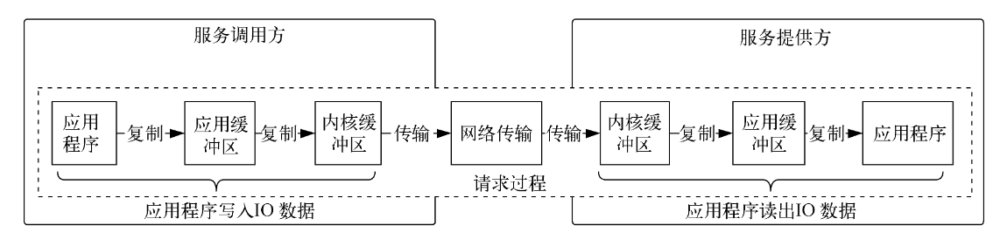

通过上面对 RPC
调用流程的描述，可以看出服务调用方需要经过一系列的数据复制，才能通过网络传输将信息发送到服务提供方，在这个调用过程中，我们关注更多的是服务调用方从发起请求，到接收响应信息的过程。在实际应用场景中，服务调用方发送请求后需要先等待服务端处理，然后才能接收到响应信息。如图
1.5
所示，服务调用方在接收响应信息时，需要经历两个阶段，分别是等待数据准备和内核复制到用户空间。信息在网络上传输时会被封装成一个个数据包，然后进行发送，每个包到达目的地的时间由于网络因素有所不同，内核系统会将收到的包放到内核缓冲区中，等所有包都到达后再放到应用缓冲区。应用缓冲区属于用户空间的范畴，应用程序如果发现信息发送到了应用缓冲区，就会获取这部分数据进行计算。如果对这两个阶段再做简化就是网络IO
传输和数据计算。网络 IO 传输的结果是将数据包放到内核缓冲区中，数据从内核缓冲区复制到应用缓冲区后就可以进行数据计算。

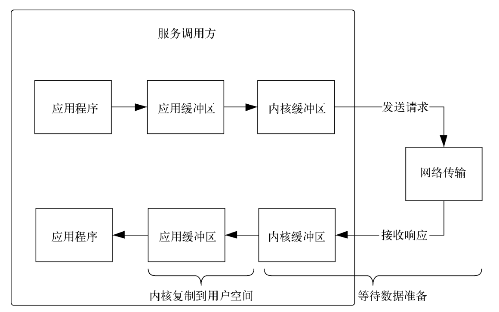

可以看出网络 IO 传输和数据计算过程存在先后顺序，因此当前者出现延迟时会导致后者处于阻塞。另外，应用程序中存在同步调用和异步调用，因此衍生出了同步阻塞
IO（blocking IO）、同步非阻塞 IO（non-blocking IO）、多路复用 IO（multiplexing IO）这几种 IO 模式。下面就这几种 IO
模式的工作原理给大家展开介绍。

#### 1. 同步阻塞 IO

如图 1.6 所示，在同步阻塞 IO
模型中，应用程序在用户空间向服务端发起请求。如果请求到达了服务端，服务端也做出了响应，那么客户端的内核会一直等待数据包从网络中回传。此时用户空间中的应用程序处于等待状态，直到数据从网络传到内核缓冲区中，再从内核缓冲区复制到应用缓冲区。之后，应用程序从应用缓冲区获取数据，并且完成数据计算或者数据处理。也就是说，
**在数据还没到达应用缓冲区时，整个应用进程都会被阻塞，不能处理别的网络 IO 请求，而且应用程序就只是等待响应状态，不会消耗 CPU
资源。简单来说，同步阻塞就是指发出请求后即等待，直到有响应信息返回才继续执行**。如果用去饭店吃饭作比喻，同步阻塞就是点餐以后一直等菜上桌，期间哪里都不去、什么都不做。

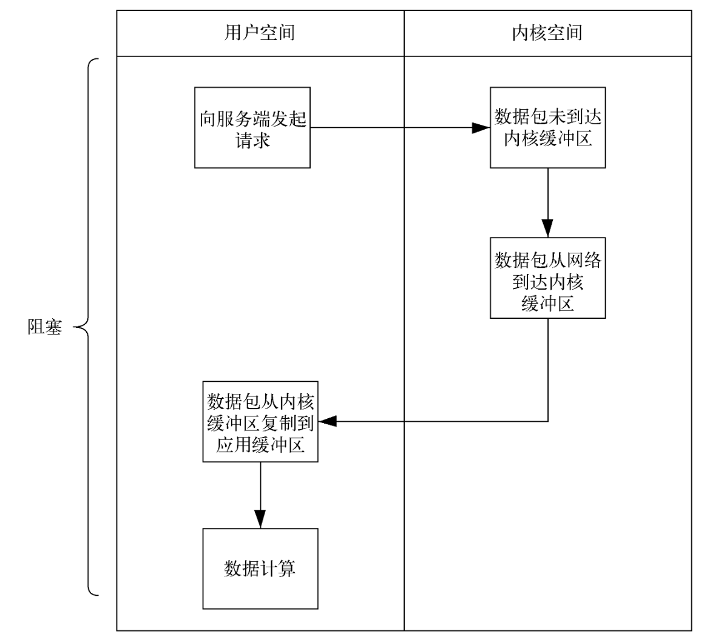

#### 2. 同步非阻塞 IO

同步阻塞 IO 模式由于需要应用程序一直等待，在等待过程中应用程序不能做其他事情，因此资源利用率并不高。为了解决这个问题，有了同步非阻塞，这种模式下，应用程序发起请求后无须一直等待。如图
1.7 所示，当用户向服务端发起请求后，会询问数据是否准备好，如果此时数据还没准备好，也就是数据还没有被复制到应用缓冲区，则内核会返回错误信息给用户空间。
*
*用户空间中的应用程序在得知数据没有准备好后，不用一直等待，可以做别的事情，只是隔段时间还会询问内核数据是否准备好，如此循环往复，直到收到数据准备好的消息，然后进行数据处理和计算，这个过程也称作轮询。在数据没有准备好的那段时间内，应用程序可以做其他事情，即处于非阻塞状态。当数据从内核缓冲区复制到用户缓冲区后，应用程序又处于阻塞状态。还是用去饭店吃饭作比喻，同步非阻塞就是指点餐以后不必一直等菜上桌，可以玩手机、聊天，时不时打探一下菜准备好了没有，如果没有准备好，可以继续干其他，如果准备好就可以吃饭了。
**

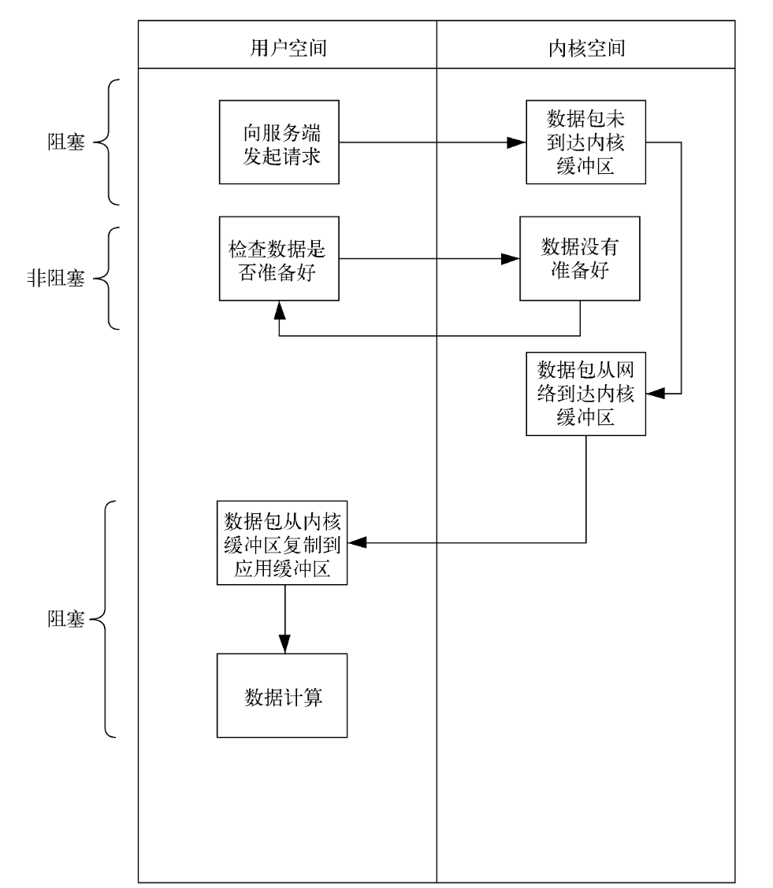

#### 3. IO 多路复用

虽然和同步阻塞 IO 相比，同步非阻塞 IO
模式下的应用程序能够在等待过程中干其他活儿，但是会增加响应时间。由于应用程序每隔一段时间都要轮询一次数据准备情况，有可能存在任务是在两次轮询之间完成的，还是举吃饭的例子，假如点餐后每隔
5 分钟查看是否准备好，如果餐在等待的 5 分钟之内就准备好了（例如：第 3 分钟就准备好了），可还是要等到第 5
分钟的时候才去检查，那么一定时间内处理的任务就少了，导致整体的数据吞吐量降低。同时，轮询操作会消耗大量 CPU
资源，如果同时有多个请求，那么每个应用的进程都需要轮询，这样效率是不高的。*
*要是有一个统一的进程可以监听多个任务请求的数据准备状态，一旦发现哪个请求的数据准备妥当，便立马通知对应的应用程序进行处理就好了
**。因此就有了多路复用 IO，实际上就是在同步非阻塞IO 的基础上加入一个进程，此进程负责监听多个请求的数据准备状态。如图 1.8
所示，当进程 1 和进程 2
发起请求时，不用两个进程都去轮询数据准备情况，因为有一个复用器（selector）进程一直在监听数据是否从网络到达了内核缓冲区中，如果监听到哪个进程对应的数据到了，就通知该进程去把数据复制到自己的应用缓冲区，进行接下来的数据处理。

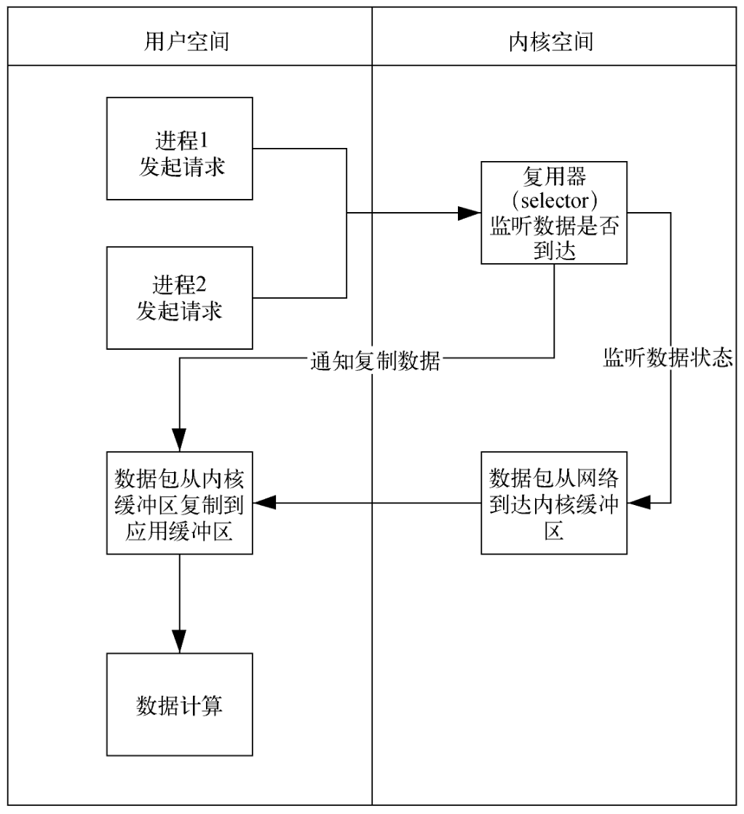

上面提到的复用器可以注册多个网络连接的
IO。当用户进程调用复用器时，进程就会被阻塞。内核会监听复用器负责的网络连接，无论哪个连接中的数据准备好，复用器都会通知用户空间复制数据包。此时用户进程再将数据从内核缓冲区中复制到用户缓冲区，并进行处理。这里有所不同的是，进程在调用复用器时就进入阻塞态了，不用等所有数据都回来再进行处理，也就是说返回一部分，就复制一部分，并处理一部分。好比一群人吃饭，每个人各点了几个菜，而且是通过同一个传菜员点的，这些人在点完菜以后虽然是在等待，不过每做好一道菜，传菜员就会把做好的菜上到桌子上，满足对应客人的需求。因此，IO
多路复用模式可以支持多个用户进程同时请求网络 IO 的情况，能够方便地处理高并发场景，这也是 RPC 架构常用的 IO 模式。

### Netty实现RPC

前面 4 节分别介绍了 RPC 的四大功能：动态代理、序列化、协议编码以及网络传输。在分布式系统的开发中，程序员们广泛使用 RPC
架构解决服务之间的调用问题，因此高性能的 RPC 框架成为分布式架构的必备品。其中 Netty 作为 RPC 异步通信框架，应用于各大知名架构，例如用作
Dubbo 框架中的通信组件，还有 RocketMQ 中生产者和消费者的通信组件。接下来基于 Netty 的基本架构和原理，深入了解 RPC 架构的最佳实践。

**Netty 是一个异步的、基于事件驱动的网络应用框架，可以用来开发高性能的服务端和客户端**。如图 1.9
所示，以前编写网络调用程序时，都会在客户端创建一个套接字，客户端通过这个套接字连接到服务端，服务端再根据这个套接字创建一个线程，用来处理请求。客户端在发起调用后，需要等待服务端处理完成，才能继续后面的操作，这就是我们在介绍的[同步阻塞 IO](
#1. 同步阻塞 IO) 模式。这种模式下，线程会处于一直等待的状态，客户端请求数越多，服务端创建的处理线程数就会越多，JVM
处理如此多的线程并不是一件容易的事。

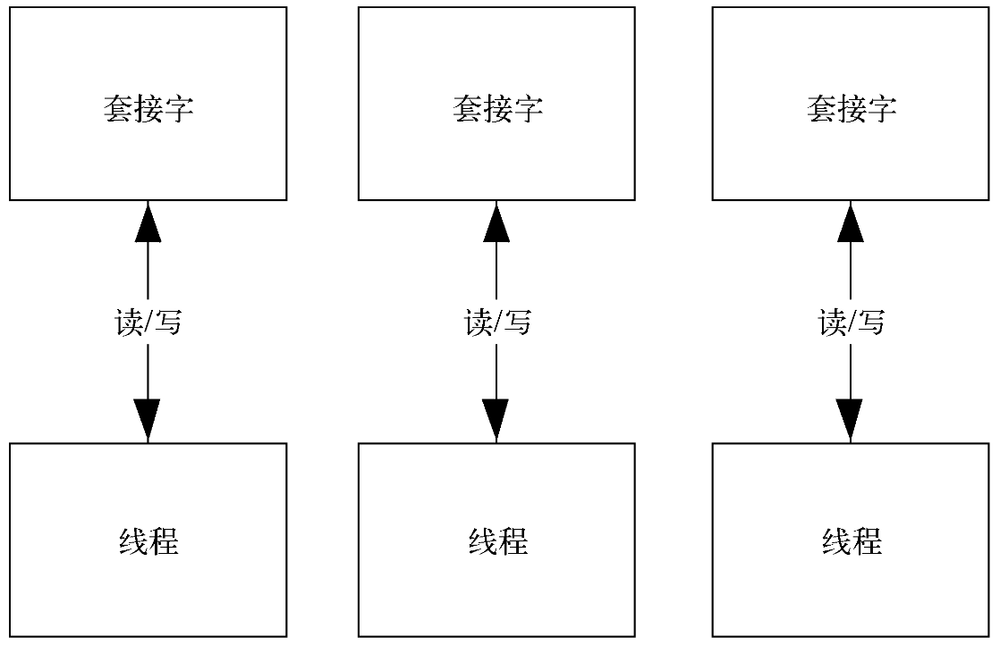

为了解决上述问题，使用了 IO 多路复用模型。[复用器机制](# 3. IO 多路复用)就是其核心。如图 1.10 所示，每次客户端发出请求时，都会创建一个
Socket Channel，并将其注册到多路复用器上。然后由多路复用器监听服务端的 IO 读写事件，服务端完成IO 读写操作后，多路复用器就会接收到通知，同时告诉客户端
IO 操作已经完成。接到通知的客户端就可以通过 Socket Channel 获取所需的数据了。

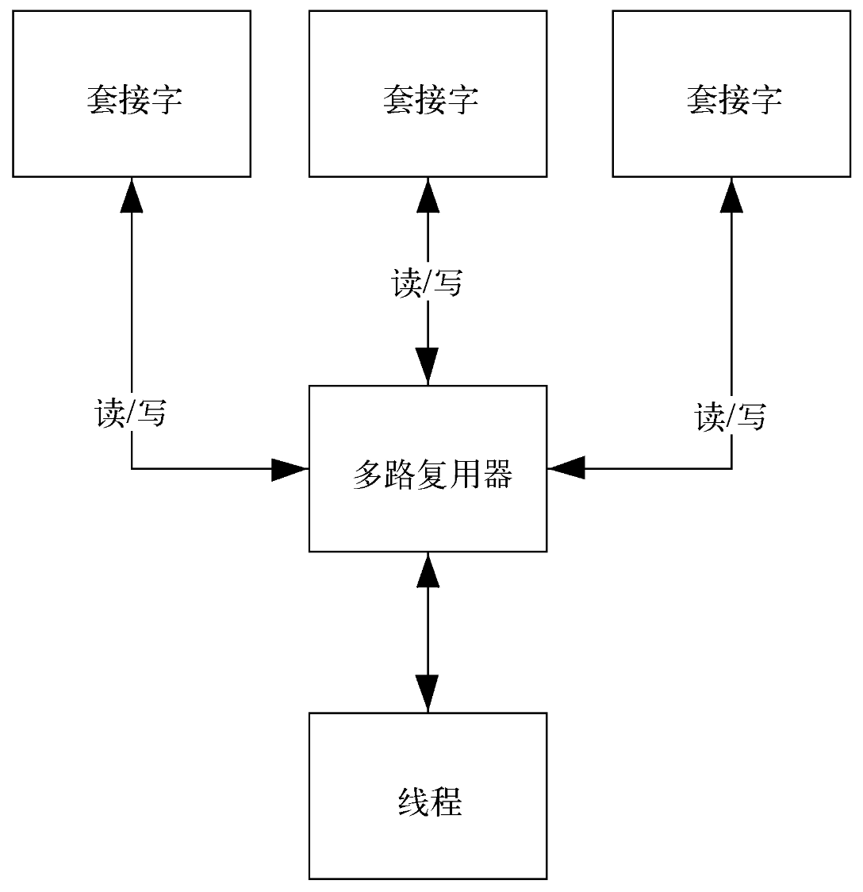

对于开发者来说，Netty 具有以下特点：

- 对多路复用机制进行封装，使开发者不需要关注其底层实现原理，只需要调用 Netty 组件就能够完成工作。
- 对网络调用透明，从 Socket 和 TCP 连接的建立，到网络异常的处理都做了包装。
- 灵活处理数据，Netty 支持多种序列化框架，通过 ChannelHandler 机制，可以自定义编码、解码器。
- 对性能调优友好，Netty 提供了线程池模式以及 Buffer 的重用机制（对象池化），不需要构建复杂的多线程模型和操作队列。

例子：

[server端](https://github.com/JiuYou2020/java-learning/blob/master/myrpc/rpc-introduction/src/main/java/cn/jiuyou2020/EchoServer.java)

```java
public class EchoServer {

    private final int port;

    public EchoServer(int port) {
        this.port = port;
    }

    public void start() throws InterruptedException {
        // 创建两个EventLoopGroup实例，bossGroup用来接收连接，workerGroup用来处理连接
        EventLoopGroup bossGroup = new NioEventLoopGroup();
        EventLoopGroup workerGroup = new NioEventLoopGroup();
        try {
            // 创建ServerBootstrap实例来设置服务端
            ServerBootstrap b = new ServerBootstrap();
            b.group(bossGroup, workerGroup) // 设置EventLoopGroup
                    .channel(NioServerSocketChannel.class) // 指定使用NioServerSocketChannel来接收连接
                    .handler(new LoggingHandler(LogLevel.INFO)) // 添加日志处理器，记录服务端的日志
                    .childHandler(new ChannelInitializer<SocketChannel>() { // 设置子通道处理器
                        @Override
                        protected void initChannel(SocketChannel ch) throws Exception {
                            ChannelPipeline p = ch.pipeline();
                            p.addLast(new EchoServerHandler()); // 添加自定义的处理器到管道
                        }
                    });

            // 绑定端口并开始接收连接
            ChannelFuture f = b.bind(port).sync();
            // 等待服务端关闭
            f.channel().closeFuture().sync();
        } finally {
            // 优雅地关闭EventLoopGroup，释放所有资源
            bossGroup.shutdownGracefully();
            workerGroup.shutdownGracefully();
        }
    }

    public static void main(String[] args) throws InterruptedException {
        new EchoServer(8080).start(); // 启动服务端，监听8080端口
    }
}


class EchoServerHandler extends ChannelInboundHandlerAdapter {

    @Override
    public void channelRead(ChannelHandlerContext ctx, Object msg) throws Exception {
        // 当接收到消息时，将消息写回给发送者
        ctx.write(msg);
        ctx.flush(); // 刷新管道中的数据，使其立即发送
    }

    @Override
    public void exceptionCaught(ChannelHandlerContext ctx, Throwable cause) throws Exception {
        // 捕捉异常并打印堆栈跟踪，关闭上下文
        cause.printStackTrace();
        ctx.close();
    }
}
```

[client端](https://github.com/JiuYou2020/java-learning/blob/master/myrpc/rpc-introduction/src/main/java/cn/jiuyou2020/HelloWorldClient.java)

```java
public class HelloWorldClient {

    private final String host;
    private final int port;

    public HelloWorldClient(String host, int port) {
        this.host = host;
        this.port = port;
    }

    public void start() throws InterruptedException {
        // 创建EventLoopGroup实例来处理客户端事件
        EventLoopGroup group = new NioEventLoopGroup();
        try {
            // 创建Bootstrap实例来设置客户端
            Bootstrap b = new Bootstrap();
            b.group(group) // 设置EventLoopGroup
                    .channel(NioSocketChannel.class) // 指定使用NioSocketChannel来作为客户端通道
                    .handler(new ChannelInitializer<SocketChannel>() { // 设置通道初始化处理器
                        @Override
                        protected void initChannel(SocketChannel ch) throws Exception {
                            ChannelPipeline p = ch.pipeline();
                            p.addLast(new LoggingHandler(LogLevel.INFO)); // 添加日志处理器
                            p.addLast(new HelloWorldClientHandler()); // 添加自定义的处理器
                        }
                    });

            // 连接到服务端
            ChannelFuture f = b.connect(host, port).sync();
            // 发送消息到服务端
            f.channel().writeAndFlush(Unpooled.copiedBuffer("Hello, World!".getBytes()));
            // 等待客户端通道关闭
            f.channel().closeFuture().sync();
        } finally {
            // 优雅地关闭EventLoopGroup，释放所有资源
            group.shutdownGracefully();
        }
    }

    public static void main(String[] args) throws InterruptedException {
        new HelloWorldClient("localhost", 8080).start(); // 启动客户端，连接到localhost的8080端口
    }
}

class HelloWorldClientHandler extends ChannelInboundHandlerAdapter {

    @Override
    public void channelRead(ChannelHandlerContext ctx, Object msg) throws Exception {
        // 当接收到服务端的消息时，打印消息
        System.out.println("Received message from server: " + msg.toString());
    }

    @Override
    public void exceptionCaught(ChannelHandlerContext ctx, Throwable cause) throws Exception {
        // 捕捉异常并打印堆栈跟踪，关闭上下文
        cause.printStackTrace();
        ctx.close();
    }
}
```

#### Netty 的核心组件

通过上面的简单例子，不难发现有些组件在服务初始化以及通信时经常被用到，下面就来介绍一下这些组件的用途和关系。

- **Channel 组件**

  **当客户端和服务端连接的时候会建立一个 Channel。我们可以把这个 Channel 理解为Socket 连接，它负责基本的 IO 操作，例如
  bind、connect、read 和 write 等。简单点说，Channel 代表连接——实体之间的连接、程序之间的连接、文件之间的连接以及设备之间的连接。同时，Channel
  也是数据“入站”和“出站”的载体。**

- **EventLoop 组件和 EventLoopGroup 组件**

  **Channel 让客户端和服务端相连，使得信息可以流动。如果把从服务端发出的信息称作“出站信息”，服务端接收到的信息称作“入站信息”，那么信息的“入站”和“出站”就会产生事件（Event）
  **，例如连接已激活、信息读取、用户事件、异常事件、打开连接和关闭连接等。信息有了，信息的流动会产生事件，顺着这个思路往下想，就需要有一个机制去
  **监控和协调**这些事件。这个机制就是 EventLoop 组件。如图 1.11 所示，在 Netty 中，每个 Channel 都会被分配到一个 EventLoop
  上，**一个 EventLoop 可以服务于多个Channel**，每个 EventLoop 都会占用一个线程，这个线程会处理 EventLoop 上产生的所有 IO
  操作和事件（Netty 4.0。

  

  了解了 EventLoop 组件，再学 EventLoopGroup 组件就容易了，EventLoopGroup 组件是用来生成 EventLoop 的。如图 1.12 所示，一个
  EventLoopGroup 中包含多个EventLoop。EventLoopGroup 要做的就是创建一个新的 Channel，并为它分配一个EventLoop。

  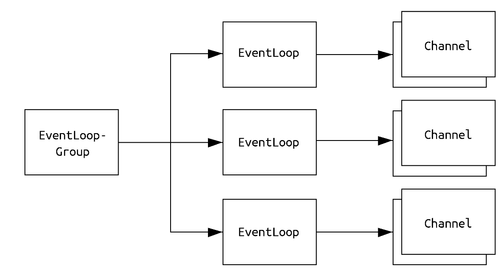

**EventLoopGroup，EventLoop 和 Channel 的关系**

在异步传输的情况下，一个 EventLoop 可以处理多个 Channel 中产生的事件，其主要负责发现事件以及通知服务端或客户端。相比以前一个
Channel 占用一个线程，Netty 的方式要合理很多。**客户端发送信息到服务端，EventLoop 发现这个事件后会通知服务端“你去获取信息”，同时客户端做其他的工作。当
EventLoop 检测到服务端返回的信息时，也会通知客户端“信息返回了，你去取吧”，然后客户端去获取信息。在这整个过程中，EventLoop
相当于监视器加传声筒。**

**ChannelHandler，ChannelPipeline 和 ChannelHandlerContext**

如果说 EventLoop 是事件的通知者，那么 ChannelHandler 就是事件的处理者。在ChannelHandler
中，可以添加一些业务代码，例如数据转换，逻辑运算等。之前的例子中也展示了，服务端和客户端分别有一个
ChannelHandler，用来读取信息，例如网络是否可用，网络异常之类的信息。如图 1.13 所示，“入站”和“出站”事件对应不同的ChannelHandler，分别是
ChannelInBoundHandler（入站事件处理器）和ChannelOutBoundHandler（出站事件处理器）。ChannelHandler 作为接口，ChannelInBoundHandler
和 ChannelOutBoundHandler 均继承自它。

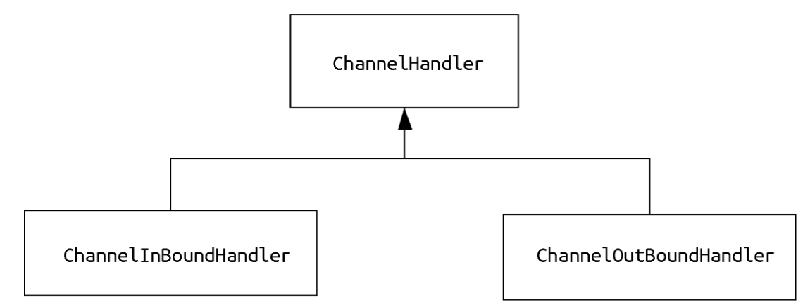

每次请求都会触发事件，ChannelHandler 负责处理这些事件，**处理的顺序由ChannelPipeline 决定**。如图 1.14
所示，ChannelOutBoundHandler 处理“出站”事件，ChannelInBoundHandler 负责处理“入站”事件。

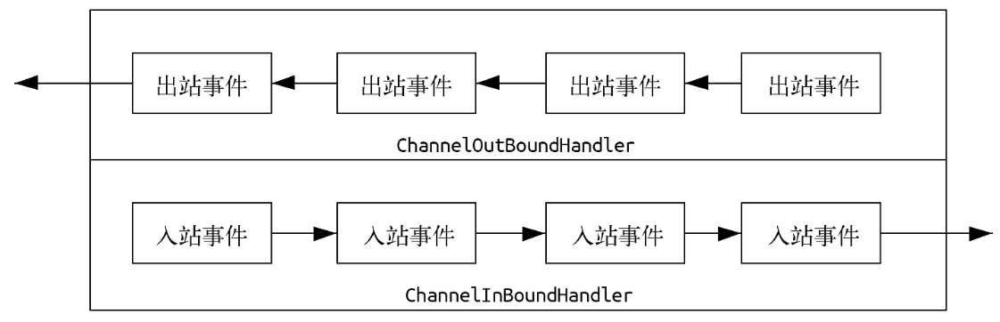

**ChannelPipeline 为 ChannelHandler ==链==提供了容器**。当创建 Channel 后，Netty 框架会自动把它分配到 ChannelPipeline
上。ChannelPipeline 保证 ChannelHandler 会按照一定的顺序处理各个事件。说白了，ChannelPipeline
是负责排队的，这里的排队是待处理事件的顺序。同时，ChannelPipeline 也可以添加或者删除 ChannelHandler，管理整个处理器队列。如图
1.15 所示，ChannelPipeline 按照先后顺序对ChannelHandler 排队，信息按照箭头所示的方向流动并且被 ChannelHandler 处理。

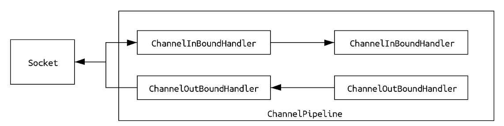

ChannelPipeline 负责管理 ChannelHandler 的排列顺序，那么它们之间的关联就由ChannelHandlerContext 来表示了。每当有
ChannelHandler 添加到ChannelPipeline 上时，会同时创建一个 ChannelHandlerContext。它的主要功能是管理 ChannelHandler 和
ChannelPipeline 之间的交互。

ChannelHandlerContext 参数贯穿 ChannelPipeline 的使用，用来将信息传递给每个 ChannelHandler，是个合格的“通信使者”。

现在把上面提到的几个核心组件归纳为图 1.16，便于记忆它们之间的关系。

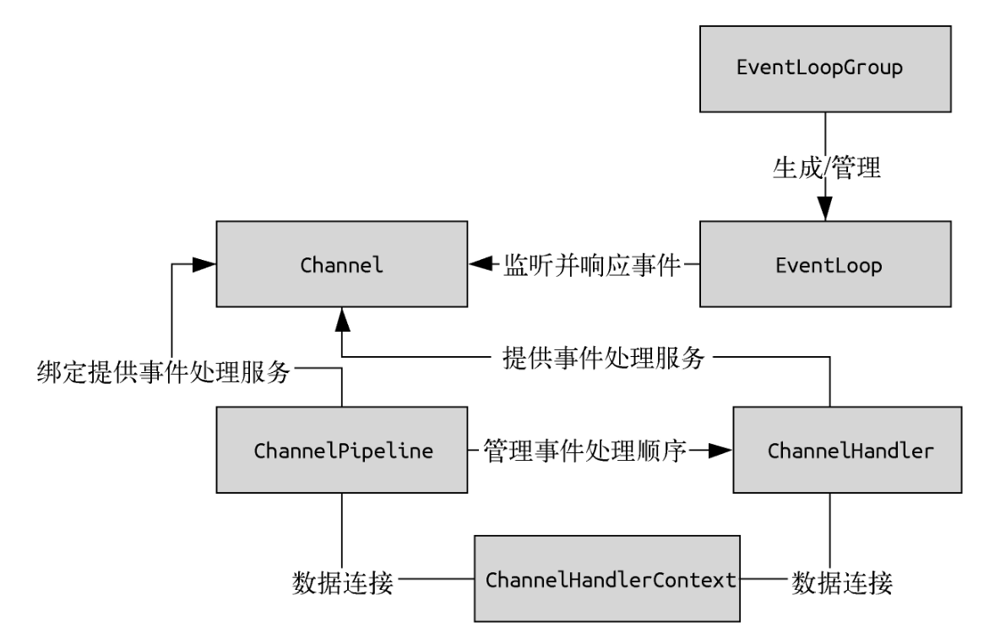

**EventLoopGroup 负责生成并且管理 EventLoop，Eventloop 用来监听并响应 Channel 上产生的事件。Channel 用来处理 Socket 的请求，其中
ChannelPipeline 提供事件的绑定和处理服务，它会按照事件到达的顺序依次处理事件，具体的处理过程交给ChannleHandler 完成。**

**ChannelHandlerContext 充当 ChannelPipeline 和 ChannelHandler 之间的通信使者，将两边的数据连接在一起。**

#### Netty 的数据容器

了解完了 Netty 的几个核心组件。接下来看看如何存放以及读写数据。Netty 框架将ByteBuf 作为存放数据的容器。

**ByteBuf 的工作原理**

**从结构上说，ByteBuf 由一串字节数组构成，数组中的每个字节都用来存放数据。如图1.17 所示，ByteBuf
提供了两个索引，readerIndex（读索引）用于读取数据，writerIndex（写索引）用于写入数据。通过让这两个索引在 ByteBuf
中移动，来定位需要读或者写数据的位置。当从 ByteBuf 中读数据时，readerIndex 将会根据读取的字节数递增；当往 ByteBuf
中写数据时，writerIndex 会根据写入的字节数递增。**

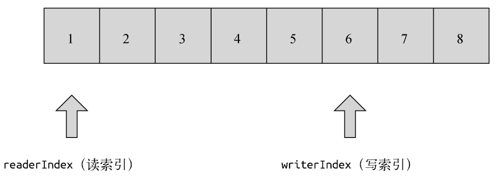

需要注意，极限情况是 readerIndex 刚好到达 writerIndex 指向的位置，如果readerIndex 超过 writerIndex，那么 Netty 会抛出
IndexOutOf-BoundsException 异常。

**ByteBuf 的使用模式**

学习了 ByteBuf 的工作原理以后，再来看看它的使用模式。根据存放缓冲区的不同，使用模式分为以下三类。

- **堆缓冲区**。ByteBuf 将数据存储在 JVM 的堆中，通过数组实现，可以做到快速分配。由于堆中的数据由 JVM
  管理，因此在不被使用时可以快速释放。这种方式下通过ByteBuf.array 方法获取 byte[] 数据。
- **直接缓冲区**。**在 JVM 的堆之外直接分配内存来存储数据，其不占用堆空间，使用时需要考虑内存容量**。这种方式在**使用 Socket
  连接传递数据时性能较好**，**==因为是间接从缓冲区发送数据的，在发送数据之前 JVM 会先将数据复制到直接缓冲区==**
  。由于直接缓冲区的数据分配在堆之外，通过 JVM 进行垃圾回收，并且分配时也需要做复制操作，因此使用成本较高。（与操作系统相关，建议了解一下数据的发送机制）
- **复合缓冲区**。顾名思义就是将上述两类缓冲区聚合在一起。Netty 提供了一个CompsiteByteBuf，可以将堆缓冲区和直接缓冲区的数据放在一起，让使用更加方便。

**ByteBuf 的分配**

聊完了结构和使用模式，再来看看 ByteBuf 是如何分配缓冲区中的数据的。Netty 提供了两种 ByteBufAllocator 的实现。

- PooledByteBufAllocator：实现了 ByteBuf 对象的池化，提高了性能，减少了内存碎片。
- Unpooled-ByteBufAllocator：没有实现 ByteBuf 对象的池化，每次分配数据都会生成新的对象实例。

**对象池化的技术和线程池的比较相似，主要目的都是提高内存的使用率。池化的简单实现思路是在 JVM 堆内存上构建一层内存池，通过
allocate 方法获取内存池的空间，通过 release 方法将空间归还给内存池。生成和销毁对象的过程，会大量调用 allocate 方法和
release 方法，因此内存池面临碎片空间的回收问题，在频繁申请和释放空间后，内存池需要保证内存空间是连续的，用于对象的分配。**
基于这个需求，产生了两种算法用于优化这一块的内存分配：伙伴系统和 slab 系统。

-
伙伴系统，用完全二叉树管理内存区域，左右节点互为伙伴，每个节点均代表一个内存块。分配内存空间时，不断地二分大块内存，直到找到满足所需条件的最小内存分片。释放内存空间时，会判断所释放内存分片的伙伴（其左右节点）是否都空闲，如果都空闲，就将左右节点合成更大块的内存。
- slab 系统，主要解决内存碎片问题，对大块内存按照一定的内存大小进行等分，形成由大小相等的内存片构成的内存集。分配内存空间时，按照内存申请空间的大小，申请尽量小块的内存或者其整数倍的内存。释放内存空间时，也是将内存分片归还给内存集。

Netty 内存池管理以 Allocate 对象的形式出现。一个 Allocate 对象由多个 Arena 组成，Arena 能够执行内存块的分配和回收操作。Arena
内部有三类内存块管理单元：TinySubPage、SmallSubPage 和 ChunkList。前两个符合 slab 系统的管理策略，ChunkList
符合伙伴系统的管理策略。当用户申请的内存空间大小介于 tinySize 和smallSize 之间时，从 tinySubPage 中获取内存块；介于
smallSize 和 pageSize 之间时，从 smallSubPage 中获取内存块；介于 pageSize 和 chunkSize 之间时，从ChunkList 中获取内存块；大于
ChunkSize（不知道分配内存的大小）时，不通过池化的方式分配内存块。

**Netty 的 Bootstrap**

回顾前面的例子，在程序最开始的时候会新建一个 Bootstrap 对象，后面的所有配置都基于这个对象而展开。

Bootstrap 的作用就是将 Netty 的核心组件配置到程序中，并且让它们运行起来。如图1.18 所示，从继承结构来看，Bootstrap 分为两类，分别是
Bootstrap 和ServerBootstrap，前者对应客户端的程序引导，后者对应服务端的程序引导。

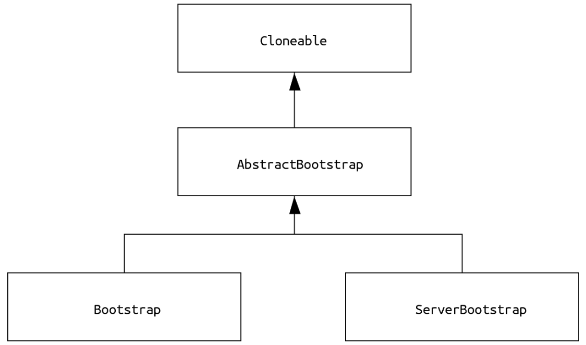

客户端的程序引导 Bootstrap 主要有两个方法：bind 和 connect。如图 1.19 所示，Bootstrap 先通过 bind 方法创建一个 Channel，然后调用
connect 方法创建 Channel 连接。

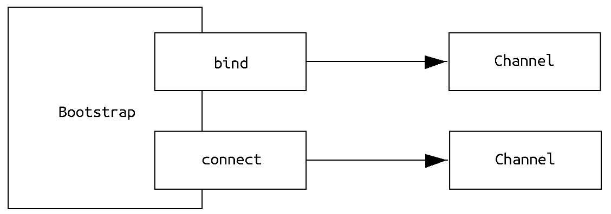

服务端的程序引导 ServerBootstrap 如图 1.20 所示，与 Bootstrap 不同的是，这里会在 bind 方法之后创建一个
ServerChannel，它不仅会创建新的 Channel，还会管理已经存在的 Channel。

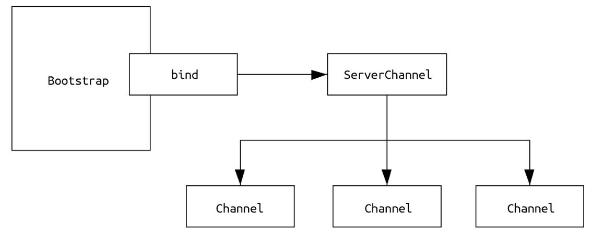

通过上面的描述，可以发现服务端和客户端的引导程序存在两个区别。

- 第一区别是ServerBootstrap 会绑定一个端口来监听客户端的连接请求，而 Bootstrap 只要知道服务端的 IP 地址和 Port 就可以建立连接了。
- **第二个区别是 Bootstrap 只需要一个EventLoopGroup，而 ServerBootstrap 需要两个，因为服务器需要两组不同的Channel，第一组
  ServerChannel 用来监听本地端口的 Socket 连接，第二组用来监听客户端请求的 Socket 连接。**

> 在简单介绍完RPC的机制之后，我们开始编写代码来实现一个简单RPC框架，源码在文首已经给出~

> 啊，终于简单介绍完了，太长了太长了，读者一定也很累吧（虽然不一定有，小声吐槽ing…）

## 二. RPC实现 环境准备

>
从这里开始正式编写代码了，虽然笔者很推荐以[TDD](https://zh.wikipedia.org/zh-sg/%E6%B5%8B%E8%AF%95%E9%A9%B1%E5%8A%A8%E5%BC%80%E5%8F%91)
的方式进行开发，但是由于笔者时间不够充裕，因此这里还是以实际的简单客户端和简单服务端进行开发，实在抱歉`(⁎⁍̴̛ᴗ⁍̴̛⁎)`

==**JDK版本为17！！！所有未出现的代码均会在类名上有个链接，放在附录部分，点击跳转，或者直接从文首网址获取**==

**==关于代码的解释在代码注释中均已详细标注，因此如非必要不会单独解释代码==**

项目整体结构在[附录](# 项目整体结构)给出。

新建一个空项目`myrpc` , 在此项目下新建一个空项目`common` 和两个SpringBoot项目`client` 和`server` ，用于测试rpc。

1. 在Client项目中分别建立[OrderController](# 代码块1)，[OrderService](# 代码块2)，[OrderServiceImpl](#
   代码块3)，[pom文件](#代码块7)（这个应该不用我教吧），如图 2.1 所示

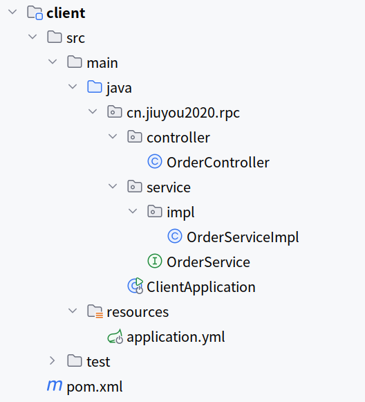

2. 在Server中分别建立[StockController](#代码块4)，[StockServiceImpl](#代码块5)，[pom文件](# 代码块9)，如图 2.2
   所示（RpcConfig是后面的内容，先不着急）

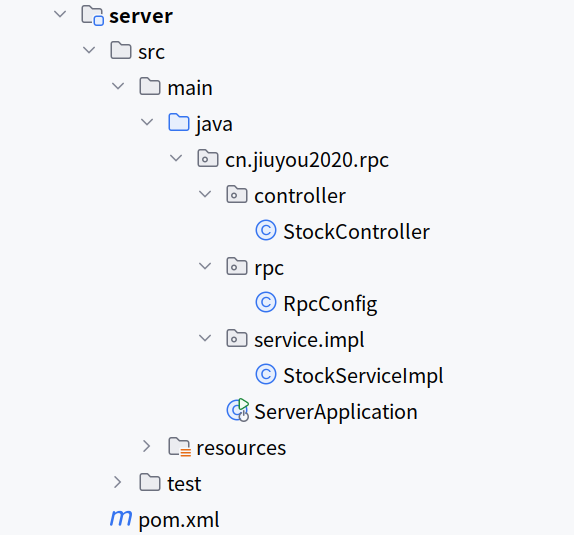

3. 在Common新建接口[StockService](# 代码块6)接口，[pom文件](# 代码块8)
   ，让server的StockServiceImpl实现此接口，并在client的OrderServiceImpl中注入并使用它，如图 2.3 所示

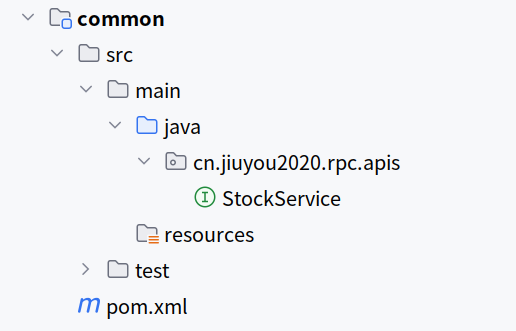

```java
@Service
public class OrderServiceImpl implements OrderService {
    //依赖注入
    @Resource
    private StockService stockService;
    //...
}
```

此时，能正常启动server项目，但是启动client项目时，会报错如下：

```shell
Error starting ApplicationContext. To display the condition evaluation report re-run your application with 'debug' enabled.
2024-05-22T20:31:36.462+08:00 ERROR 59445 --- [client] [           main] o.s.b.d.LoggingFailureAnalysisReporter   : 

***************************
APPLICATION FAILED TO START
***************************

Description:

Field orderService in cn.jiuyou2020.rpc.controller.OrderController required a bean of type 'cn.jiuyou2020.rpc.apis.StockService' that could not be found.

The injection point has the following annotations:
 - @org.springframework.beans.factory.annotation.Autowired(required=true)


Action:

Consider defining a bean of type 'cn.jiuyou2020.rpc.apis.StockService' in your configuration.
```

## 三. RPC实现 动态代理

为什么会报上面的错误呢？因为我们没有在client项目中写stockService的实现类，这也是需要去动态代理的对象。

1. 新建rpc空项目，如图3.1

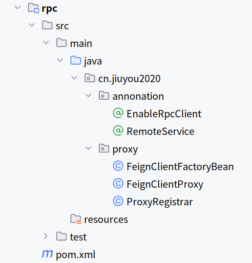

2. 新建注解RemoteService，用于获取远程客户端的属性。

   这么多属性不理解不要紧，只需要知道一个name是远程客户端的名称，url是远程客户端的路径就可以了，其它的实际也没有用上，仅仅留以后用。

```java
/**
 * @author jiuyou2020
 * @description 远程服务注解
 * @date 2024/4/24 下午8:19
 */
@Target(ElementType.TYPE)
@Retention(RetentionPolicy.RUNTIME)
@SuppressWarnings("unused")
public @interface RemoteService {
    /**
     * The name of the service with optional protocol prefix. Synonym for {@link #name()
     * name}. A name must be specified for all clients, whether or not a url is provided.
     * Can be specified as property key, eg: ${propertyKey}.
     *
     * @return the name of the service with optional protocol prefix
     */
    @AliasFor("name")
    String value() default "";

    /**
     * This will be used as the bean name instead of name if present, but will not be used
     * as a service id.
     *
     * @return bean name instead of name if present
     */
    String contextId() default "";

    /**
     * @return The service id with optional protocol prefix. Synonym for {@link #value()
     * value}.
     */
    @AliasFor("value")
    String name() default "";

    /**
     * @return the <code>@Qualifiers</code> value for the feign client.
     */
    String[] qualifiers() default {};

    /**
     * @return an absolute URL or resolvable hostname (the protocol is optional).
     */
    String url() default "";

    /**
     * @return path prefix to be used by all method-level mappings.
     */
    String path() default "";

    /**
     * @return whether to mark the feign proxy as a primary bean. Defaults to true.
     */
    boolean primary() default true;
}
```

3. 给`cn.jiuyou2020.rpc.apis.StockService`加上注解

```java
@RemoteService(url = "http://localhost", name = "demo")
public interface StockService {
    @GetMapping("/testGetParam")
    String testGetParam(String stockId, int num);
    //...
}
```

4. 定义远程客户端的BeanDefinition，请去了解一下Spring Bean的生命周期，需要注意的是，在将定义好的BeanDefinition注册后，Spring
   并不会立马创建该Bean，在后续回调实现了`org.springframework.beans.factory.FactoryBean`
   接口的类的`org.springframework.beans.factory.FactoryBean#getObject`方法时，才会进行Bean的创建。因此，创建以下三个类

[**ProxyRegistrar**类](#代码块10)：用于创建远程代理对象的BeanDefinition并注册

[**FeignClientFactoryBean**类](# 代码块11)：实现了`org.springframework.beans.factory.FactoryBean`
接口，用于注册Bean，并创建`FeignClientProxy`代理对象，该类在`cn.jiuyou2020.proxy.ProxyRegistrar#registerFeignClient`方法中被调用。

```java
private void registerFeignClient(BeanDefinitionRegistry registry, AnnotationMetadata annotationMetadata, Map<String, Object> attributes) {
    // 创建 FeignClientFactoryBean 的 BeanDefinition
    BeanDefinitionBuilder definition = BeanDefinitionBuilder.genericBeanDefinition(FeignClientFactoryBean.class);
    //...
}
```

**[FeignClientProxy类](# 代码块12)**：代理对象，用于创建远程对象的代理，负责动态代理的后续过程。

**[@EnableRpcClient注解](#代码块13)**：注解，用于将@Import中的类作为Bean导入Spring容器。

将@EnableRpcClient注解标注待client的启动类上

```java
@SpringBootApplication
@EnableRpcClient
public class ClientApplication {
    public static void main(String[] args) {
        SpringApplication.run(ClientApplication.class, args);
    }
}
```

此时，启动client项目，并点击链接<http://localhost:8080/order/testGetParam/ABC123/10> 会打印日志如下，同时返回结果`111`

```java
2024-05-22T21:05:44.423+08:00  INFO 62928 --- [client] [nio-8080-exec-1] cn.jiuyou2020.proxy.FeignClientProxy     : 调用远程方法：testGetParam
```

## 四. RPC实现 序列化

### 请求序列化

本部分完成后的结构 ，如图4.1

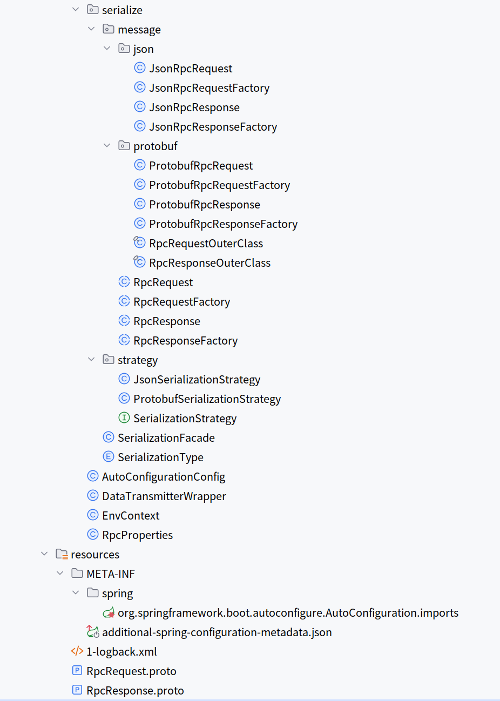

在完成动态代理后，就需要将请求的内容作为**请求（Request）**发出，包括

- 远程调用的类名（全限定名）
- 方法名
- 方法参数类型集合
- 方法参数值集合

该项目支持JSON和Protobuf序列化方式，同时为了支持拓展，使用工厂模式，策略模式和外观模式一起完成序列化功能。

首先，定义枚举类[SerializationType](# 代码块30)，枚举JSON和Protobuf两种类型。

定义RpcRequest基类，Json和Protobuf序列化方式发出的Request都需要实现该类

```java
/**
 * @author: jiuyou2020
 * @description: rpc请求的抽象类，如果要实现新的序列化方式，需要继承此类
 */
public abstract class RpcRequest {
    private static final Map<Integer, RpcRequest> map = new HashMap<>();

    public static void addRpcRequest(Integer type, RpcRequest request) {
        map.put(type, request);
    }

    public static RpcRequest getRpcRequest(Integer serializationType) {
        return map.get(serializationType);
    }

    public abstract String getClassName();

    public abstract String getMethodName();

    public abstract <T> T getParameters() throws Exception;

    public abstract <T> T getParameterTypes() throws ClassNotFoundException;

}
```

定义[JsonRpcRequest](# 代码块14)，实现RpcRequest基类

定义RpcRequestFactory，用于创建RpcRequest，凡是创建RpcRequest及其子类的方法都是使用该工厂创建，符合里氏代换原则

```java
/**
 * @author: jiuyou2020
 * @description: rpc请求工厂的抽象类，如果要实现新的序列化方式，需要继承此类，用于创建{@link RpcRequest}
 */
public abstract class RpcRequestFactory {
    private static final Map<Integer, RpcRequestFactory> map = new HashMap<>();

    public static void addFactory(Integer type, RpcRequestFactory requestFactory) {
        map.put(type, requestFactory);
    }

    public static RpcRequestFactory getFactory(Integer serializationType) {
        return map.get(serializationType);
    }

    public abstract RpcRequest createRpcRequest(Method method, Object[] args, FeignClientFactoryBean clientFactoryBean) throws Exception;
}
```

定义[JsonRpcRequestFactory](# 代码块15)，用于创建JsonRpcRequest

定义[ProtobufRpcRequest](#代码块16)类，实现RpcRequest基类

定义[ProtobufRpcRequestFactory](#代码块17)，用于创建ProtobufRpcRequest

定义RpcRequest.proto，用于protobuf序列化ProtobufRpcRequest的内容(如何根据.proto文件生成具体类请百度)

```protobuf
syntax = "proto3";

package cn.jiuyou2020.serialize.message.protobuf;
option java_outer_classname = "RpcRequestOuterClass";


message RpcRequestProto {
  string className = 1;  // New field for class type
  string methodName = 2;
  repeated string parameterTypes = 3;
  repeated bytes parameters = 4;
}
```

定义SerializationStrategy接口，用于实现序列化策略

```java
/**
 * 序列化策略，如果要实现新的序列化方式，需要实现此接口
 */
public interface SerializationStrategy {
    byte[] serialize(Object object) throws Exception;

    <T> T deserialize(byte[] data, Class<T> clazz) throws Exception;
}
```

定义[JsonSerializationStrategy](# 代码块18)类，实现SerializationStrategy接口，实现Json序列化方式

定义[ProtobufSerializationStrategy](# 代码块19)类，实现SerializationStrategy接口，实现Protobuf序列化方式

定义SerializationFacade类，作为外观类，封装序列化详情，调用者只需要调用该类便可以序列化内容。

```java
/**
 * 序列化外观类, 用于封装序列化策略，对外提供序列化和反序列化方法
 */
public class SerializationFacade {
    private static final Map<Integer, SerializationStrategy> map = new HashMap<>();

    public SerializationFacade() {
        addStrategy(SerializationType.JSON.getValue(), new JsonSerializationStrategy());
    }

    public static void addStrategy(Integer type, SerializationStrategy strategy) {
        map.put(type, strategy);
    }

    public static SerializationStrategy getStrategy(Integer type) {
        return map.get(type);
    }

}
```

定义[DataTransmitterWrapper](# 代码块20)，用于作为中间者，处理代理层，序列化层，网络传输层的内容。

定义AutoConfigurationConfig，用于将具体的策略加入到Map中，方便后续调用，map存在于RpcRequest，RpcRequestFactory，SerializationFacade之中

```java
/**
 * @author: jiuyou2020
 * @description: 自动配置类，用于注册序列化策略，如果需要实现新的序列化方式，需要手动添加
 */
@Configuration(proxyBeanMethods = false)
@EnableConfigurationProperties({RpcProperties.class})
public class AutoConfigurationConfig {

    @Bean
    @ConditionalOnProperty(name = "rpc.type", havingValue = "protobuf")
    public void registerProtobufStrategy() {
        SerializationFacade.addStrategy(SerializationType.PROTOBUF.getValue(), new ProtobufSerializationStrategy());
        RpcRequestFactory.addFactory(SerializationType.PROTOBUF.getValue(), new ProtobufRpcRequestFactory());
        RpcRequest.addRpcRequest(SerializationType.PROTOBUF.getValue(), new ProtobufRpcRequest(RpcRequestOuterClass.RpcRequestProto.newBuilder().build()));
        RpcResponseFactory.addFactory(SerializationType.PROTOBUF.getValue(), new ProtobufRpcResponseFactory());
        RpcResponse.addRpcResponse(SerializationType.PROTOBUF.getValue(), new ProtobufRpcResponse(RpcResponseOuterClass.RpcResponseProto.newBuilder().build()));
    }

    @Bean
    public void registerJsonStrategy() {
        SerializationFacade.addStrategy(SerializationType.JSON.getValue(), new JsonSerializationStrategy());
    }

    @Bean
    @ConditionalOnProperty(name = "rpc.type", havingValue = "json", matchIfMissing = true)
    public void registerJsonRequest() {
        RpcRequestFactory.addFactory(SerializationType.JSON.getValue(), new JsonRpcRequestFactory());
        RpcRequest.addRpcRequest(SerializationType.JSON.getValue(), new JsonRpcRequest());
        RpcResponseFactory.addFactory(SerializationType.JSON.getValue(), new JsonRpcResponseFactory());
        RpcResponse.addRpcResponse(SerializationType.JSON.getValue(), new JsonRpcResponse());
    }
}
```

### 响应序列化

与请求类似，响应序列化有[RpcResponse基类](# 代码块21)，[RpcResponseFactory基类](# 代码块22)，[JsonRpcResponse](# 代码块23)
类，[JsonRpcResponseFactory](# 代码块24)类，[ProtobufRpcResponse](# 代码块25)类，[ProtobufRpcResponseFactory](# 代码块26)
类和[RpcResponse.proto](# 代码块27)文件

定义EvnContext：作为全局参数的容器，负责从Spring容器中获取配置文件的参数或者其它内容，将其放入[`org.springframework.boot.autoconfigure.AutoConfiguration.imports`](#
代码块31)文件中，注册为Bean

```java
/**
 * @author: jiuyou2020
 * @description: 用于获取环境变量
 */
@Configuration
public class EnvContext implements BeanFactoryAware, ApplicationContextAware {
    private static BeanFactory beanFactory = null;
    private static RpcProperties rpcProperties = null;
    private static ApplicationContext applicationContext = null;

    /**
     * 获取序列化类型
     *
     * @return 序列化类型, 如果没有设置，默认为protobuf
     */
    public static SerializationType getSerializationType() {
        if (rpcProperties == null) {
            rpcProperties = beanFactory.getBean(RpcProperties.class);
        }
        return SerializationType.getSerializationType(rpcProperties.getType());
    }

    public static int getPort() {
        if (rpcProperties == null) {
            rpcProperties = beanFactory.getBean(RpcProperties.class);
        }
        return rpcProperties.getPort();
    }

    public static ApplicationContext getApplicationContext() {
        return applicationContext;
    }

    @Override
    public void setBeanFactory(@Nonnull BeanFactory beanFactory) throws BeansException {
        EnvContext.beanFactory = beanFactory;
    }

    @Override
    public void setApplicationContext(@Nonnull ApplicationContext applicationContext) throws BeansException {
        EnvContext.applicationContext = applicationContext;
    }
}
```

定义[RpcProperties](# 代码块32)：是一些用于配置文件的参数

定义[`additional-spring-configuration-metadata.json`](# 代码块33)：是方便Idea等开发工具进行文档化的工具

完成上述内容后，修改[FeignClientProxy类](# 代码块28)和[@EnableRpcClient](# 代码块29)注解

此时，启动client项目，并点击链接<http://localhost:8080/order/testGetParam/ABC123/10> 会接受到类名,如图 4.2 ，并打印日志

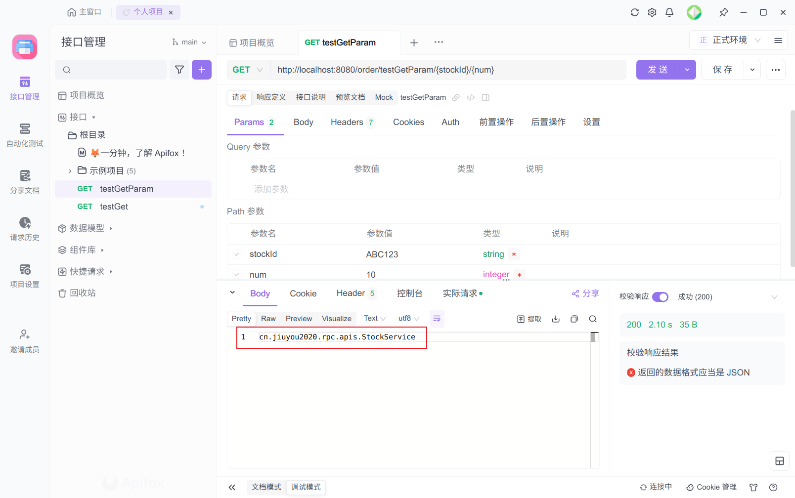

```java
024-05-23T00:39:01.249+08:00  INFO 24805 --- [client] [nio-8080-exec-2] cn.jiuyou2020.DataTransmitterWrapper     : 序列化后的数据：{"className":"cn.jiuyou2020.rpc.apis.StockService","methodName":"testGetParam","parameterTypes":["java.lang.String","int"],"parameters":["ABC123",10]}
2024-05-23T00:39:01.263+08:00  INFO 24805 --- [client] [nio-8080-exec-2] cn.jiuyou2020.DataTransmitterWrapper     : 反序列化后的数据：cn.jiuyou2020.serialize.message.json.JsonRpcRequest@584851da
```

## 五 RPC实现 网络传输

在[Netty实现RPC](# Netty实现RPC)中，已经讲述过使用Netty实现网络传输的优势~ 完成后的项目如图 5.1

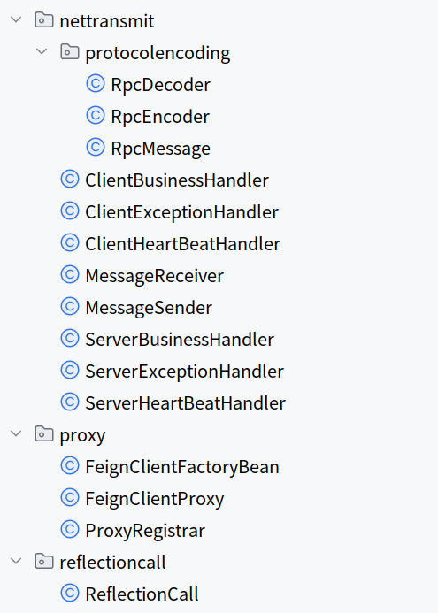

1. 定义一个自定义消息体[RpcMessage](# 代码块34)类
2. 定义一个自定义编码器[RpcEncoder](#代码块35)类
3. 定义一个自定义解码器[RpcDecoder](#代码块36)类
4. 定义一个消息发送器[MessageSender](#代码块37)类
5. 定义用于业务处理的管道处理器[ClientBusinessHandler](#代码块38)类
6. 定义用于处理客户端异常或者接收服务器异常的[ClientExceptionHandler](#代码块39)类
7. 定义用于发送心跳的[ClientHeartBeatHandler](#代码块40)类，心跳机制如下
    - 如果发送数据消息后1s内没有收到数据包回复，发送心跳包
        - 服务端回复心跳包，则再过1s再次发送心跳包
        - 服务端没有回复，则累积10次没有回复就会关闭连接（我也知道数值不合理，别太计较这个`(,,Ծ‸Ծ,, )`）。
    - 客户端收到数据消息，关闭连接
8. 定义一个消息接收器[MessageReceiver](#代码块41)
9. 定义用于业务处理的管道处理器[ServerBusinessHandler](#代码块42)类
10. 定义用于处理服务器异常的[ServerExceptionHandler](#代码块43)类
11. 定义用于接收并回复心跳的[ServerHeartBeatHandler](#代码块44)类
12. 定义用于反射调用的[ReflectionCall](#代码块45)类

完成上述内容后，修改[DataTransmitterWrapper](# 代码块46)类，在server模块添加一个[RpcConfig](# 代码块47)类

此时，启动client项目和server项目，并点击链接<http://localhost:8080/order/testGetParam/ABC123/10> ，就可以收到消息啦！

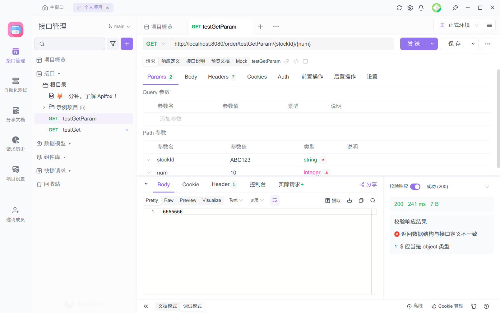

> 至此，简单的RPC框架就完成啦！真是辛苦我啦~ 如果有小伙伴看到这里的话，不妨点个赞呀~

> coding time：Apr 22, 2024 — May 23, 2024

## 六. 附录

### 环境准备部分附录

#### 项目整体结构

```shell
/home/code/Java/Project/learning/myrpc git:[master]
tree
.
├── client
│   ├── pom.xml
│   ├── src
│   │   ├── main
│   │   │   ├── java
│   │   │   │   └── cn
│   │   │   │       └── jiuyou2020
│   │   │   │           └── rpc
│   │   │   │               ├── ClientApplication.java
│   │   │   │               ├── controller
│   │   │   │               │   └── OrderController.java
│   │   │   │               └── service
│   │   │   │                   ├── impl
│   │   │   │                   │   └── OrderServiceImpl.java
│   │   │   │                   └── OrderService.java
│   │   │   └── resources
│   │   │       └── application.yml
│   │   └── test
│   │       └── java
│   │           └── cn
│   │               └── jiuyou2020
│   │                   └── rpc
│   │                       └── ClientApplicationTests.java
│   └── target
│       ├── classes
│       │   ├── application.yml
│       │   └── cn
│       │       └── jiuyou2020
│       │           └── rpc
│       │               ├── ClientApplication.class
│       │               ├── controller
│       │               │   └── OrderController.class
│       │               └── service
│       │                   ├── impl
│       │                   │   └── OrderServiceImpl.class
│       │                   └── OrderService.class
│       └── generated-sources
│           └── annotations
├── common
│   ├── pom.xml
│   ├── src
│   │   ├── main
│   │   │   ├── java
│   │   │   │   └── cn
│   │   │   │       └── jiuyou2020
│   │   │   │           └── rpc
│   │   │   │               └── apis
│   │   │   │                   └── StockService.java
│   │   │   └── resources
│   │   └── test
│   │       └── java
│   └── target
│       ├── classes
│       │   └── cn
│       │       └── jiuyou2020
│       │           └── rpc
│       │               └── apis
│       │                   └── StockService.class
│       └── generated-sources
│           └── annotations
├── myrpc.md
├── pom.xml
├── rpc
│   ├── pom.xml
│   ├── readme.md
│   ├── src
│   │   ├── main
│   │   │   ├── java
│   │   │   │   └── cn
│   │   │   │       └── jiuyou2020
│   │   │   │           ├── annonation
│   │   │   │           │   ├── EnableRpcClient.java
│   │   │   │           │   └── RemoteService.java
│   │   │   │           ├── AutoConfigurationConfig.java
│   │   │   │           ├── DataTransmitterWrapper.java
│   │   │   │           ├── EnvContext.java
│   │   │   │           ├── nettransmit
│   │   │   │           │   ├── ClientBusinessHandler.java
│   │   │   │           │   ├── ClientExceptionHandler.java
│   │   │   │           │   ├── ClientHeartBeatHandler.java
│   │   │   │           │   ├── MessageReceiver.java
│   │   │   │           │   ├── MessageSender.java
│   │   │   │           │   ├── protocolencoding
│   │   │   │           │   │   ├── RpcDecoder.java
│   │   │   │           │   │   ├── RpcEncoder.java
│   │   │   │           │   │   └── RpcMessage.java
│   │   │   │           │   ├── ServerBusinessHandler.java
│   │   │   │           │   ├── ServerExceptionHandler.java
│   │   │   │           │   └── ServerHeartBeatHandler.java
│   │   │   │           ├── proxy
│   │   │   │           │   ├── FeignClientFactoryBean.java
│   │   │   │           │   ├── FeignClientProxy.java
│   │   │   │           │   └── ProxyRegistrar.java
│   │   │   │           ├── reflectioncall
│   │   │   │           │   └── ReflectionCall.java
│   │   │   │           ├── RpcProperties.java
│   │   │   │           └── serialize
│   │   │   │               ├── message
│   │   │   │               │   ├── json
│   │   │   │               │   │   ├── JsonRpcRequestFactory.java
│   │   │   │               │   │   ├── JsonRpcRequest.java
│   │   │   │               │   │   ├── JsonRpcResponseFactory.java
│   │   │   │               │   │   └── JsonRpcResponse.java
│   │   │   │               │   ├── protobuf
│   │   │   │               │   │   ├── ProtobufRpcRequestFactory.java
│   │   │   │               │   │   ├── ProtobufRpcRequest.java
│   │   │   │               │   │   ├── ProtobufRpcResponseFactory.java
│   │   │   │               │   │   ├── ProtobufRpcResponse.java
│   │   │   │               │   │   ├── RpcRequestOuterClass.java
│   │   │   │               │   │   └── RpcResponseOuterClass.java
│   │   │   │               │   ├── RpcRequestFactory.java
│   │   │   │               │   ├── RpcRequest.java
│   │   │   │               │   ├── RpcResponseFactory.java
│   │   │   │               │   └── RpcResponse.java
│   │   │   │               ├── SerializationFacade.java
│   │   │   │               ├── SerializationType.java
│   │   │   │               └── strategy
│   │   │   │                   ├── JsonSerializationStrategy.java
│   │   │   │                   ├── ProtobufSerializationStrategy.java
│   │   │   │                   └── SerializationStrategy.java
│   │   │   └── resources
│   │   │       ├── 1-logback.xml
│   │   │       ├── META-INF
│   │   │       │   ├── additional-spring-configuration-metadata.json
│   │   │       │   └── spring
│   │   │       │       └── org.springframework.boot.autoconfigure.AutoConfiguration.imports
│   │   │       ├── RpcRequest.proto
│   │   │       └── RpcResponse.proto
│   │   └── test
│   │       └── java
│   │           └── cn
│   │               └── jiuyou2020
│   │                   ├── nettransmit
│   │                   │   ├── MessageSenderTest.java
│   │                   │   ├── MessageTestReceiver.java
│   │                   │   └── ServerTestHandler.java
│   │                   └── serialize
│   └── target
│       ├── classes
│       │   ├── 1-logback.xml
│       │   ├── cn
│       │   │   └── jiuyou2020
│       │   │       ├── annonation
│       │   │       │   ├── EnableRpcClient.class
│       │   │       │   └── RemoteService.class
│       │   │       ├── AutoConfigurationConfig.class
│       │   │       ├── DataTransmitterWrapper.class
│       │   │       ├── EnvContext.class
│       │   │       ├── nettransmit
│       │   │       │   ├── ClientBusinessHandler.class
│       │   │       │   ├── ClientExceptionHandler.class
│       │   │       │   ├── ClientHeartBeatHandler.class
│       │   │       │   ├── MessageReceiver$1.class
│       │   │       │   ├── MessageReceiver.class
│       │   │       │   ├── MessageSender$1.class
│       │   │       │   ├── MessageSender.class
│       │   │       │   ├── protocolencoding
│       │   │       │   │   ├── RpcDecoder.class
│       │   │       │   │   ├── RpcEncoder.class
│       │   │       │   │   ├── RpcMessage$Builder.class
│       │   │       │   │   └── RpcMessage.class
│       │   │       │   ├── ServerBusinessHandler.class
│       │   │       │   ├── ServerExceptionHandler.class
│       │   │       │   └── ServerHeartBeatHandler.class
│       │   │       ├── proxy
│       │   │       │   ├── FeignClientFactoryBean.class
│       │   │       │   ├── FeignClientProxy.class
│       │   │       │   ├── ProxyRegistrar$1.class
│       │   │       │   └── ProxyRegistrar.class
│       │   │       ├── reflectioncall
│       │   │       │   └── ReflectionCall.class
│       │   │       ├── RpcProperties.class
│       │   │       └── serialize
│       │   │           ├── message
│       │   │           │   ├── json
│       │   │           │   │   ├── JsonRpcRequest.class
│       │   │           │   │   ├── JsonRpcRequestFactory.class
│       │   │           │   │   ├── JsonRpcResponse.class
│       │   │           │   │   └── JsonRpcResponseFactory.class
│       │   │           │   ├── protobuf
│       │   │           │   │   ├── ProtobufRpcRequest.class
│       │   │           │   │   ├── ProtobufRpcRequestFactory.class
│       │   │           │   │   ├── ProtobufRpcResponse.class
│       │   │           │   │   ├── ProtobufRpcResponseFactory.class
│       │   │           │   │   ├── RpcRequestOuterClass$RpcRequestProto$1.class
│       │   │           │   │   ├── RpcRequestOuterClass$RpcRequestProto$Builder.class
│       │   │           │   │   ├── RpcRequestOuterClass$RpcRequestProto.class
│       │   │           │   │   ├── RpcRequestOuterClass$RpcRequestProtoOrBuilder.class
│       │   │           │   │   ├── RpcRequestOuterClass.class
│       │   │           │   │   ├── RpcResponseOuterClass$RpcResponseProto$1.class
│       │   │           │   │   ├── RpcResponseOuterClass$RpcResponseProto$Builder.class
│       │   │           │   │   ├── RpcResponseOuterClass$RpcResponseProto.class
│       │   │           │   │   ├── RpcResponseOuterClass$RpcResponseProtoOrBuilder.class
│       │   │           │   │   └── RpcResponseOuterClass.class
│       │   │           │   ├── RpcRequest.class
│       │   │           │   ├── RpcRequestFactory.class
│       │   │           │   ├── RpcResponse.class
│       │   │           │   └── RpcResponseFactory.class
│       │   │           ├── SerializationFacade.class
│       │   │           ├── SerializationType.class
│       │   │           └── strategy
│       │   │               ├── JsonSerializationStrategy.class
│       │   │               ├── ProtobufSerializationStrategy.class
│       │   │               └── SerializationStrategy.class
│       │   ├── META-INF
│       │   │   ├── additional-spring-configuration-metadata.json
│       │   │   └── spring
│       │   │       └── org.springframework.boot.autoconfigure.AutoConfiguration.imports
│       │   ├── RpcRequest.proto
│       │   └── RpcResponse.proto
│       └── generated-sources
│           └── annotations
├── rpc-introduction
│   ├── pom.xml
│   └── src
│       ├── main
│       │   ├── java
│       │   │   └── cn
│       │   │       └── jiuyou2020
│       │   │           ├── EchoServer.java
│       │   │           ├── HelloWorldClient.java
│       │   │           └── Service.java
│       │   └── resources
│       └── test
│           └── java
└── server
    ├── pom.xml
    ├── src
    │   ├── main
    │   │   ├── java
    │   │   │   └── cn
    │   │   │       └── jiuyou2020
    │   │   │           └── rpc
    │   │   │               ├── controller
    │   │   │               │   └── StockController.java
    │   │   │               ├── rpc
    │   │   │               │   └── RpcConfig.java
    │   │   │               ├── ServerApplication.java
    │   │   │               └── service
    │   │   │                   └── impl
    │   │   │                       └── StockServiceImpl.java
    │   │   └── resources
    │   │       └── application.yml
    │   └── test
    │       └── java
    │           └── cn
    │               └── jiuyou2020
    │                   └── rpc
    │                       └── ServerApplicationTests.java
    └── target
        ├── classes
        │   ├── application.yml
        │   └── cn
        │       └── jiuyou2020
        │           └── rpc
        │               ├── controller
        │               │   └── StockController.class
        │               ├── rpc
        │               │   └── RpcConfig.class
        │               ├── ServerApplication.class
        │               └── service
        │                   └── impl
        │                       └── StockServiceImpl.class
        └── generated-sources
            └── annotations
```

#### 代码块1

```java
@RestController
@RequestMapping("/order")
public class OrderController {
    @Autowired
    private OrderService orderService;

    @GetMapping("/testGetParam/{stockId}/{num}")
    public String testGetParam(@PathVariable String stockId, @PathVariable int num) {
        return orderService.testGetParam(stockId, num);
    }

    @GetMapping("/testGet")
    public String testGet() {
        return orderService.testGet();
    }

    @PostMapping("/testPost")
    public String testPost() {
        return orderService.testPost();
    }

    @PutMapping("/testPostRequestBody")
    public String testPostRequestBody(@RequestBody String requestBody) {
        return orderService.testPostRequestBody(requestBody);
    }

    //Delete，有一个参数
    @DeleteMapping("/testDeleteParam/{stockId}")
    public String testDeleteParam(@PathVariable String stockId) {
        return orderService.testDeleteParam(stockId);
    }

    //Put，有一个参数
    @PutMapping("/testPut/{stockId}")
    public String testPut(@PathVariable String stockId) {
        return orderService.testPut(stockId);
    }

}
```

#### 代码块2

```java
/**
 * @author jiuyou2020
 * @description 订单service
 * @date 2024/4/24 下午5:45
 */
public interface OrderService {
    String testGetParam(String stockId, int num);

    String testGet();

    String testPost();

    String testPostRequestBody(String requestBody);

    String testDeleteParam(String stockId);

    String testPut(String stockId);
}
```

#### 代码块3

```java
/**
 * @author jiuyou2020
 * @description
 * @date 2024/4/24 下午5:45
 */
@Service
public class OrderServiceImpl implements OrderService {
    @Resource
    private StockService stockService;

    @Override
    public String testGetParam(String stockId, int num) {
        return stockService.testGetParam(stockId, num);
    }

    @Override
    public String testGet() {
        return stockService.testGet();
    }

    @Override
    public String testPost() {
        return stockService.testPost();
    }

    @Override
    public String testPostRequestBody(String requestBody) {
        return stockService.testPostRequestBody(requestBody);
    }

    @Override
    public String testDeleteParam(String stockId) {
        return stockService.testDeleteParam(stockId);
    }

    @Override
    public String testPut(String stockId) {
        return stockService.testPut(stockId);
    }
}
```

#### 代码块4

```java
/**
 * @author jiuyou2020
 * @description
 * @date 2024/4/24 下午8:14
 */
@RestController
@RequestMapping("/stock")
public class StockController {
    @Autowired
    private StockService stockService;

    @GetMapping("/testGetParam")
    public String reduceStock() {
        return stockService.testGetParam("1", 1);
    }
}
```

#### 代码块5

```java
/**
 * @author jiuyou2020
 * @description
 * @date 2024/4/24 下午8:09
 */
@Service
public class StockServiceImpl implements StockService {
    @Override
    public String testGetParam(String stockId, int num) {
        return "6666666";
    }

    @Override
    public String testGet() {
        return "";
    }

    @Override
    public String testPost() {
        return "";
    }

    @Override
    public String testPostRequestBody(String requestBody) {
        return "";
    }

    @Override
    public String testDeleteParam(String stockId) {
        return "";
    }

    @Override
    public String testPut(String stockId) {
        return "";
    }
}
```

#### 代码块6

```java
/**
 * @author jiuyou2020
 * @description
 * @date 2024/4/24 下午8:19
 */
public interface StockService {
    @GetMapping("/testGetParam")
    String testGetParam(String stockId, int num);

    @GetMapping("/testGet")
    String testGet();

    @GetMapping("/testPost")
    String testPost();

    @GetMapping("/testPostRequestBody")
    String testPostRequestBody(String requestBody);

    @GetMapping("/testDeleteParam")
    String testDeleteParam(String stockId);

    @GetMapping("/testPut")
    String testPut(String stockId);
}
```

#### 代码块7

```xml
<dependencies>
    <dependency>
        <groupId>org.springframework.boot</groupId>
        <artifactId>spring-boot-starter</artifactId>
    </dependency>

    <dependency>
        <groupId>org.springframework.boot</groupId>
        <artifactId>spring-boot-starter-test</artifactId>
        <scope>test</scope>
    </dependency>
    <dependency>
        <groupId>cn.jiuyou2020</groupId>
        <artifactId>common</artifactId>
        <version>1.0-SNAPSHOT</version>
    </dependency>
    <dependency>
        <groupId>org.springframework.boot</groupId>
        <artifactId>spring-boot-starter-actuator</artifactId>
    </dependency>
</dependencies>
```

#### 代码块8

```xml
<dependencies>
    <dependency>
        <groupId>cn.jiuyou2020</groupId>
        <artifactId>rpc</artifactId>
        <version>1.0-SNAPSHOT</version>
    </dependency>
    <dependency>
        <groupId>org.springframework.boot</groupId>
        <artifactId>spring-boot-starter-web</artifactId>
        <version>RELEASE</version>
        <scope>compile</scope>
    </dependency>
</dependencies>
```

#### 代码块9

```xml
<dependencies>
    <dependency>
        <groupId>org.springframework.boot</groupId>
        <artifactId>spring-boot-starter-test</artifactId>
        <scope>test</scope>
    </dependency>
    <dependency>
        <groupId>cn.jiuyou2020</groupId>
        <artifactId>common</artifactId>
        <version>1.0-SNAPSHOT</version>
    </dependency>
    <dependency>
        <groupId>org.springframework.boot</groupId>
        <artifactId>spring-boot-starter-actuator</artifactId>
    </dependency>
</dependencies>
```

### 动态代理部分附录

#### 代码块10

```java
/**
 * @author jiuyou2020
 * @description 远程服务代理，用于创建远程服务代理对象
 * <p>
 * 通过实现<a href="https://docs.spring.io/spring-framework/reference/core/aot.html#aot.bestpractices.bean-registration">ImportBeanDefinitionRegistrar</a>接口，可以在Spring容器启动时动态注册BeanDefinition
 */
public class ProxyRegistrar implements ImportBeanDefinitionRegistrar, ResourceLoaderAware, EnvironmentAware {
    private ResourceLoader resourceLoader;

    private Environment environment;

    @Override
    public void setEnvironment(@Nonnull Environment environment) {
        this.environment = environment;
    }

    @Override
    public void setResourceLoader(@Nonnull ResourceLoader resourceLoader) {
        this.resourceLoader = resourceLoader;
    }

    @Override
    public void registerBeanDefinitions(@Nonnull AnnotationMetadata importingClassMetadata, @Nonnull BeanDefinitionRegistry registry) {
        registerRemoteServices(importingClassMetadata, registry);
    }

    /**
     * 注册远程服务的BeanDefinition，注意，这里仅仅是将BeanDefinition注册到Spring容器，Spring容器并不会立即实例化BeanDefinition
     *
     * @param metadata 注解元数据
     * @param registry BeanDefinition注册表
     */
    private void registerRemoteServices(AnnotationMetadata metadata, BeanDefinitionRegistry registry) {
        //扫描带有@RemoteService注解的接口
        LinkedHashSet<BeanDefinition> candidateComponents = new LinkedHashSet<>();
        ClassPathScanningCandidateComponentProvider scanner = getScanner();
        scanner.addIncludeFilter(new AnnotationTypeFilter(RemoteService.class));
        scanner.setResourceLoader(this.resourceLoader);

        //获取扫描的包路径
        Set<String> basePackages = getBasePackages(metadata);
        for (String basePackage : basePackages) {
            Set<BeanDefinition> components = scanner.findCandidateComponents(basePackage);
            candidateComponents.addAll(components);
        }

        //遍历扫描到的接口，创建代理对象并注册到Spring容器
        for (BeanDefinition candidateComponent : candidateComponents) {
            if (candidateComponent instanceof AnnotatedBeanDefinition beanDefinition) {
                // 验证被注解的类是否为接口
                AnnotationMetadata annotationMetadata = beanDefinition.getMetadata();
                Assert.isTrue(annotationMetadata.isInterface(), "@FeignClient can only be specified on an interface");
                // 获取@FeignClient注解的属性值,getCanonicalName()返回类的规范名称
                Map<String, Object> attributes = annotationMetadata
                        .getAnnotationAttributes(RemoteService.class.getCanonicalName());
                // 注册Feign客户端
                registerFeignClient(registry, annotationMetadata, attributes);
            }
        }
    }

    /**
     * 注册Feign客户端的BeanDefinition
     * <p>
     * 另一种将BeanDefinition注册到Spring容器的方式是使用BeanDefinitionReader，BeanDefinitionReader是Spring提供的用于读取BeanDefinition的工具类 例如：
     * <pre>
     * {@code
     * BeanDefinitionHolder holder = new BeanDefinitionHolder(beanDefinition, className, qualifiers);
     * BeanDefinitionReaderUtils.registerBeanDefinition(holder, registry);
     * }
     * </pre>
     *
     * @param registry           BeanDefinition注册表
     * @param annotationMetadata 注解元数据
     * @param attributes         注解属性
     */
    private void registerFeignClient(BeanDefinitionRegistry registry, AnnotationMetadata annotationMetadata, Map<String, Object> attributes) {
        // 创建 FeignClientFactoryBean 的 BeanDefinition
        BeanDefinitionBuilder definition = BeanDefinitionBuilder.genericBeanDefinition(FeignClientFactoryBean.class);
        String className = addBeanProperty(annotationMetadata, attributes, definition);

        AbstractBeanDefinition beanDefinition = definition.getBeanDefinition();
        Class<?> type = ClassUtils.resolveClassName(className, null);
        beanDefinition.setAttribute(FactoryBean.OBJECT_TYPE_ATTRIBUTE, type);
        // 获取primary属性值
        boolean primary = (Boolean) attributes.get("primary");
        beanDefinition.setPrimary(primary);
        // 注册Feign客户端的代理类
        registry.registerBeanDefinition(className, beanDefinition);
    }

    /**
     * 添加Bean属性
     *
     * @param annotationMetadata 注解元数据
     * @param attributes         注解属性
     * @param definition         Bean定义
     * @return 类名
     */
    private String addBeanProperty(AnnotationMetadata annotationMetadata, Map<String, Object> attributes, BeanDefinitionBuilder definition) {
        String className = annotationMetadata.getClassName();
        definition.addPropertyValue("type", className);

        String name = (String) attributes.get("name");
        definition.addPropertyValue("name", name);

        definition.addPropertyValue("url", getUrl(attributes));

        String contextId = getContextId(attributes);
        definition.addPropertyValue("contextId", contextId);

        definition.addPropertyValue("path", attributes.get("path"));

        definition.setAutowireMode(AbstractBeanDefinition.AUTOWIRE_BY_TYPE);
        String[] qualifiers = getQualifiers(attributes);
        if (ObjectUtils.isEmpty(qualifiers)) {
            qualifiers = new String[]{contextId + "FeignClient"};
        }
        // 设置 Bean 的限定符（qualifiers）,qualifiers的作用是为Bean定义添加限定符，以便在注入时进行区分
        definition.addPropertyValue("qualifiers", qualifiers);
        return className;
    }

    /**
     * 获取代理客户端的url,并完善
     *
     * @param attributes 注解属性
     * @return 完整的url
     */
    @SuppressWarnings("all")
    private static Object getUrl(Map<String, Object> attributes) {
        String url;
        Object oUrl = attributes.get("url");
        if (!(oUrl instanceof String)) {
            throw new IllegalStateException("url must be string type");
        }
        if (!StringUtils.hasText((String) oUrl)) {
            throw new IllegalStateException("url must be set");
        }
        url = (String) oUrl;
        if (!url.startsWith("http://") && !url.startsWith("https://")) {
            url = "http://" + url;
        }
        return url;
    }

    /**
     * 获取代理客户端的contextId
     *
     * @param attributes 注解属性
     * @return contextId
     */
    private static String getContextId(Map<String, Object> attributes) {
        String contextId;
        contextId = (String) attributes.get("contextId");
        if (!StringUtils.hasText(contextId)) {
            contextId = (String) attributes.get("name");
        }
        return contextId;
    }

    /**
     * 获取代理客户端的限定符,限定符用于区分不同的Bean定义，与别名相关
     *
     * @param attributes 注解属性
     * @return 限定符数组
     */
    private String[] getQualifiers(Map<String, Object> attributes) {
        if (attributes == null) {
            return null;
        }
        List<String> qualifierList = new ArrayList<>(Arrays.asList((String[]) attributes.get("qualifiers")));
        qualifierList.removeIf(qualifier -> !StringUtils.hasText(qualifier));
        if (qualifierList.isEmpty() && getQualifier(attributes) != null) {
            qualifierList = Collections.singletonList(getQualifier(attributes));
        }
        return !qualifierList.isEmpty() ? qualifierList.toArray(new String[0]) : null;
    }

    /**
     * 获取代理客户端的限定符
     *
     * @param attributes 注解属性
     * @return 限定符
     */
    private String getQualifier(Map<String, Object> attributes) {
        if (attributes == null) {
            return null;
        }
        String qualifier = (String) attributes.get("qualifier");
        if (StringUtils.hasText(qualifier)) {
            return qualifier;
        }
        return null;
    }


    /**
     * 获取扫描的包路径
     *
     * @param metadata 注解元数据
     * @return 包路径集合
     */
    private Set<String> getBasePackages(AnnotationMetadata metadata) {
        HashSet<String> basePackages = new HashSet<>();
        basePackages.add(ClassUtils.getPackageName(metadata.getClassName()));
        return basePackages;
    }

    /**
     * 获取扫描器,ClassPathScanningCandidateComponentProvider是Spring提供的用于扫描类路径的工具类
     *
     * @return 扫描器
     */
    protected ClassPathScanningCandidateComponentProvider getScanner() {
        return new ClassPathScanningCandidateComponentProvider(false, this.environment) {
            @Override
            //是否有资格成为候选组件
            protected boolean isCandidateComponent(@Nonnull AnnotatedBeanDefinition beanDefinition) {
                boolean isCandidate = false;
                // 判断候选组件是否独立
                if (beanDefinition.getMetadata().isIndependent()) {
                    // 如果候选组件不是注解类型，则视为合格的候选组件
                    if (!beanDefinition.getMetadata().isAnnotation()) {
                        isCandidate = true;
                    }
                }
                return isCandidate;
            }
        };
    }
}
```

#### 代码块11

```java
/**
 * @author: jiuyou2020
 * @description: Feign客户端工厂Bean，用于创建Feign客户端的代理Bean并注入到Spring容器中
 */
@SuppressWarnings("unused")
public class FeignClientFactoryBean implements FactoryBean<Object>, InitializingBean, ApplicationContextAware, BeanFactoryAware {

    // 日志对象，用于记录日志
    private static final Log LOG = LogFactory.getLog(FeignClientFactoryBean.class);

    // Feign客户端的类型
    private Class<?> type;

    // Feign客户端的名称
    private String name;

    // Feign客户端的URL
    private String url;

    // Feign客户端的上下文ID
    private String contextId;

    // Feign客户端的路径
    private String path;

    // 是否继承父上下文
    private boolean inheritParentContext = true;

    // Spring应用上下文
    private ApplicationContext applicationContext;

    // Spring Bean工厂
    private BeanFactory beanFactory;

    // 修饰符数组
    private String[] qualifiers = new String[]{};

    // For AOT testing
    public FeignClientFactoryBean() {
        if (LOG.isDebugEnabled()) {
            LOG.debug("Creating a FeignClientFactoryBean.");
        }
    }

    /**
     * Check the properties and initialize the Feign builder.
     */
    @Override
    public void afterPropertiesSet() {
        Assert.hasText(contextId, "Context id must be set");
        Assert.hasText(name, "Name must be set");
    }


    /**
     * 创建 远程客户端 的代理对象
     *
     * @return 代理对象，会将它注入到Spring容器中，根据 {@link ProxyRegistrar}中定义的BeanDefinition的逻辑
     */
    @Override
    public Object getObject() {
        return FeignClientProxy.createProxy(type, this);
    }

    @Override
    public Class<?> getObjectType() {
        return type;
    }

    public Class<?> getType() {
        return type;
    }

    public void setType(Class<?> type) {
        this.type = type;
    }

    public String getName() {
        return name;
    }

    public void setName(String name) {
        this.name = name;
    }

    public String getContextId() {
        return contextId;
    }

    public void setContextId(String contextId) {
        this.contextId = contextId;
    }

    public String getUrl() {
        return url;
    }

    public void setUrl(String url) {
        this.url = url;
    }

    public String getPath() {
        return path;
    }

    public void setPath(String path) {
        this.path = path;
    }

    public boolean isInheritParentContext() {
        return inheritParentContext;
    }

    public void setInheritParentContext(boolean inheritParentContext) {
        this.inheritParentContext = inheritParentContext;
    }

    public ApplicationContext getApplicationContext() {
        return applicationContext;
    }

    @Override
    public void setApplicationContext(@Nonnull ApplicationContext context) throws BeansException {
        applicationContext = context;
        beanFactory = context;
    }

    public String[] getQualifiers() {
        return qualifiers;
    }

    public void setQualifiers(String[] qualifiers) {
        this.qualifiers = qualifiers;
    }

    @Override
    public boolean equals(Object o) {
        if (this == o) {
            return true;
        }
        if (o == null || getClass() != o.getClass()) {
            return false;
        }
        FeignClientFactoryBean that = (FeignClientFactoryBean) o;
        return Objects.equals(applicationContext, that.applicationContext) && Objects.equals(beanFactory, that.beanFactory) && inheritParentContext == that.inheritParentContext && Objects.equals(name, that.name) && Objects.equals(path, that.path) && Objects.equals(type, that.type) && Objects.equals(url, that.url);
    }

    @Override
    public int hashCode() {
        return Objects.hash(applicationContext, beanFactory, inheritParentContext, name, path, type, url);
    }

    @Override
    public String toString() {
        return "FeignClientFactoryBean{" + "type=" + type + ", " + "name='" + name + "', " + "url='" + url + "', " + "path='" + path + "', " + "inheritParentContext=" + inheritParentContext + ", " + "applicationContext=" + applicationContext + ", " + "beanFactory=" + beanFactory + "}" + "connectTimeoutMillis=" + "}" + "readTimeoutMillis=" + "}";
    }

    @Override
    public void setBeanFactory(@Nonnull BeanFactory beanFactory) throws BeansException {
        this.beanFactory = beanFactory;
    }

}
```

#### 代码块12

```java
/**
 * @author: jiuyou2020
 * @description: 代理对象，用于调用远程方法
 */
@SuppressWarnings("unchecked")
public class FeignClientProxy implements InvocationHandler {
    private Log log = LogFactory.getLog(FeignClientProxy.class);
    private final FeignClientFactoryBean clientFactoryBean;

    public FeignClientProxy(FeignClientFactoryBean clientFactoryBean) {
        this.clientFactoryBean = clientFactoryBean;
    }

    @Override
    public Object invoke(Object proxy, Method method, Object[] args) throws Exception {
        log.info("调用远程方法：" + method.getName());
        return "111";
    }

    public static <T> T createProxy(Class<T> interfaceClass, FeignClientFactoryBean feignClientFactoryBean) {
        return (T) Proxy.newProxyInstance(interfaceClass.getClassLoader(),
                new Class[]{interfaceClass}, new FeignClientProxy(feignClientFactoryBean));
    }
}
```

#### 代码块13

```java
/**
 * @author: jiuyou2020
 * @description: 导入配置，用于启动rpc客户端
 */
@Retention(RetentionPolicy.RUNTIME)
@Target(ElementType.TYPE)
@Documented
@Import({ProxyRegistrar.class})
public @interface EnableRpcClient {

}
```

### 序列化部分附录

#### 代码块14

```java
/**
 * @author: jiuyou2020
 * @description: json rpc请求
 */
public class JsonRpcRequest extends RpcRequest {
    String className;
    String methodName;
    Class<?>[] parameterTypes;
    Object[] parameters;

    @Override
    public String getClassName() {
        return className;
    }

    @Override
    public String getMethodName() {
        return methodName;
    }

    @Override
    public Class<?>[] getParameterTypes() {
        return parameterTypes;
    }

    @Override
    public Object[] getParameters() {
        return parameters;
    }

    public void setClassName(String className) {
        this.className = className;
    }

    public void setMethodName(String methodName) {
        this.methodName = methodName;
    }

    public void setParameterTypes(Class<?>[] parameterTypes) {
        this.parameterTypes = parameterTypes;
    }

    public void setParameters(Object[] parameters) {
        this.parameters = parameters;
    }
}
```

#### 代码块15

```java
/**
 * @author: jiuyou2020
 * @description: json rpc请求工厂,用于创建{@link JsonRpcRequest}
 */
public class JsonRpcRequestFactory extends RpcRequestFactory {
    public RpcRequest createRpcRequest(Method method, Object[] args, FeignClientFactoryBean clientFactoryBean) {
        JsonRpcRequest rpcRequest = new JsonRpcRequest();
        String className = clientFactoryBean.getType().getName();
        String methodName = method.getName();
        rpcRequest.setClassName(className);
        rpcRequest.setMethodName(methodName);
        rpcRequest.setParameterTypes(method.getParameterTypes());
        rpcRequest.setParameters(args);
        return rpcRequest;
    }
}
```

#### 代码块16

```java
/**
 * @author: jiuyou2020
 * @description: protobuf rpc请求
 */
public class ProtobufRpcRequest extends RpcRequest {
    private final RpcRequestProto requestProto;
    private Class<?>[] parameterTypes;

    public ProtobufRpcRequest(RpcRequestProto requestProto) {
        this.requestProto = requestProto;
    }

    @Override
    public String getClassName() {
        return requestProto.getClassName();
    }

    @Override
    public String getMethodName() {
        return requestProto.getMethodName();
    }

    @Override
    public Class<?>[] getParameterTypes() throws ClassNotFoundException {
        if (parameterTypes != null) {
            return parameterTypes;
        }
        List<String> parameterTypesList = requestProto.getParameterTypesList();
        Class<?>[] classes = new Class<?>[parameterTypesList.size()];
        getTypes(parameterTypesList, classes);
        parameterTypes = classes;
        return classes;
    }

    @Override
    public Object[] getParameters() throws Exception {
        List<ByteString> parametersList = requestProto.getParametersList();
        Object[] objects = new Object[parametersList.size()];
        getParams(parametersList, objects);
        return objects;
    }

    private static void getTypes(List<String> parameterTypesList, Class<?>[] classes) throws ClassNotFoundException {
        for (int i = 0; i < parameterTypesList.size(); i++) {
            //如果是基本类型，直接获取对应的Class对象
            switch (parameterTypesList.get(i)) {
                case "int" -> {
                    classes[i] = int.class;
                    continue;
                }
                case "long" -> {
                    classes[i] = long.class;
                    continue;
                }
                case "short" -> {
                    classes[i] = short.class;
                    continue;
                }
                case "byte" -> {
                    classes[i] = byte.class;
                    continue;
                }
                case "float" -> {
                    classes[i] = float.class;
                    continue;
                }
                case "double" -> {
                    classes[i] = double.class;
                    continue;
                }
                case "boolean" -> {
                    classes[i] = boolean.class;
                    continue;
                }
                case "char" -> {
                    classes[i] = char.class;
                    continue;
                }
            }
            classes[i] = Class.forName(parameterTypesList.get(i));
        }
    }


    private void getParams(List<ByteString> parametersList, Object[] objects) throws Exception {
        if (parameterTypes == null) {
            getParameterTypes();
        }
        for (int i = 0; i < parametersList.size(); i++) {
            objects[i] = SerializationFacade.getStrategy(SerializationType.JSON.getValue()).deserialize(parametersList.get(i).toByteArray(), parameterTypes[i]);
        }
    }

    public byte[] toByteArray() {
        return requestProto.toByteArray();
    }

    public static ProtobufRpcRequest parseFrom(byte[] data) throws InvalidProtocolBufferException {
        return new ProtobufRpcRequest(RpcRequestProto.parseFrom(data));
    }
}
```

#### 代码块17

```java
/**
 * @author: jiuyou2020
 * @description: protobuf rpc请求工厂,用于创建{@link ProtobufRpcRequest}
 */
public class ProtobufRpcRequestFactory extends RpcRequestFactory {

    @Override
    public RpcRequest createRpcRequest(Method method, Object[] args, FeignClientFactoryBean clientFactoryBean) throws Exception {
        RpcRequestProto.Builder requestBuilder = RpcRequestProto.newBuilder();
        String className = clientFactoryBean.getType().getName();
        String methodName = method.getName();
        requestBuilder.setClassName(className);
        requestBuilder.setMethodName(methodName);
        for (Class<?> parameterType : method.getParameterTypes()) {
            requestBuilder.addParameterTypes(parameterType.getName());
        }
        if (args != null) {
            for (Object arg : args) {
                byte[] serialize = SerializationFacade.getStrategy(SerializationType.JSON.getValue()).serialize(arg);
                requestBuilder.addParameters(com.google.protobuf.ByteString.copyFrom(serialize));
            }
        }

        return new ProtobufRpcRequest(requestBuilder.build());
    }
}
```

#### 代码块18

```java
/**
 * @author: jiuyou2020
 * @description: json序列化策略
 */
public class JsonSerializationStrategy implements SerializationStrategy {
    private final ObjectMapper objectMapper = new ObjectMapper();

    public JsonSerializationStrategy() {
        objectMapper.configure(DeserializationFeature.FAIL_ON_UNKNOWN_PROPERTIES, false);
        objectMapper.setVisibility(PropertyAccessor.FIELD, JsonAutoDetect.Visibility.ANY);
    }

    @Override
    public byte[] serialize(Object object) throws Exception {
        return objectMapper.writeValueAsBytes(object);
    }

    @Override
    public <T> T deserialize(byte[] data, Class<T> clazz) throws Exception {
        return objectMapper.readValue(data, clazz);
    }
}
```

#### 代码块19

```java
public class ProtobufSerializationStrategy implements SerializationStrategy {

    @Override
    public byte[] serialize(Object object) throws Exception {
        if (object instanceof ProtobufRpcRequest request) {
            return request.toByteArray();
        }
        if (object instanceof ProtobufRpcResponse response) {
            return response.toByteArray();
        }
        throw new Exception("不支持的序列化对象");
    }

    @Override
    @SuppressWarnings("unchecked")
    public <T> T deserialize(byte[] data, Class<T> clazz) throws Exception {
        if (ProtobufRpcRequest.class.isAssignableFrom(clazz)) {
            return (T) ProtobufRpcRequest.parseFrom(data);
        }
        if (ProtobufRpcResponse.class.isAssignableFrom(clazz)) {
            return (T) ProtobufRpcResponse.parseFrom(data);
        }
        throw new Exception("不支持的序列化对象");
    }
}
```

#### 代码块20

```java
/**
 * @author: jiuyou2020
 * @description: 负责组织数据的序列化，传输和初始化
 */
public class DataTransmitterWrapper {
    Log log = LogFactory.getLog(DataTransmitterWrapper.class);

    public Object executeDataTransmit(Method method, Object[] args, FeignClientFactoryBean clientFactoryBean) throws Exception {
        int serializationType = EnvContext.getSerializationType().getValue();
        //执行序列化
        RpcRequest rpcRequest = RpcRequestFactory.getFactory(serializationType).createRpcRequest(method, args, clientFactoryBean);
        SerializationStrategy strategy = SerializationFacade.getStrategy(serializationType);
        byte[] serialize = strategy.serialize(rpcRequest);
        log.info("序列化后的数据：" + new String(serialize));
        //进行数据传输
        //执行反序列化
        JsonRpcRequest deserialize = strategy.deserialize(serialize, JsonRpcRequest.class);
        log.info("反序列化后的数据：" + deserialize);
        return deserialize.getClassName();
    }
}

```

#### 代码块21

```java
/**
 * @author: jiuyou2020
 * @description: rpc响应的抽象类，如果要实现新的序列化方式，需要继承此类
 */
@SuppressWarnings("unused")
public abstract class RpcResponse {
    public static final String SUCCESS = "success";
    public static final String ERROR = "error";

    private static final Map<Integer, RpcResponse> map = new HashMap<>();

    public static void addRpcResponse(Integer type, RpcResponse request) {
        map.put(type, request);
    }

    public static RpcResponse getRpcResponse(Integer serializationType) {
        return map.get(serializationType);
    }

    public abstract Object getResult(Class<?> returnType) throws Exception;

    public abstract String getErrorMessage();
}
```

#### 代码块22

```java
/**
 * @author: jiuyou2020
 * @description: rpc响应工厂的抽象类，如果要实现新的序列化方式，需要继承此类，用于创建{@link RpcResponse}
 */
public abstract class RpcResponseFactory {
    private static final Map<Integer, RpcResponseFactory> map = new HashMap<>();

    public static void addFactory(Integer type, RpcResponseFactory requestFactory) {
        map.put(type, requestFactory);
    }

    public static RpcResponseFactory getFactory(Integer serializationType) {
        return map.get(serializationType);
    }

    public abstract RpcResponse createRpcResponse(Object o) throws Exception;
}
```

#### 代码块23

```java
/**
 * @author: jiuyou2020
 * @description: json rpc响应
 */
public class JsonRpcResponse extends RpcResponse {
    private Object result;
    private String errorMessage;

    public JsonRpcResponse() {
    }

    @Override
    public Object getResult(Class<?> returnType) {
        return result;
    }

    @Override
    public String getErrorMessage() {
        return errorMessage;
    }

    public void setResult(Object result) {
        this.result = result;
    }

    public void setErrorMessage(String errorMessage) {
        this.errorMessage = errorMessage;
    }
}
```

#### 代码块24

```java
/**
 * @author: jiuyou2020
 * @description: json rpc响应工厂,用于创建{@link JsonRpcResponse}
 */
public class JsonRpcResponseFactory extends RpcResponseFactory {

    @Override
    public RpcResponse createRpcResponse(Object o) {
        JsonRpcResponse jsonRpcResponse = new JsonRpcResponse();
        jsonRpcResponse.setResult(o);
        jsonRpcResponse.setErrorMessage(RpcResponse.SUCCESS);
        return jsonRpcResponse;
    }
}
```

#### 代码块25

```java
/**
 * @author: jiuyou2020
 * @description: protobuf rpc响应
 */
@SuppressWarnings("unused")
public class ProtobufRpcResponse extends RpcResponse {
    private byte[] result;
    private String errorMessage;
    private final RpcResponseProto responseProto;

    public ProtobufRpcResponse(RpcResponseProto responseProto) {
        this.responseProto = responseProto;
    }

    public Object getResult() throws Exception {
        byte[] byteArray = responseProto.getResult().toByteArray();
        return SerializationFacade.getStrategy(SerializationType.JSON.getValue()).deserialize(byteArray, Object.class);
    }

    @Override
    public Object getResult(Class<?> returnType) throws Exception {
        byte[] byteArray = responseProto.getResult().toByteArray();
        return SerializationFacade.getStrategy(SerializationType.JSON.getValue()).deserialize(byteArray, returnType);
    }

    public String getErrorMessage() {
        return errorMessage;
    }

    public void setResult(byte[] result) {
        this.result = result;
    }

    public void setErrorMessage(String errorMessage) {
        this.errorMessage = errorMessage;
    }

    public byte[] toByteArray() {
        return responseProto.toByteArray();
    }

    public static ProtobufRpcResponse parseFrom(byte[] data) throws InvalidProtocolBufferException {
        return new ProtobufRpcResponse(RpcResponseProto.parseFrom(data));
    }
}
```

#### 代码块26

```java
/**
 * @author: jiuyou2020
 * @description: protobuf rpc响应工厂,用于创建{@link ProtobufRpcResponse}
 */
public class ProtobufRpcResponseFactory extends RpcResponseFactory {

    @Override
    public RpcResponse createRpcResponse(Object o) throws Exception {
        RpcResponseProto.Builder respBuilder = RpcResponseProto.newBuilder();
        byte[] serialize = SerializationFacade.getStrategy(SerializationType.JSON.getValue()).serialize(o);
        respBuilder.setResult(com.google.protobuf.ByteString.copyFrom(serialize));
        respBuilder.setErrorMessage(RpcResponse.SUCCESS);
        return new ProtobufRpcResponse(respBuilder.build());
    }
}
```

#### 代码块27

```protobuf
syntax = "proto3";

package cn.jiuyou2020.serialize.message;
option java_outer_classname = "RpcResponseOuterClass";

message RpcResponseProto {
  bytes result = 1;
  string errorMessage = 2;
}
```

#### 代码块28

```java
/**
 * @author: jiuyou2020
 * @description: 代理对象，用于调用远程方法
 */
@SuppressWarnings("unchecked")
public class FeignClientProxy implements InvocationHandler {
    private final FeignClientFactoryBean clientFactoryBean;
    private final DataTransmitterWrapper dataTransmitterWrapper;

    public FeignClientProxy(FeignClientFactoryBean clientFactoryBean) {
        this.clientFactoryBean = clientFactoryBean;
        dataTransmitterWrapper = new DataTransmitterWrapper();
    }

    @Override
    public Object invoke(Object proxy, Method method, Object[] args) throws Exception {
        return dataTransmitterWrapper.executeDataTransmit(method, args, clientFactoryBean);
    }

    public static <T> T createProxy(Class<T> interfaceClass, FeignClientFactoryBean feignClientFactoryBean) {
        return (T) Proxy.newProxyInstance(interfaceClass.getClassLoader(),
                new Class[]{interfaceClass}, new FeignClientProxy(feignClientFactoryBean));
    }
}
```

#### 代码块29

```java
/**
 * @author: jiuyou2020
 * @description: 导入配置，用于启动rpc客户端
 */
@Retention(RetentionPolicy.RUNTIME)
@Target(ElementType.TYPE)
@Documented
@Import({ProxyRegistrar.class, AutoConfigurationConfig.class})
public @interface EnableRpcClient {

}
```

#### 代码块30

```java
/**
 * @author: jiuyou2020
 * @description: 序列化类型，用于标识不同的序列化方式，如果要实现新的序列化方式，需要往3个map中加入实现的类
 */
public enum SerializationType {
    JSON(0, "json"),
    PROTOBUF(1, "protobuf");

    private final int value;
    private final String name;

    SerializationType(int value, String name) {
        this.value = value;
        this.name = name;
    }

    public int getValue() {
        return value;
    }

    public String getName() {
        return name;
    }

    public static SerializationType getSerializationType(String value) {
        for (SerializationType serializationType : SerializationType.values()) {
            if (serializationType.getName().equals(value)) {
                return serializationType;
            }
        }
        throw new IllegalArgumentException("不支持的序列化类型：" + value);
    }

    public static SerializationType getSerializationType(int value) {
        for (SerializationType serializationType : SerializationType.values()) {
            if (serializationType.getValue() == value) {
                return serializationType;
            }
        }
        throw new IllegalArgumentException("不支持的序列化类型：" + value);
    }

    @Override
    public String toString() {
        return "SerializationType{" +
                "value=" + value +
                ", name='" + name + '\'' +
                '}';
    }
}
```

#### 代码块31

```json
cn.jiuyou2020.AutoConfigurationConfig
cn.jiuyou2020.EnvContext
```

#### 代码块32

```java
/**
 * @author: jiuyou2020
 * @description: rpc配置
 */
@ConfigurationProperties("rpc")
public class RpcProperties {
    public int port = 9099;

    //实际前缀是rpc.client.type
    public String type = "json";

    public int getPort() {
        return port;
    }

    public String getType() {
        return type;
    }

    public void setPort(int port) {
        this.port = port;
    }

    public void setType(String type) {
        this.type = type;
    }
}
```

#### 代码块33

```json
{
  "groups": [
  ],
  "properties": [
    {
      "name": "rpc.port",
      "type": "java.lang.Integer",
      "description": "The port to listen on for RPC requests.",
      "defaultValue": "9099"
    },
    {
      "name": "rpc.type",
      "type": "java.lang.String",
      "description": "The type of RPC to use.  Currently 'json' or 'protobuf' is supported.",
      "defaultValue": "json",
      "validValues": [
        "json",
        "protobuf"
      ]
    }
  ]
}
```

### 网络传输部分

#### 代码块34

```java
/**
 * @author: jiuyou2020
 * @description: 自定义协议消息, 用于netty传输消息
 */
public class RpcMessage {
    public static final short MAGIC = (short) 0xCAFEBABE;      //2 bytes
    public static final short HEADER_SIZE = 21;                //2 bytes
    public static final short VERSION = 1;                     //2 bytes
    private final byte serializationType;                     //1 byte //0是json序列化，1是protobuf序列化
    private final boolean isHeartbeat;                        //1 byte
    private final boolean isOneWay;                           //1 byte
    private final boolean isResponse;                         //1 byte
    private final byte statusCode;                            //1 byte
    private final short reserved;                             //2 bytes
    private final int messageId;                              //4 bytes
    private final int bodySize;                               //4 bytes
    private final byte[] body;                                //n bytes

    private RpcMessage(Builder builder) {
        this.serializationType = builder.serializationType;
        this.isHeartbeat = builder.isHeartbeat;
        this.isOneWay = builder.isOneWay;
        this.isResponse = builder.isResponse;
        this.statusCode = builder.statusCode;
        this.reserved = builder.reserved;
        this.messageId = builder.messageId;
        this.bodySize = builder.bodySize;
        this.body = builder.body;
    }

    public static class Builder {
        private byte serializationType;
        private boolean isHeartbeat;
        private boolean isOneWay;
        private boolean isResponse;
        private byte statusCode;
        private short reserved;
        private int messageId;
        private int bodySize;
        private byte[] body;

        public Builder setSerializationType(byte serializationType) {
            this.serializationType = serializationType;
            return this;
        }

        public Builder setIsHeartbeat(boolean isHeartbeat) {
            this.isHeartbeat = isHeartbeat;
            return this;
        }

        public Builder setIsOneWay(boolean isOneWay) {
            this.isOneWay = isOneWay;
            return this;
        }

        public Builder setIsResponse(boolean isResponse) {
            this.isResponse = isResponse;
            return this;
        }

        public Builder setStatusCode(byte statusCode) {
            this.statusCode = statusCode;
            return this;
        }

        public Builder setReserved(short reserved) {
            this.reserved = reserved;
            return this;
        }

        public Builder setMessageId(int messageId) {
            this.messageId = messageId;
            return this;
        }

        public Builder setBodySize(int bodySize) {
            this.bodySize = bodySize;
            return this;
        }

        public Builder setBody(byte[] body) {
            this.body = body;
            return this;
        }

        public RpcMessage build() {
            // Automatically set the body size if body is provided
            if (this.body != null) {
                this.bodySize = this.body.length;
            }
            return new RpcMessage(this);
        }
    }

    // Getters
    public byte getSerializationType() {
        return serializationType;
    }

    public boolean isHeartbeat() {
        return isHeartbeat;
    }

    public boolean isOneWay() {
        return isOneWay;
    }

    public boolean isResponse() {
        return isResponse;
    }

    public byte getStatusCode() {
        return statusCode;
    }

    public short getReserved() {
        return reserved;
    }

    public int getMessageId() {
        return messageId;
    }

    public int getBodySize() {
        return bodySize;
    }

    public byte[] getBody() {
        return body;
    }
}
```

#### 代码块35

```java
/**
 * @author: jiuyou2020
 * @description: 自定义协议编码器
 */
public class RpcEncoder extends MessageToByteEncoder<RpcMessage> {

    /**
     * Encode a message into a {@link ByteBuf}. This method will be called for each written message that can be handled
     *
     * @param ctx the {@link ChannelHandlerContext} which this {@link MessageToByteEncoder} belongs to
     * @param msg the message to encode
     * @param out the {@link ByteBuf} into which the encoded message will be written
     */
    @Override
    protected void encode(ChannelHandlerContext ctx, RpcMessage msg, ByteBuf out) {
        out.writeShort(RpcMessage.MAGIC);
        out.writeShort(RpcMessage.HEADER_SIZE);
        out.writeShort(RpcMessage.VERSION);
        out.writeByte(msg.getSerializationType());
        out.writeBoolean(msg.isHeartbeat());
        out.writeBoolean(msg.isOneWay());
        out.writeBoolean(msg.isResponse());
        out.writeByte(msg.getStatusCode());
        out.writeShort(msg.getReserved());
        out.writeInt(msg.getMessageId());
        out.writeInt(msg.getBodySize());
        out.writeBytes(msg.getBody());
    }
}
```

#### 代码块36

```java
/**
 * @author: jiuyou2020
 * @description: 自定义协议解码器
 */
@SuppressWarnings("unused")
public class RpcDecoder extends ByteToMessageDecoder {

    /**
     * 在Netty的ByteToMessageDecoder中，decode方法的参数out是一个输出列表，用于存储解码后的消息。
     * <p>
     * 在这段代码中，decode方法从输入的ByteBuf中读取并解码出一个RpcMessage对象，
     * 然后将这个对象添加到out列表中。这样，解码后的消息就可以被后续的ChannelHandler处理。
     * <p>
     * 当decode方法执行完毕，Netty会检查out列表，如果列表中有元素，Netty会将这些元素传递给
     * ChannelPipeline中的下一个ChannelHandler进行处理。如果out列表为空，
     * 那么Netty会认为当前的decode方法没有解码出任何消息，不会触发下一个ChannelHandler。
     * <p>
     * 因此，向out列表中添加元素的目的是将解码后的消息传递给ChannelPipeline中的
     * 下一个ChannelHandler。
     *
     * @param ctx the {@link ChannelHandlerContext} which this {@link ByteToMessageDecoder} belongs to
     * @param in  the {@link ByteBuf} from which to read data
     * @param out the {@link List} to which decoded messages should be added
     */
    @Override
    protected void decode(ChannelHandlerContext ctx, ByteBuf in, List<Object> out) {
        // 检查是否有足够的数据来读取消息头
        if (in.readableBytes() < RpcMessage.HEADER_SIZE) {
            return;
        }

        // 标记当前读指针的位置
        in.markReaderIndex();

        // 读取魔术位
        short magic = in.readShort();
        if (magic != RpcMessage.MAGIC) {
            // 不是预期的魔术位，关闭连接
            ctx.close();
            return;
        }

        // 读取消息头长度
        short headerSize = in.readShort();
        if (headerSize != RpcMessage.HEADER_SIZE) {
            // 消息头长度不符合预期，关闭连接
            ctx.close();
            return;
        }

        // 读取协议版本
        short version = in.readShort();

        // 读取消息体序列化类型
        byte serializationType = in.readByte();

        // 读取心跳标记
        boolean isHeartbeat = in.readBoolean();

        // 读取单向消息标记
        boolean isOneWay = in.readBoolean();

        // 读取响应消息标记
        boolean isResponse = in.readBoolean();

        // 读取响应消息状态码
        byte statusCode = in.readByte();

        // 读取保留字段
        short reserved = in.readShort();

        // 读取消息ID
        int messageId = in.readInt();

        // 读取消息体长度
        int bodySize = in.readInt();

        // 检查是否有足够的数据来读取消息体
        if (in.readableBytes() < bodySize) {
            // 没有足够的数据来读取消息体，重置读指针
            in.resetReaderIndex();
            return;
        }

        // 读取消息体
        byte[] body = new byte[bodySize];
        in.readBytes(body);

        // 创建消息对象并添加到输出列表
        RpcMessage message = new RpcMessage.Builder()
                .setSerializationType(serializationType)
                .setIsHeartbeat(isHeartbeat)
                .setIsOneWay(isOneWay)
                .setIsResponse(isResponse)
                .setStatusCode(statusCode)
                .setReserved(reserved)
                .setMessageId(messageId)
                .setBodySize(bodySize)
                .setBody(body)
                .build();
        out.add(message);

    }
}
```

#### 代码块37

```java
/**
 * @author: jiuyou2020
 * @description: 消息发送器, 用于与远程服务器建立连接并发送消息
 */
public class MessageSender {
    private static final Log LOG = LogFactory.getLog(MessageReceiver.class);

    /**
     * 连接到服务器
     *
     * @param url            服务器地址
     * @param serializedData 序列化后的数据
     * @return 服务器返回的数据
     * @throws Exception 连接异常
     */
    public byte[] connect(String url, byte[] serializedData) throws Exception {
        EventLoopGroup group = new NioEventLoopGroup();
        try {
            Bootstrap bootstrap = getBootstrap(group);
            // 连接到服务器
            String host = new URL(url).getHost();
            int port = EnvContext.getPort();
            ChannelFuture f = bootstrap.connect(host, port).sync();

            ClientBusinessHandler clientBusinessHandler = f.channel().pipeline().get(ClientBusinessHandler.class);
            ChannelPromise promise = getPromise(f, clientBusinessHandler);

            sendMessage(serializedData, f);
            // 等待异步操作完成
            promise.await();
            // 返回异步操作的结果
            RpcMessage response = clientBusinessHandler.getResponse();
            if (response == null) {
                throw new RuntimeException("发生异常，未收到响应消息");
            }
            // 等待连接关闭
            f.channel().closeFuture().sync();
            return response.getBody();
        } finally {
            group.shutdownGracefully();
        }
    }

    /**
     * 构建并发送消息
     *
     * @param serializedData 序列化后的数据
     * @param f              ChannelFuture对象
     */
    private static void sendMessage(byte[] serializedData, ChannelFuture f) {
        // 构造一个RpcMessage对象
        RpcMessage message = new RpcMessage.Builder()
                .setSerializationType((byte) EnvContext.getSerializationType().getValue())
                .setIsHeartbeat(false)
                .setIsOneWay(false)
                .setIsResponse(false)
                .setStatusCode((byte) 0)
                .setMessageId(1)
                .setBodySize(serializedData.length)
                .setBody(serializedData)
                .build();
        LOG.info("发送数据消息: " + message);
        f.channel().writeAndFlush(message);
    }

    /**
     * 获取一个ChannelPromise对象，并给Handlers设置Promise
     *
     * @param f                     ChannelFuture对象
     * @param clientBusinessHandler 客户端业务处理器
     * @return ChannelPromise对象
     */
    private static ChannelPromise getPromise(ChannelFuture f, ClientBusinessHandler clientBusinessHandler) {
        // 创建一个ChannelPromise对象，用于异步操作的通知
        ChannelPromise promise = f.channel().newPromise();
        clientBusinessHandler.setPromise(promise);
        f.channel().pipeline().get(ClientHeartBeatHandler.class).setPromise(promise);
        f.channel().pipeline().get(ClientExceptionHandler.class).setPromise(promise);
        return promise;
    }

    /**
     * 获取配置好的Bootstrap实例
     *
     * @param group 事件循环组
     * @return Bootstrap实例
     */
    private static Bootstrap getBootstrap(EventLoopGroup group) {
        // 初始化一个Bootstrap实例，Netty客户端启动器
        Bootstrap bootstrap = new Bootstrap();

        // 配置Bootstrap使用的线程组，EventLoopGroup处理所有的事件（如连接、读、写事件）
        bootstrap.group(group)
                // 设置通道类型为NioSocketChannel，用于非阻塞传输的客户端通道类型
                .channel(NioSocketChannel.class)
                // 设置通道选项，SO_KEEPALIVE表示是否启用TCP Keep-Alive机制，保持长连接
                .option(ChannelOption.SO_KEEPALIVE, true)
                // 设置用于初始化新连接的ChannelHandler
                .handler(new ChannelInitializer<SocketChannel>() {
                    // 当一个新的连接被接受时，这个方法会被调用
                    @Override
                    public void initChannel(SocketChannel ch) {
                        // 向管道中添加一个IdleStateHandler，用于检测空闲状态
                        // readerIdleTime：读超时（毫秒），1000表示在1秒内没有读操作则触发readIdle事件
                        // writerIdleTime：写超时（毫秒），0表示不检测
                        // allIdleTime：读或写超时（毫秒），0表示不检测
                        ch.pipeline().addLast(new IdleStateHandler(1000, 0, 0, TimeUnit.MILLISECONDS));
                        ch.pipeline().addLast(new RpcDecoder());
                        ch.pipeline().addLast(new RpcEncoder());
                        // 向管道中添加自定义的处理器ClientHandler，用于处理业务逻辑
                        ch.pipeline().addLast(new ClientBusinessHandler());
                        ch.pipeline().addLast(new ClientHeartBeatHandler());
                        ch.pipeline().addLast(new ClientExceptionHandler());
                    }
                });
        return bootstrap;
    }
}
```

#### 代码块38

```java
/**
 * @author: jiuyou2020
 * @description: 客户端业务处理器，用于处理客户端的业务逻辑，如果是心跳消息或者状态码不为0的消息，直接调用下一个处理器
 */
public class ClientBusinessHandler extends ChannelInboundHandlerAdapter {
    private static final Log LOG = LogFactory.getLog(ClientBusinessHandler.class);
    private ChannelPromise promise;
    private RpcMessage response;


    @Override
    public void channelRead(ChannelHandlerContext ctx, Object msg) {
        if (!(msg instanceof RpcMessage rpcMessage)) {
            return;
        }
        if (rpcMessage.isHeartbeat() || rpcMessage.getStatusCode() != 0) {
            //调用下一个处理器
            ctx.fireChannelRead(msg);
            return;
        }
        LOG.info("客户端收到数据消息: " + rpcMessage);
        if (promise != null) {
            response = rpcMessage;
            promise.setSuccess();
        }
        ctx.close();
    }

    public void setPromise(ChannelPromise promise) {
        this.promise = promise;
    }

    public RpcMessage getResponse() {
        return response;
    }
}
```

#### 代码块39

```java
/**
 * @author: jiuyou2020
 * @description: 客户端异常处理器，用于处理客户端的异常消息
 */
public class ClientExceptionHandler extends ChannelInboundHandlerAdapter {
    private static final Log LOG = LogFactory.getLog(ClientExceptionHandler.class);
    private ChannelPromise promise;


    @Override
    public void channelRead(ChannelHandlerContext ctx, Object msg) {
        if (!(msg instanceof RpcMessage rpcMessage)) {
            return;
        }
        // 如果是异常消息
        if (rpcMessage.getStatusCode() != 0) {
            String exception = new String(rpcMessage.getBody());
            LOG.error("客户端收到异常消息: " + exception);
            ctx.close();
            promise.setFailure(new RuntimeException("客户端收到异常消息: " + rpcMessage));
        }
    }

    @Override
    public void exceptionCaught(ChannelHandlerContext ctx, Throwable cause) {
        ctx.close();
        LOG.error("客户端发生异常，关闭连接", cause);
        promise.setFailure(cause);
        throw new RuntimeException(cause);
    }

    public void setPromise(ChannelPromise promise) {
        this.promise = promise;
    }
}
```

#### 代码块40

```java
/**
 * @author: jiuyou2020
 * @description: 客户端心跳处理器，用于处理客户端的心跳消息，如果是异常消息，直接调用下一个处理器
 */
public class ClientHeartBeatHandler extends ChannelInboundHandlerAdapter {
    private static final Log LOG = LogFactory.getLog(ClientHeartBeatHandler.class);
    private ChannelPromise promise;
    // 发送的心跳包的次数
    private int heartbeats = 0;
    private final long lastDataMessageTime = System.currentTimeMillis();


    @Override
    public void channelRead(ChannelHandlerContext ctx, Object msg) {
        if (!(msg instanceof RpcMessage rpcMessage)) {
            return;
        }
        if (rpcMessage.getStatusCode() != 0) {
            //调用下一个处理器
            ctx.fireChannelRead(msg);
            return;
        }
        // 如果是心跳消息
        if (rpcMessage.isHeartbeat()) {
            heartbeats++;
            LOG.info("客户端收到心跳消息响应: " + rpcMessage);
        }
    }

    /**
     * 用于处理读空闲或者写空闲的事件，这里用于触发心跳包
     *
     * @param ctx the {@link ChannelHandlerContext} for which the event was fired
     * @param evt the event to handle
     * @throws Exception is thrown if an error occurred
     */
    @Override
    public void userEventTriggered(ChannelHandlerContext ctx, Object evt) throws Exception {
        if (evt instanceof IdleStateEvent event) {
            // 在规定时间内如果读空闲(即没有收到消息)，则触发该事件，并发送心跳包
            if (Objects.requireNonNull(event.state()) == IdleState.READER_IDLE) {
                //构建心跳消息
                RpcMessage heartbeatMessage = new RpcMessage.Builder()
                        .setSerializationType((byte) EnvContext.getSerializationType().getValue())
                        .setIsHeartbeat(true)
                        .setIsOneWay(false)
                        .setIsResponse(false)
                        .setStatusCode((byte) 0)
                        .setMessageId(heartbeats)
                        .setBodySize(0)
                        .setBody(new byte[0])
                        .build();
                LOG.info("客户端发送心跳包: " + heartbeatMessage);
                ctx.writeAndFlush(heartbeatMessage);
                if (System.currentTimeMillis() - lastDataMessageTime > 10000) {
                    LOG.info("长时间未收到数据包，关闭连接");
                    promise.setFailure(new RuntimeException("长时间未收到数据包，关闭连接"));
                    ctx.close();
                }
            }
        } else {
            super.userEventTriggered(ctx, evt);
        }
    }


    public void setPromise(ChannelPromise promise) {
        this.promise = promise;
    }
}
```

#### 代码块41

```java
/**
 * @author: jiuyou2020
 * @description: 客户端心跳处理器，用于处理客户端的心跳消息，如果是异常消息，直接调用下一个处理器
 */
public class MessageReceiver {
    private static final Log LOG = LogFactory.getLog(MessageReceiver.class);
    @Resource
    private ApplicationContext applicationContext;

    /**
     * 在新线程中启动Netty服务器，以免阻塞Spring Boot的主线程
     */
    public void run() {
        ExecutorService executorService = Executors.newSingleThreadExecutor();
        executorService.submit(() -> {
            try {
                startServer();
            } catch (Exception e) {
                LOG.error("Netty服务启动失败", e);
            }
        });
    }


    /**
     * 启动Netty服务器
     *
     * @throws InterruptedException 线程中断异常
     */
    private void startServer() throws InterruptedException {
        EventLoopGroup bossGroup = new NioEventLoopGroup();
        EventLoopGroup workerGroup = new NioEventLoopGroup();
        try {
            ServerBootstrap b = new ServerBootstrap();
            b.group(bossGroup, workerGroup).channel(NioServerSocketChannel.class).option(ChannelOption.SO_BACKLOG, 100).handler(new LoggingHandler(LogLevel.INFO)).childHandler(new ChannelInitializer<SocketChannel>() {
                @Override
                public void initChannel(SocketChannel ch) {
                    ch.pipeline().addLast(new RpcDecoder());
                    ch.pipeline().addLast(new RpcEncoder());
                    ch.pipeline().addLast(new ServerBusinessHandler(new ReflectionCall()));
                    ch.pipeline().addLast(new ServerHeartBeatHandler());
                    ch.pipeline().addLast(new ServerExceptionHandler());
                }
            });

            // 启动服务器
            int port = EnvContext.getPort();
            LOG.info("Netty 服务启动成功： " + port);
            b.bind(port).sync().channel().closeFuture().sync();

        } finally {
            bossGroup.shutdownGracefully();
            workerGroup.shutdownGracefully();
        }
    }
}
```

#### 代码块42

```java
/**
 * @author: jiuyou2020
 * @description: 服务端业务处理器，用于处理服务端的业务逻辑，如果是心跳消息或者状态码不为0的消息，直接调用下一个处理器
 */
public class ServerBusinessHandler extends ChannelInboundHandlerAdapter {
    private static final Log LOG = LogFactory.getLog(ServerBusinessHandler.class);
    // 反射调用
    private final ReflectionCall reflectionCall;

    public ServerBusinessHandler(ReflectionCall reflectionCall) {
        this.reflectionCall = reflectionCall;
    }

    @Override
    public void channelRead(ChannelHandlerContext ctx, Object msg) throws Exception {
        if (!(msg instanceof RpcMessage rpcMessage)) {
            return;
        }
        if (rpcMessage.isHeartbeat()) {
            ctx.fireChannelRead(msg);
            return;
        }
        Object call = reflectionCall.call(rpcMessage);
        // 模拟耗时
        // Thread.sleep(10000);
        // 模拟异常
        // throw new RuntimeException("模拟异常");
        int serializationType = rpcMessage.getSerializationType();
        RpcResponse rpcResponse = RpcResponseFactory.getFactory(serializationType).createRpcResponse(call);
        byte[] respData = SerializationFacade.getStrategy(serializationType).serialize(rpcResponse);
        // 构建返回消息
        RpcMessage resp = new RpcMessage.Builder()
                .setSerializationType(rpcMessage.getSerializationType())
                .setIsHeartbeat(false)
                .setIsOneWay(true)
                .setIsResponse(true)
                .setStatusCode((byte) 0)
                .setMessageId(rpcMessage.getMessageId())
                .setBodySize(respData.length)
                .setBody(respData)
                .build();
        LOG.info("服务端返回数据消息: " + resp);
        ctx.writeAndFlush(resp);
        ctx.close();
    }
}
```

#### 代码块43

```java
/**
 * @author: jiuyou2020
 * @description: 服务端异常处理器，用于处理服务端的异常消息，发送给客户端异常消息，并关闭连接
 */
public class ServerExceptionHandler extends ChannelInboundHandlerAdapter {
    private static final Log LOG = LogFactory.getLog(ServerExceptionHandler.class);

    @Override
    public void exceptionCaught(ChannelHandlerContext ctx, Throwable cause) {
        // 构建异常消息
        int value = EnvContext.getSerializationType().getValue();
        byte[] bytes = cause.getMessage().getBytes();

        RpcMessage rpcMessage = new RpcMessage.Builder()
                .setSerializationType((byte) value)
                .setIsHeartbeat(false)
                .setIsOneWay(true)
                .setIsResponse(true)
                .setStatusCode((byte) 1)
                .setMessageId(0)
                .setBodySize(bytes.length)
                .setBody(bytes)
                .build();
        LOG.error("发生异常，连接关闭，并发送异常消息", cause);
        ctx.writeAndFlush(rpcMessage);
        ctx.close();
        throw new RuntimeException(cause);
    }
}
```

#### 代码块44

```java
/**
 * @author: jiuyou2020
 * @description: 服务端心跳处理器，用于处理服务端的心跳消息
 */
public class ServerHeartBeatHandler extends ChannelInboundHandlerAdapter {
    private static final Log LOG = LogFactory.getLog(ServerHeartBeatHandler.class);

    @Override
    public void channelRead(ChannelHandlerContext ctx, Object msg) {
        if (!(msg instanceof RpcMessage rpcMessage)) {
            return;
        }
        if (rpcMessage.isHeartbeat()) {
            LOG.info("收到心跳消息" + rpcMessage);
            RpcMessage heartbeatMessage = new RpcMessage.Builder()
                    .setSerializationType((byte) EnvContext.getSerializationType().getValue())
                    .setIsHeartbeat(true)
                    .setIsOneWay(true)
                    .setIsResponse(true)
                    .setStatusCode((byte) 0)
                    .setMessageId(0)
                    .setBodySize(0)
                    .setBody(new byte[0])
                    .build();
            LOG.info("响应心跳消息：" + heartbeatMessage);
            ctx.writeAndFlush(heartbeatMessage);
        }
    }
}
```

#### 代码块45

```java
/**
 * @author: jiuyou2020
 * @description: 反射调用
 */
public class ReflectionCall {


    /**
     * 反射调用
     *
     * @param rpcMessage rpc消息
     * @return 返回结果
     * @throws Exception 异常
     */
    public Object call(RpcMessage rpcMessage) throws Exception {
        byte serializationType = rpcMessage.getSerializationType();
        RpcRequest rpcRequest;
        rpcRequest = deserialize(rpcMessage, serializationType);
        String className = rpcRequest.getClassName();
        String methodName = rpcRequest.getMethodName();
        Class<?>[] parameterTypes = rpcRequest.getParameterTypes();
        Object[] parameters = rpcRequest.getParameters();
        // 反射调用,获取该接口的所有实现类
        Class<?> type = Class.forName(className);
        ApplicationContext applicationContext = EnvContext.getApplicationContext();
        String[] beanNamesForType = applicationContext.getBeanNamesForType(type);
        if (beanNamesForType.length == 0) {
            throw new RuntimeException("未找到实现类 " + className);
        }
        if (beanNamesForType.length > 1) {
            throw new RuntimeException("实现类多于1个： " + className);
        }
        String beanName = beanNamesForType[0];
        Object bean = applicationContext.getBean(beanName);
        // 返回结果
        return bean.getClass().getMethod(methodName, parameterTypes).invoke(bean, parameters);
    }

    private RpcRequest deserialize(RpcMessage rpcMessage, int serializationType) throws Exception {
        byte[] data = rpcMessage.getBody();
        SerializationType type = SerializationType.getSerializationType(serializationType);
        RpcRequest rpcRequest = RpcRequest.getRpcRequest(type.getValue());
        Class<? extends RpcRequest> aClass = rpcRequest.getClass();
        return SerializationFacade.getStrategy(type.getValue()).deserialize(data, aClass);
    }
}
```

#### 代码块46

```java
/**
 * @author: jiuyou2020
 * @description: 负责组织数据的序列化，传输和初始化
 */
public class DataTransmitterWrapper {

    public Object executeDataTransmit(Method method, Object[] args, FeignClientFactoryBean clientFactoryBean) throws Exception {
        int serializationType = EnvContext.getSerializationType().getValue();
        //执行序列化
        RpcRequest rpcRequest = RpcRequestFactory.getFactory(serializationType).createRpcRequest(method, args, clientFactoryBean);
        SerializationStrategy strategy = SerializationFacade.getStrategy(serializationType);
        byte[] serialize = strategy.serialize(rpcRequest);
        //进行数据传输
        MessageSender messageSender = new MessageSender();
        byte[] receivedData = messageSender.connect(clientFactoryBean.getUrl(), serialize);
        //执行反序列化
        RpcResponse rpcResponse = strategy
                .deserialize(receivedData, RpcResponse.getRpcResponse(serializationType).getClass());
        return rpcResponse.getResult(method.getReturnType());
    }
}
```

#### 代码块47

```java
/**
 * @author: jiuyou2020
 * @description:
 */
@Configuration
public class RpcConfig {

    @Bean
    public ApplicationRunner applicationRunner() {
        return args -> {
            new MessageReceiver().run();
        };
    }
}
```

## 参考内容

《[分布式架构原理与实践](https://weread.qq.com/web/bookDetail/948326f0813ab7294g014bb7)》崔浩 著

[openfeign源码](https://github.com/spring-cloud/spring-cloud-openfeign)

[ChatGPT 4o](https://chatgpt.com/)
