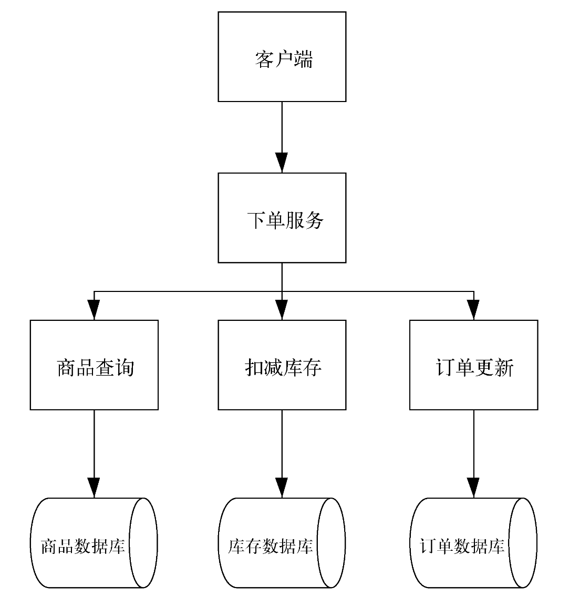
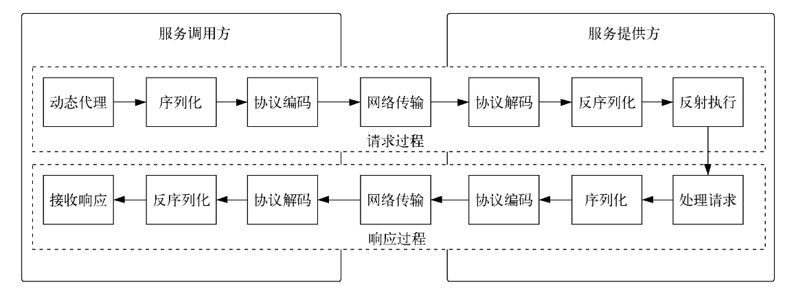
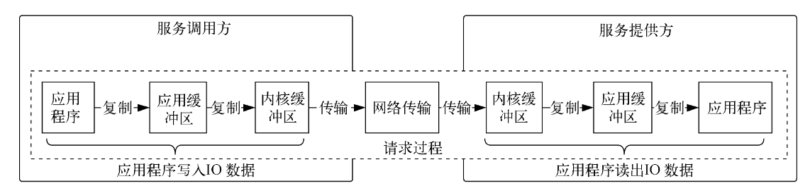
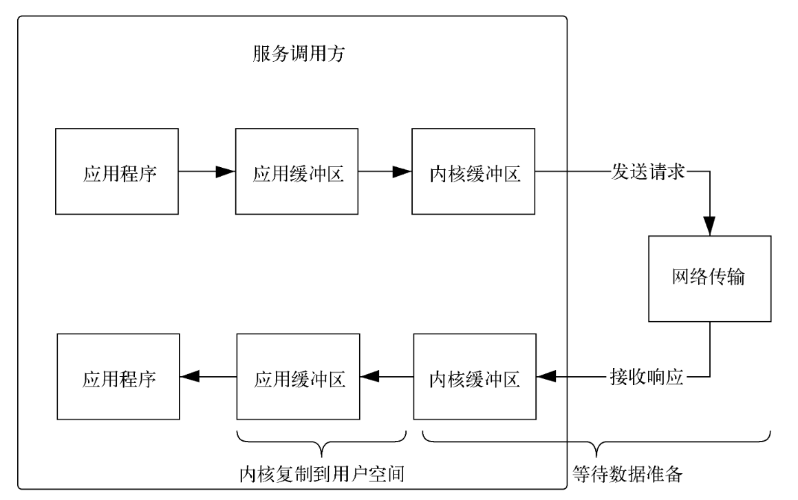
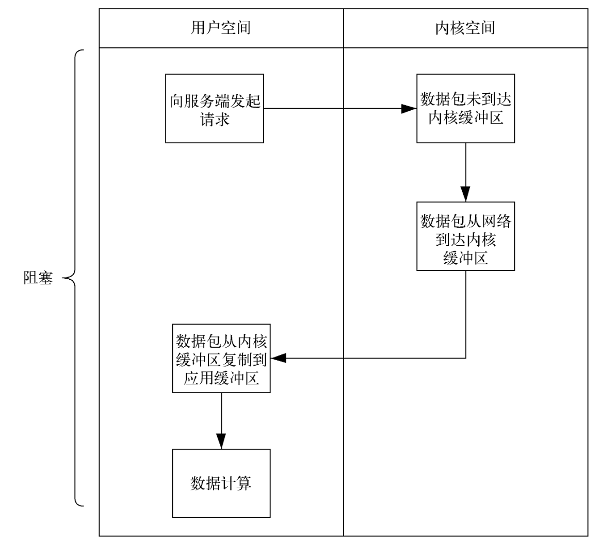
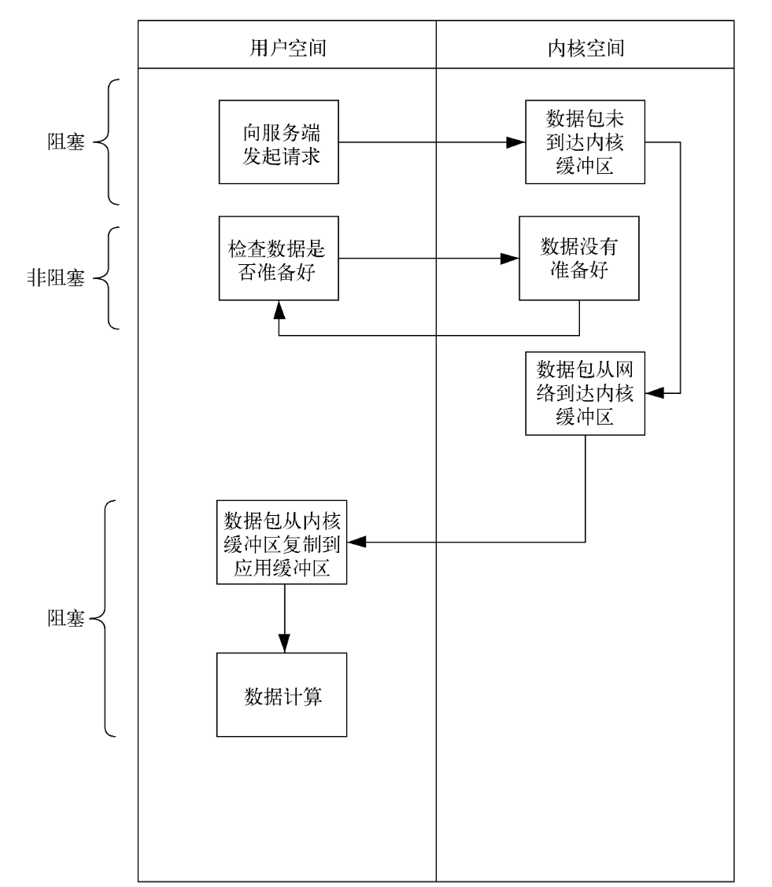
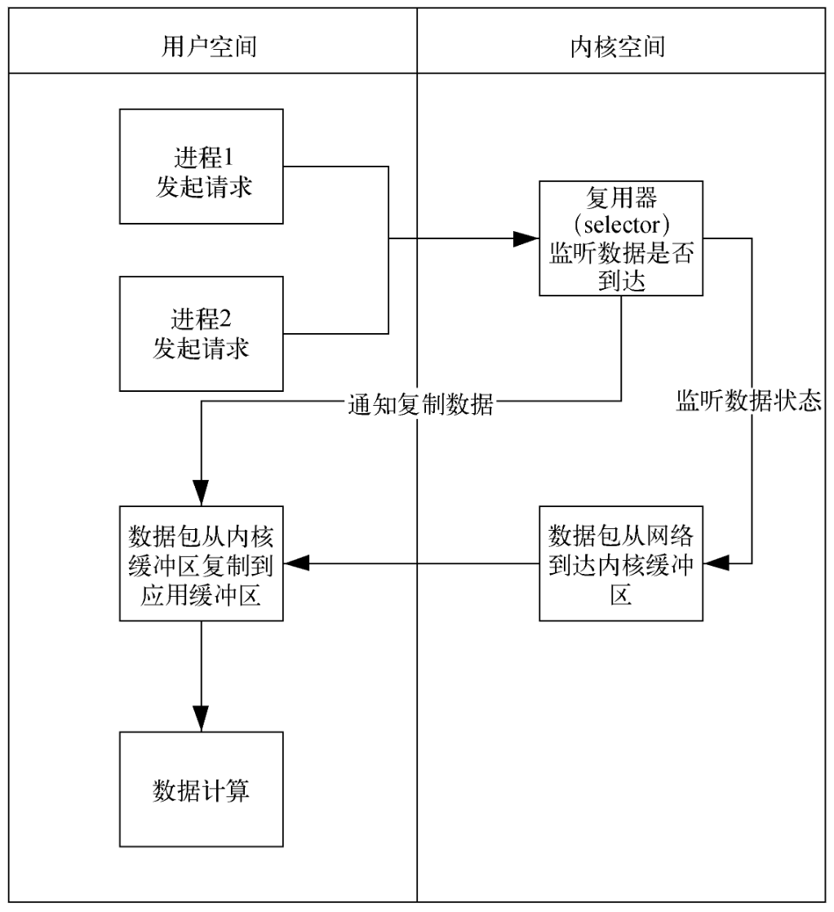
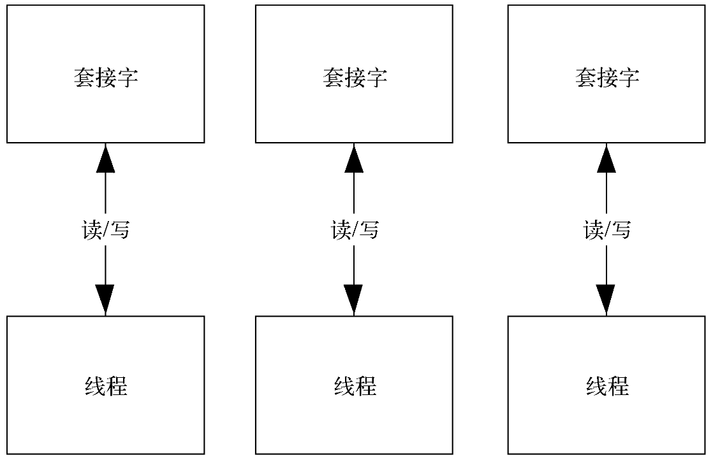
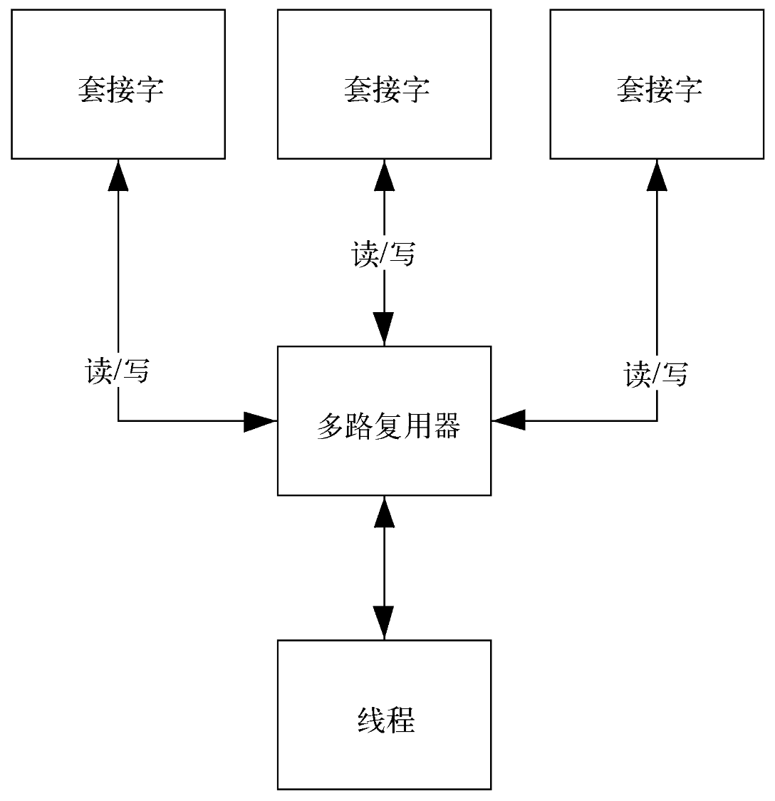

# 一文到底手搓简易RPC

> 请注意！！！是简易版，和`Open Feign`等RPC框架没有任何可比性。请勿吐槽，当然，如果有改进建议，可以提出。

> 源码地址：[myrpc](https://github.com/JiuYou2020/learning/tree/master/myrpc)

> 测试代码待编写！！！


## 一. 对RPC框架的简单介绍

在分布式系统中，应用或者服务会被部署到不同的服务器和网络环境中，特别是在有微服务的情况下，应用被拆分为很多个服务，每个服务都有可能依赖其他服务。如图 1.1 所示，客户端调用下单服务时，还会调用商品查询服务、扣减库存服务、订单更新服务，如果这三个服务分别对应三个数据库，那么一次客户端请求就会引发 6 次调用，要是这些服务或者数据库都部署在不同的服务器或者网络节点，这 6 次调用就会引发 6 次网络请求。因此，分布式部署方式在提高系统性能和可用性的前提下，对网络调用效率也发起了挑战。



为了面对这种挑战，需要选择合适的网络模型，对传输的数据包进行有效的序列化，调整网络参数优化网络传输性能。为了做到以上几点我们需要引入 **RPC**，下面就来介绍RPC 是如何解决服务之间网络传输问题的。

### RPC调用过程

**RPC 是 Remote Procedure Call（远程过程调用）的缩写，该技术可以让一台服务器上的服务通过网络调用另一台服务器上的服务，简单来说就是让不同网络节点上的服务相互调用。**因此 RPC 框架会封装网络调用的细节，让调用远程服务看起来像调用本地服务一样简单。由于微服务架构的兴起，RPC 的概念得到广泛应用，在消息队列、分布式缓存、分布式数据库等多个领域都有用到。可以将 RPC 理解为连接两个城市的高速公路，让车辆能够在城市之间自由通行。由于 RPC 屏蔽了远程调用和本地调用的区别，因此程序开发者无须过多关注网络通信，可以把更多精力放到业务逻辑的开发上。

下面看一下 RPC 调用的流程。图 1.2 描述了服务调用的过程，这里涉及左侧的服务调用方和右侧的服务提供方。既然是服务的调用过程，就存在请求过程和响应过程，这两部分用虚线圈出来了。从图左侧的服务调用方开始，利用“**动态代理**”方式向服务提供方发起调用，这里会制定服务、接口、方法以及输入的参数；将这些信息打包好之后进行“**序列化**”操作，由于 RPC 是基于 TCP 进行传输的，因此在网络传输中使用的数据必须是二进制形式，序列化操作就是将请求数据转换为二进制，以便网络传输；打好二进制包后，需要对信息进行说明，比如协议标识、数据大小、请求类型等，这个过程叫作“**协议编码**”，说白了就是对数据包进行描述，并告诉数据接收方数据包有多大、要发送到什么地方去。至此，数据发送的准备工作就完成了，数据包会通过“**网络传输**”到达服务提供方。服务提供方接收到数据包以后，先进行“协议解码”，并对解码后的数据“反序列化”，然后通过“反射执行”获取由动态代理封装好的请求。此时随着箭头到了图的最右边，顺着向下的箭头，服务提供方开始“处理请求”，处理完后就要发送响应信息给服务调用方了，之后的发送过程和服务调用方发送请求的过程调用方了，之后的发送过程和服务调用方发送请求的过程是一致的，只是方向相反，依次为“序列化→协议编码→网络传输→协议解码→反序列化→接收响应”。以上便是整个RPC 调用的请求、响应流程。



分析上述的 RPC 调用流程后，发现无论是服务调用方发送请求，还是服务提供方发送响应，有几个步骤都是必不可少的，分别为**动态代理、序列化、协议编码和网络传输**。下面对这四个方面展开讨论。

### RPC动态代理

服务调用方访问服务提供方的过程是一个 RPC 调用。作为服务调用方的客户端通过一个接口访问作为服务提供方的服务端，这个接口决定了访问方法和传入参数，可以告诉客户端如何调用服务端，实际的程序运行也就是接口实现是在客户端进行的。RPC 会通过动态代理机制，为客户端请求生成一个代理类，在项目中调用接口时绑定对应的代理类，之后当调用接口时，会被代理类拦截，在代理类里加入远程调用逻辑即可调用远程服务端。原理说起来有些枯燥，我们通过一个例子来帮助大家理解，相关代码如下：（简单的[例子](https://github.com/JiuYou2020/learning/blob/master/myrpc/rpc-introduction/src/main/java/cn/jiuyou2020/Service.java)，就算笔者自己实现的RPC也绝无可能这么简单）

```java
// 服务接口
interface Service {
    String sayHello(String name);
}

// 服务实现类
class ServiceImpl implements Service {
    @Override
    public String sayHello(String name) {
        return "Hello, " + name;
    }
}

// 动态代理处理器
class RpcInvocationHandler implements InvocationHandler {
    private final Object target;

    public RpcInvocationHandler(Object target) {
        this.target = target;
    }

    @Override
    public Object invoke(Object proxy, Method method, Object[] args) throws Throwable {
        // 在这里加入远程调用逻辑
        System.out.println("Calling remote service...");

        // 模拟远程调用，实际调用本地的服务实现
        Object result = method.invoke(target, args);

        System.out.println("Remote service called successfully.");
        return result;
    }
}

// 客户端代码
class RpcClient {
    public static void main(String[] args) {
        // 创建服务实现
        Service service = new ServiceImpl();

        // 创建动态代理
        Service proxy = (Service) Proxy.newProxyInstance(service.getClass().getClassLoader(), service.getClass().getInterfaces(), new RpcInvocationHandler(service));

        // 通过代理调用服务
        String response = proxy.sayHello("Alice");
        System.out.println("Response: " + response);
    }
}
```

回顾上述调用过程不难发现，在客户端和服务端之间加入了一层动态代理，这个代理用来代理服务端接口。客户端只需要知道调用服务端接口的方法名字和输入参数就可以了，并不需要知道具体的实现过程。在实际的 RPC 调用过程中，在客户端生成需要调用的服务端接口实例，将它丢给代理类，当代理类将这些信息传到服务端以后再执行。因此，**RPC 动态代理是对客户端的调用和服务端的执行进行了解耦**，目的是让客户端像调用本地方法一样调用远程服务。

### RPC序列化

序列化是将对象转化为字节流的过程，RPC 客户端在请求服务端时会发送请求的对象，这个对象如果通过网络传输，就需要进行序列化，也就是将对象转换成字节流数据。反过来，在服务端接收到字节流数据后，将其转换成可读的对象，就是反序列化。如果把序列化比作快递打包的过程，那么收到快递后拆包的过程就是反序列化。序列化和反序列化的核心思想是设计一种序列化、反序列化规则，将对象的类型、属性、属性值、方法名、方法的传入参数等信息按照规定格式写入到字节流中，然后再通过这套规则读取对象的相关信息，完成反序列化操作。下面罗列几种常见的序列化方式供大家参考。

| 序列化方式               | 格式     | 效率                                                         | 可读性                                   | 语言支持                                             | 易用性                                                       | 使用场景                                                     |
| ------------------------ | -------- | ------------------------------------------------------------ | ---------------------------------------- | ---------------------------------------------------- | ------------------------------------------------------------ | ------------------------------------------------------------ |
| **JSON**                 | 文本格式 | JSON 在空间和速度方面的效率不如二进制格式。虽然它在可读格式中速度相对较快，但仍比二进制替代品慢。 | 高度可读，易于调试和检查数据。           | 几乎所有编程语言都支持 JSON。                        | 使用简单，进行基本操作时不需要额外的工具或库。               | 适用于需要人类可读性的网页应用和配置文件。                   |
| **Protobuf**（协议缓冲） | 二进制   | 在空间和速度方面都非常高效，使用变长编码优化存储。           | 不可读，但有工具可以检查 Protobuf 数据。 | 支持多种语言，包括 C++、Java、Python 等。            | 需要在 .proto 文件中定义数据结构，然后编译成代码。这增加了一步，但确保了数据一致性。 | 适用于高性能应用，如微服务架构中的服务间通信。               |
| **Thrift**               | 二进制   | 性能与 Protobuf 相当，序列化稍微低效，但反序列化效率高。     | 不可读，主要用于机器处理。               | 支持多种语言，包括 C++、Java、Python、PHP、Ruby 等。 | 与 Protobuf 类似，使用 IDL（接口定义语言）文件定义数据和服务接口，需要额外一步生成代码。 | 非常适合多语言环境中的跨语言服务，特别是涉及多种语言的分布式系统。 |
| **Hessian**              | 二进制   | 高效的二进制序列化，Hessian 2.0 比 Hessian 1.0 有所改进。    | 不可读。                                 | 支持多种语言，包括 Java、Python、C++、.Net 等。      | 比 Protobuf 和 Thrift 更简单使用，因为不需要 IDL，而是使用自描述格式。 | 适用于需要高效数据交换且设置最少的 RPC 框架和场景。          |

**总结**

- **JSON**：适合需要人类可读性和简单性的场景，如网页应用和配置文件。
- **Protobuf**：适合高吞吐量、低延迟的应用，如高性能服务通信。
- **Thrift**：适合跨语言兼容性和高效序列化/反序列化的场景，如多语言环境中的分布式系统。
- **Hessian**：适合需要高效二进制序列化且无需 IDL 的场景，如 RPC 框架和高效数据交换。


### 协议编码

有了序列化功能，就可以将客户端的请求对象转化成字节流在网络上传输了，这个字节流转换为二进制信息以后会写入本地的 Socket 中，然后通过网卡发送到服务端。从编程角度来看，每次请求只会发送一个请求包，但是从网络传输的角度来看，网络传输过程中会将二进制包拆分成很多个数据包，这一点也可以从 TCP 传输数据的原理看出。拆分后的多个二进制包会同时发往服务端，服务端接收到这些数据包以后，将它们合并到一起，再进行反序列化以及后面的操作。实际上，协议编码要做的事情就是对同一次网络请求的数据包进行拆分，并且为拆分得到的每个数据包定义边界、长度等信息。如果把序列化比作快递打包过程，那么协议编码更像快递公司发快递时，往每个快递包裹上贴目的地址和收件人信息，这样快递员拿到包裹以后就知道该把包裹送往哪里、交给谁。当然这只是个例子，RPC 协议包含的内容要更为广泛。

接下来一起看看 RPC 协议的消息设计格式。RPC 协议的消息由两部分组成：消息头和消息体。消息头部分主要存放消息本身的描述信息，如图 1.3 所示。


- 魔术位（magic）：协议魔术，为解码设计。
- 消息头长度（header size）：用来描述消息头长度，为扩展设计。
- 协议版本（version）：协议版本，用于版本兼容。
- 消息体序列化类型（st）：描述消息体的序列化类型，例如 JSON、Protobuf。
- 心跳标记（hb）：每次传输都会建立一个长连接，隔一段时间向接收方发送一次心跳请求，保证对方始终在线。
- 单向消息标记（ow）：标记是否为单向消息。
- 响应消息标记（rp）：用来标记是请求消息还是响应消息。
- 响应消息状态码（status code）：标记响应消息状态码。
- 保留字段（reserved）：用于填充消息，保证消息的字节是对齐的。但是在我的设计中貌似没有起到任何作用。
- 消息 Id（message id）：用来唯一确定一个消息的标识。
- 消息头长度（body size）：描述消息体的长度。

从上面的介绍也可以看出，消息头主要负责描述消息本身，其内容甚至比上面提到的更加详细。消息体的内容相对而言就显得非常简单了，就是在 [RPC序列化](# RPC序列化) 中提到的序列化所得的字节流信息，包括 JSON、Hessian、Protobuf、Thrift 等。

### 网络传输

动态代理使客户端可以像调用本地方法一样调用服务端接口；序列化将传输的信息打包成字节码，使之适合在网络上传输；协议编码对序列化信息进行标注，使其能够顺利地传输到目的地。做完前面这些准备工作后就可以进行网络传输了。RPC 的网络传输本质上是服务调用方和服务提供方的一次网络信息交换过程。以 Linux 操作系统为例，操作系统的核心是内核，独立于普通的应用程序，可以访问受保护的内存空间，还拥有访问底层硬件设备（比说网卡）的所有权限。为了保证内核的安全，用户的应用程序并不能直接访问内核。对此，操作系统将内存空间划分为两部分，一部分是内核空间，一部分是用户空间。如果用户空间想访问内核空间就需要以缓冲区作为跳板。网络传输也是如此，**如果一个应用程序（用户空间）想访问网卡发送的信息，就需要通过应用缓冲区将数据传递给内核空间的内核缓冲区，再通过内核空间访问硬件设备，也就是网卡，最终完成信息的发送**。下面来看看 RPC 应用程序进行网络传输的流程，希望能给大家一些启发。

如图 1.4 所示，整个请求过程分为左右两边，左边是服务调用方，右边是服务提供方，左边是应用程序写入 IO 数据的操作，右边是应用程序读出 IO 数据的操作。**从左往右看这张图，图的最左边是服务调用方中的应用程序发起网络请求，也就是应用程序的写 IO 操作。然后应用程序把要写入的数据复制到应用缓冲区，操作系统再将应用缓冲区中的数据复制到内核缓冲区，接下来通过网卡发送到服务提供方。服务提供方接收到数据后，先将数据复制到内核缓冲区内，再复制到应用缓冲区，最后供应用程序使用，这便完成了应用程序读出 IO 数据的操作。**



通过上面对 RPC 调用流程的描述，可以看出服务调用方需要经过一系列的数据复制，才能通过网络传输将信息发送到服务提供方，在这个调用过程中，我们关注更多的是服务调用方从发起请求，到接收响应信息的过程。在实际应用场景中，服务调用方发送请求后需要先等待服务端处理，然后才能接收到响应信息。如图 1.5 所示，服务调用方在接收响应信息时，需要经历两个阶段，分别是等待数据准备和内核复制到用户空间。信息在网络上传输时会被封装成一个个数据包，然后进行发送，每个包到达目的地的时间由于网络因素有所不同，内核系统会将收到的包放到内核缓冲区中，等所有包都到达后再放到应用缓冲区。应用缓冲区属于用户空间的范畴，应用程序如果发现信息发送到了应用缓冲区，就会获取这部分数据进行计算。如果对这两个阶段再做简化就是网络IO 传输和数据计算。网络 IO 传输的结果是将数据包放到内核缓冲区中，数据从内核缓冲区复制到应用缓冲区后就可以进行数据计算。



可以看出网络 IO 传输和数据计算过程存在先后顺序，因此当前者出现延迟时会导致后者处于阻塞。另外，应用程序中存在同步调用和异步调用，因此衍生出了同步阻塞 IO（blocking IO）、同步非阻塞 IO（non-blocking IO）、多路复用 IO（multiplexing IO）这几种 IO 模式。下面就这几种 IO 模式的工作原理给大家展开介绍。

#### 1. 同步阻塞IO

如图 1.6 所示，在同步阻塞 IO 模型中，应用程序在用户空间向服务端发起请求。如果请求到达了服务端，服务端也做出了响应，那么客户端的内核会一直等待数据包从网络中回传。此时用户空间中的应用程序处于等待状态，直到数据从网络传到内核缓冲区中，再从内核缓冲区复制到应用缓冲区。之后，应用程序从应用缓冲区获取数据，并且完成数据计算或者数据处理。也就是说，**在数据还没到达应用缓冲区时，整个应用进程都会被阻塞，不能处理别的网络 IO 请求，而且应用程序就只是等待响应状态，不会消耗 CPU 资源。简单来说，同步阻塞就是指发出请求后即等待，直到有响应信息返回才继续执行**。如果用去饭店吃饭作比喻，同步阻塞就是点餐以后一直等菜上桌，期间哪里都不去、什么都不做。



#### 2. 同步非阻塞IO

同步阻塞 IO 模式由于需要应用程序一直等待，在等待过程中应用程序不能做其他事情，因此资源利用率并不高。为了解决这个问题，有了同步非阻塞，这种模式下，应用程序发起请求后无须一直等待。如图 1.7 所示，当用户向服务端发起请求后，会询问数据是否准备好，如果此时数据还没准备好，也就是数据还没有被复制到应用缓冲区，则内核会返回错误信息给用户空间。**用户空间中的应用程序在得知数据没有准备好后，不用一直等待，可以做别的事情，只是隔段时间还会询问内核数据是否准备好，如此循环往复，直到收到数据准备好的消息，然后进行数据处理和计算，这个过程也称作轮询。在数据没有准备好的那段时间内，应用程序可以做其他事情，即处于非阻塞状态。当数据从内核缓冲区复制到用户缓冲区后，应用程序又处于阻塞状态。还是用去饭店吃饭作比喻，同步非阻塞就是指点餐以后不必一直等菜上桌，可以玩手机、聊天，时不时打探一下菜准备好了没有，如果没有准备好，可以继续干其他，如果准备好就可以吃饭了。**



#### 3. IO 多路复用

虽然和同步阻塞 IO 相比，同步非阻塞 IO 模式下的应用程序能够在等待过程中干其他活儿，但是会增加响应时间。由于应用程序每隔一段时间都要轮询一次数据准备情况，有可能存在任务是在两次轮询之间完成的，还是举吃饭的例子，假如点餐后每隔 5 分钟查看是否准备好，如果餐在等待的 5 分钟之内就准备好了（例如：第 3 分钟就准备好了），可还是要等到第 5 分钟的时候才去检查，那么一定时间内处理的任务就少了，导致整体的数据吞吐量降低。同时，轮询操作会消耗大量 CPU 资源，如果同时有多个请求，那么每个应用的进程都需要轮询，这样效率是不高的。**要是有一个统一的进程可以监听多个任务请求的数据准备状态，一旦发现哪个请求的数据准备妥当，便立马通知对应的应用程序进行处理就好了**。因此就有了多路复用 IO，实际上就是在同步非阻塞IO 的基础上加入一个进程，此进程负责监听多个请求的数据准备状态。如图 1.8 所示，当进程 1 和进程 2 发起请求时，不用两个进程都去轮询数据准备情况，因为有一个复用器（selector）进程一直在监听数据是否从网络到达了内核缓冲区中，如果监听到哪个进程对应的数据到了，就通知该进程去把数据复制到自己的应用缓冲区，进行接下来的数据处理。



上面提到的复用器可以注册多个网络连接的 IO。当用户进程调用复用器时，进程就会被阻塞。内核会监听复用器负责的网络连接，无论哪个连接中的数据准备好，复用器都会通知用户空间复制数据包。此时用户进程再将数据从内核缓冲区中复制到用户缓冲区，并进行处理。这里有所不同的是，进程在调用复用器时就进入阻塞态了，不用等所有数据都回来再进行处理，也就是说返回一部分，就复制一部分，并处理一部分。好比一群人吃饭，每个人各点了几个菜，而且是通过同一个传菜员点的，这些人在点完菜以后虽然是在等待，不过每做好一道菜，传菜员就会把做好的菜上到桌子上，满足对应客人的需求。因此，IO 多路复用模式可以支持多个用户进程同时请求网络 IO 的情况，能够方便地处理高并发场景，这也是 RPC 架构常用的 IO 模式。

### Netty实现RPC

前面 4 节分别介绍了 RPC 的四大功能：动态代理、序列化、协议编码以及网络传输。在分布式系统的开发中，程序员们广泛使用 RPC 架构解决服务之间的调用问题，因此高性能的 RPC 框架成为分布式架构的必备品。其中 Netty 作为 RPC 异步通信框架，应用于各大知名架构，例如用作 Dubbo 框架中的通信组件，还有 RocketMQ 中生产者和消费者的通信组件。接下来基于 Netty 的基本架构和原理，深入了解 RPC 架构的最佳实践。

**Netty 是一个异步的、基于事件驱动的网络应用框架，可以用来开发高性能的服务端和客户端**。如图 1.9 所示，以前编写网络调用程序时，都会在客户端创建一个套接字，客户端通过这个套接字连接到服务端，服务端再根据这个套接字创建一个线程，用来处理请求。客户端在发起调用后，需要等待服务端处理完成，才能继续后面的操作，这就是我们在介绍的[同步阻塞 IO](#1. 同步阻塞IO) 模式。这种模式下，线程会处于一直等待的状态，客户端请求数越多，服务端创建的处理线程数就会越多，JVM 处理如此多的线程并不是一件容易的事。



为了解决上述问题，使用了 IO 多路复用模型。[复用器机制](# 3. IO 多路复用)就是其核心。如图 1.10 所示，每次客户端发出请求时，都会创建一个 Socket Channel，并将其注册到多路复用器上。然后由多路复用器监听服务端的 IO 读写事件，服务端完成IO 读写操作后，多路复用器就会接收到通知，同时告诉客户端 IO 操作已经完成。接到通知的客户端就可以通过 Socket Channel 获取所需的数据了。



对于开发者来说，Netty 具有以下特点：

- 对多路复用机制进行封装，使开发者不需要关注其底层实现原理，只需要调用 Netty 组件就能够完成工作。
- 对网络调用透明，从 Socket 和 TCP 连接的建立，到网络异常的处理都做了包装。
- 灵活处理数据，Netty 支持多种序列化框架，通过 ChannelHandler 机制，可以自定义编码、解码器。
- 对性能调优友好，Netty 提供了线程池模式以及 Buffer 的重用机制（对象池化），不需要构建复杂的多线程模型和操作队列。

例子：

server端

```java
public class EchoServer {

    private final int port;

    public EchoServer(int port) {
        this.port = port;
    }

    public void start() throws InterruptedException {
        // 创建两个EventLoopGroup实例，bossGroup用来接收连接，workerGroup用来处理连接
        EventLoopGroup bossGroup = new NioEventLoopGroup();
        EventLoopGroup workerGroup = new NioEventLoopGroup();
        try {
            // 创建ServerBootstrap实例来设置服务端
            ServerBootstrap b = new ServerBootstrap();
            b.group(bossGroup, workerGroup) // 设置EventLoopGroup
                    .channel(NioServerSocketChannel.class) // 指定使用NioServerSocketChannel来接收连接
                    .handler(new LoggingHandler(LogLevel.INFO)) // 添加日志处理器，记录服务端的日志
                    .childHandler(new ChannelInitializer<SocketChannel>() { // 设置子通道处理器
                        @Override
                        protected void initChannel(SocketChannel ch) throws Exception {
                            ChannelPipeline p = ch.pipeline();
                            p.addLast(new EchoServerHandler()); // 添加自定义的处理器到管道
                        }
                    });

            // 绑定端口并开始接收连接
            ChannelFuture f = b.bind(port).sync();
            // 等待服务端关闭
            f.channel().closeFuture().sync();
        } finally {
            // 优雅地关闭EventLoopGroup，释放所有资源
            bossGroup.shutdownGracefully();
            workerGroup.shutdownGracefully();
        }
    }

    public static void main(String[] args) throws InterruptedException {
        new EchoServer(8080).start(); // 启动服务端，监听8080端口
    }
}


class EchoServerHandler extends ChannelInboundHandlerAdapter {

    @Override
    public void channelRead(ChannelHandlerContext ctx, Object msg) throws Exception {
        // 当接收到消息时，将消息写回给发送者
        ctx.write(msg);
        ctx.flush(); // 刷新管道中的数据，使其立即发送
    }

    @Override
    public void exceptionCaught(ChannelHandlerContext ctx, Throwable cause) throws Exception {
        // 捕捉异常并打印堆栈跟踪，关闭上下文
        cause.printStackTrace();
        ctx.close();
    }
}
```

client端

```java
public class HelloWorldClient {

    private final String host;
    private final int port;

    public HelloWorldClient(String host, int port) {
        this.host = host;
        this.port = port;
    }

    public void start() throws InterruptedException {
        // 创建EventLoopGroup实例来处理客户端事件
        EventLoopGroup group = new NioEventLoopGroup();
        try {
            // 创建Bootstrap实例来设置客户端
            Bootstrap b = new Bootstrap();
            b.group(group) // 设置EventLoopGroup
                    .channel(NioSocketChannel.class) // 指定使用NioSocketChannel来作为客户端通道
                    .handler(new ChannelInitializer<SocketChannel>() { // 设置通道初始化处理器
                        @Override
                        protected void initChannel(SocketChannel ch) throws Exception {
                            ChannelPipeline p = ch.pipeline();
                            p.addLast(new LoggingHandler(LogLevel.INFO)); // 添加日志处理器
                            p.addLast(new HelloWorldClientHandler()); // 添加自定义的处理器
                        }
                    });

            // 连接到服务端
            ChannelFuture f = b.connect(host, port).sync();
            // 发送消息到服务端
            f.channel().writeAndFlush(Unpooled.copiedBuffer("Hello, World!".getBytes()));
            // 等待客户端通道关闭
            f.channel().closeFuture().sync();
        } finally {
            // 优雅地关闭EventLoopGroup，释放所有资源
            group.shutdownGracefully();
        }
    }

    public static void main(String[] args) throws InterruptedException {
        new HelloWorldClient("localhost", 8080).start(); // 启动客户端，连接到localhost的8080端口
    }
}

class HelloWorldClientHandler extends ChannelInboundHandlerAdapter {

    @Override
    public void channelRead(ChannelHandlerContext ctx, Object msg) throws Exception {
        // 当接收到服务端的消息时，打印消息
        System.out.println("Received message from server: " + msg.toString());
    }

    @Override
    public void exceptionCaught(ChannelHandlerContext ctx, Throwable cause) throws Exception {
        // 捕捉异常并打印堆栈跟踪，关闭上下文
        cause.printStackTrace();
        ctx.close();
    }
}
```