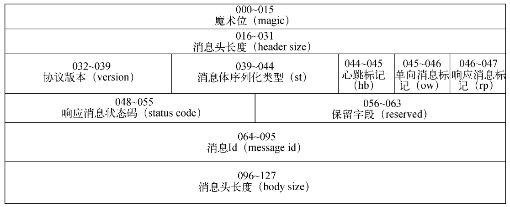

# 第三部分 协议编码

- 魔术位（magic）：16位，固定为0xBABY
- 消息头长度（header size）：16位，固定为消息头的长度
- 协议版本（version）：8位，固定为1
- 消息体序列化类型（st）：4位，序列化类型，0：json，1：protobuf
- 心跳标记（hb）：1位，0：非心跳消息，1：心跳消息 每次传输都会建立一个长连接，隔一段时间会发送心跳包，保持连接
- 单向消息标记（ow）：1位，0：非单向消息，1：单向消息
- 响应消息标记（rp）：1位，0：请求消息，1：响应消息
- 响应消息状态码（status code）：8位，响应消息状态码，0：成功，非0：失败
- 保留字段（reserved）：9位，保留字段，暂时未使用
- 消息ID（message id）：32位，消息ID，用于标识消息的唯一性
- 消息体长度（body size）：32位，消息体长度
- 消息体（body）：消息体，序列化后的字节数组

综上，0-15位为魔术位、16-31位为消息头长度、32-39位为协议版本、40-43位为序列化类型、44位为心跳标记、45位为单向消息标记、46位为响应消息标记、47-54位为响应消息状态码、55-63位为保留字段、64-95位为消息ID、96-127位为消息体长度。

//改进思路，客户端提供对象，如果选中protobuf序列化，
那么客户端提供的对象必须是protobuf对象，否则报错，我再直接使用protobuf序列化

如果客户端选择json序列化，那么客户端可以正常提供对象，我再使用json序列化